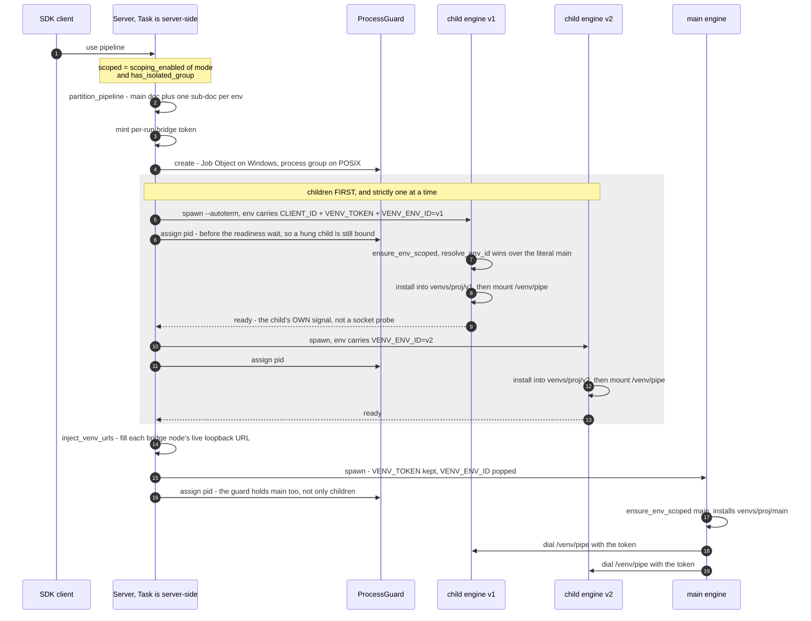
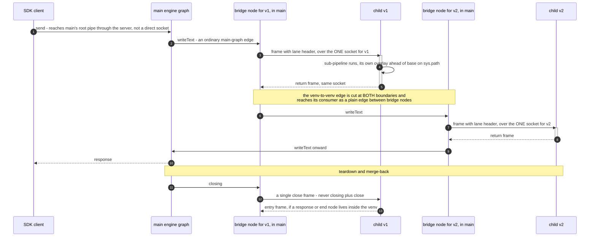

# Design: Virtual Environments for RocketRide Pipelines

**Status:** Living document — largely implemented. Phase 2A (per-environment scoping) and Phase 2B
(the venv runtime, steps 4–8.7) are shipped and live-verified; what remains open is named where it
lives — §4.9's base shrink, §4.10's second-run-collision question, the client half of `rrext_venv`
(§7), Phase 2C, and 2A-4 (§4.16, in progress). Each increment's record sits with its section, so
"is this built?" is answered locally rather than here. *This field read "Draft (design round — no
implementation yet)" through the whole of 2A and 2B; a status nobody updates is worse than none,
which is why it now points at the sections that carry the truth instead of restating it.*
**Scope:** Engine (C++ + embedded Python), `depends.py`, the `remote` sub-pipeline mechanism,
the pipeline canvas (shared-ui / VS Code), and the test/CLI harnesses.
**Audience:** Engine + tooling engineers. This is an *internal* design document, not user-facing
documentation — it deliberately lives in `packages/server/design/`, **not** `packages/server/docs/`
(which `docs:gather` publishes to the public site under *Protocols › WebSocket*).

---

## 1. Problem

When a pipeline runs, **all** of its nodes execute inside **one** `engine.exe` process (an embedded
CPython interpreter). Every node module is imported into that single interpreter, sharing **one**
`lib/site-packages` pinned by **one** `cache/constraints.txt`.

That constraints file is built by globbing **all** node and `ai/` requirements
(`REQUIREMENTS_GLOBS = ['requirement*.txt', 'nodes/**/requirement*.txt', 'ai/**/requirement*.txt']`
in `depends.py`), concatenating them (`_combine_requirements`), and running **`uv pip compile` over
the union** (`ensure_constraints`). So if two nodes need incompatible versions (e.g. `torch==2.0` vs
`torch==2.1`), the unified compile **fails at engine startup** (`_compile_constraints` →
*"Failed to compile constraints"*), before any pipeline runs.

**Corollary:** today *all shipped nodes must be mutually dependency-compatible*, and a pipeline that
uses nothing audio-related still drags in `whisper`; nothing NER-related still drags in `gliner`.

**Goal:** let a user partition a pipeline into named **virtual environments** — groups of nodes that
run in their own OS process with their own isolated `site-packages` — so conflicting dependencies no
longer collide. Nodes in different environments exchange lane data over secured local IPC.

### Goals
- Allow nodes with mutually-incompatible Python dependencies to coexist in one pipeline.
- Scope dependency installation to **only the nodes a pipeline actually uses** (per environment) —
  faster, smaller, and conflict-surfacing at *compile* time rather than at *runtime*.
- Reuse existing engine machinery (the `remote` sub-pipeline, `depends.py`, the canvas group node)
  rather than inventing parallel stacks; **no/minimal C++ engine changes**.

### Non-goals
- **Not a security sandbox.** Virtual environments isolate *dependencies*, not untrusted code — a
  node in a venv can still touch the filesystem and network. This is not tenant isolation.
- Not a general distributed-execution feature. Inter-venv transport is local (loopback) in v1.

---

## 2. Background (verified)

### 2.1 Canvas groups are inert in the engine
The canvas (`packages/shared-ui/src/components/canvas`, ReactFlow/xyflow) already has a **group node**
(`INodeType.Group`). Nodes dropped into a group get `parentId`; on save,
`graph.ts:getProjectComponents()` **nests the group's children into `config.pipeline.components`**.

But a group has **no engine-side meaning today**: there is no `group` provider, nothing flattens or
recurses into `config.pipeline.components`, and `stack.cpp` (`generatePipelineStack`/`buildConnections`)
iterates only top-level `components[]`. So a group is purely a UI container; the nested blob in the
saved document is inert. **The new partitioner is where group structure gets runtime meaning.**

### 2.2 The `remote` sub-pipeline mechanism (the reuse foundation)
The repo has a **live** remote-sub-pipeline feature under `nodes/src/nodes/remote/`:
`remote` / `remote_server` nodes + `prepare_pipeline.py` + a WebSocket lane bridge + HTTP endpoints in
`packages/ai/src/ai/modules/remote/`. It already:

- takes a nested `config.pipeline` (the **same shape** as canvas groups);
- **rewrites the graph** two ways — `prepareLocalPipeline` *inlines* a sub-pipeline (= "flatten");
  `prepareRemotePipeline` *inserts bridge/stub nodes + reroutes lanes* (= cut a boundary);
- bridges lane data over a **token-authed WebSocket** (Bearer token, `~1 MB` chunking);
- gates members by a **`REMOTING`** capability (on by default; cleared by `noremote`, `services.cpp:1737`).

Two facts that shape the design (both **verified** against the code):

- **Lane coverage is 3, not 5.** Server-side `callLocal` (`remote/base/IInstance.py`) handles only
  `writeTag`/`writeText`/`writeDocuments` (+ `open`/`closing`/`close`) → **text/tags/documents**;
  everything else `raise TypeError`. `image`/`video`/`audio`/questions/answers/classifications are
  missing. (The client also *sends* `words` but the server has **no `writeWords` handler** — a latent
  network-remote bug to fix separately.)
- **The transport is not cleanly separable.** WebSocket `_send`/`_recv`/`connect`/`disconnect` are
  embedded **directly** in `remote/base/IInstance.py`, not behind a transport seam.
- `remote_source_stub` is **not** a real node — it is *synthesized at runtime* by `prepare_pipeline.py`.
- `REMOTING`/`noremote` is a **network**-remoting gate; the `noremote` set is local-resource nodes
  (local filesystem `core` source, DB nodes, `text_output`). Venvs are *same-host*, so this gate may
  be too restrictive — see §7.

### 2.3 Embedded Python & dependency machinery
- `init.cpp` initializes CPython with an **isolated `PyConfig`** (`Py_InitializeFromConfig`), home set
  to the executable dir. **`PYTHONPATH` is ignored** — `sys.path` is mutated at runtime instead
  (`init.cpp:setPaths`, and `depends.py:_ensure_site_packages` does `sys.path.append(...)`).
- Linux/macOS statically link CPython into `engine.exe`; Windows ships `python3XX.dll` + the MSVC
  `vcruntime` next to it, loaded at C++ init **before** `sys.path` is touched.
- `depends.py` resolves all paths relative to `dirname(sys.executable)`: `engine_cache_dir()` =
  `<exe>/cache`, `model_cache_dir(name)` = `<exe>/cache/models/<name>`, base site-packages =
  `<exe>/lib/site-packages`. It already has a `FileLock`/`install.lock` + progress sidecar for
  concurrent installs.
- The dev-mode debug shim copies `engine.exe → python.exe` **in the same directory** (so
  `dirname(sys.executable)` is unchanged). `engtest` (the engine-lib Catch2 binary) asserts
  `sys.prefix == sys.executable dir == rootDir` — an invariant this design preserves.

### 2.4 `project_id` and multi-source pipelines
- A pipeline's stable id lives at **`config.pipeline.project_id`** (a GUID; the top-level
  `project_id` is null). `task_server.py` reuses it and only generates one if absent; it survives
  edit/save/rename. Unsaved ad-hoc editor runs may get a fresh UUID each run.
- A pipeline may have **multiple source nodes** (e.g. `dropper_1`, `dropper_2`) = multiple execution
  lanes. The engine runs **one source per task** (separate `task-*.json` + `taskId` per source), but
  **every per-source task file carries the FULL `components[]` and the same `project_id`** (verified
  on `examples/task-0d4f3caa.dropper_1…json` / `task-575adb74.dropper_2…json`).

---

## 3. Design overview

**A virtual environment = a "local remote".** Each isolated group becomes a flat sub-pipeline run by
a child `engine.exe` process (TARGET mode, as the engine runs any pipeline today), with its own
isolated `site-packages` overlay. Boundary edges are bridged over a token-authed WebSocket on
loopback; inter-venv traffic is routed by **main's engine graph** — an environment feeding another
becomes a plain edge between their two bridge nodes (§4.6, step 8.3), so every socket stays
main↔child and no frame is ever relayed by the orchestrator. The C++ engine is unchanged.

Three pillars:

1. **Per-environment requirement scoping** (the actual conflict fix). Stop globbing all node/`ai`
   requirements into one resolution; instead each environment compiles + installs **only the nodes it
   uses**, into its own overlay. This even helps no-venv pipelines (scoped installs). *Foundation —
   shippable on its own.*
2. **The venv runtime.** A new first-class canvas **Virtual Environment** container; a Python
   **partitioner** that turns isolated groups into venv sub-pipelines + bridge nodes; a **`venv`
   bridge node** (sharing a base with `remote`) carrying all lanes; **local spawn + routing through
   main's graph**; orchestration (lifecycle, merge-back, observability).
3. **Polish & scale.** Cross-cut debug/observability, pre-warm, and v2 optimizations (direct
   venv↔venv mesh, shared-memory for large buffers, the local-IPC transport seam).

### 3.1 Two views of one scoped run

The same run answers two different questions badly when drawn once: *what starts when* is about
**processes and ordering**, *how data crosses* is about **frames and channels**, and the two do not
share a shape. Both diagrams below describe a `=1` (or `auto` + isolated group) run of
`webhook → [v1] → [v2] → response`; under `=0` neither applies, because the partitioner flattens
the document and there is only ever one engine.

*Rendered by GitHub natively. This file is **not** part of the docs site — `gather.js` collects
`{nodes,packages,apps}/**/docs/**`, and `design/` is not `docs/` — so nothing in the site build
depends on these blocks.*

**View 1 — processes: what starts, in what order, holding what.**



Three things this ordering makes visible, each of which has bitten someone:
**children finish before main starts** (main's bridge nodes dial ports that must already answer);
**the loop is sequential**, so N cold environments cost *install₁ + … + installₙ* of wall clock, not
the maximum (§4.10 — parallel spawn is possible now that each env owns its lock, and still out of
scope); and **the env id travels in opposite directions at the two ends** — assigned to a child,
popped from main (§4.15).

**View 2 — messages: one socket per child, and no socket between children.**



Why this is correct in one breath: each child has exactly **one** connection, so a double-open is
impossible by construction; ordering is delegated to **main's engine**; and main's engine thread is
only ever inside one bridge node's call, so a return always arrives on the socket being read — the
two `callRemote`s simply nest. Channels are keyed `(direction, env)`, one forward and one return per
environment, which is what lets a venv→venv edge be cut twice rather than relayed (§4.6).

**What deliberately does not appear in view 2:** a child's **events** — status, traces, metrics,
warnings — do not travel on these sockets at all. They are drained from the child's **stdout**,
classified, and fanned into the run (§7, increment 8.4A — there is no §4.x home for it). Drawing
them as frames would suggest the
bridge carries observability, and the first person to debug a missing trace would look at the wrong
transport.

---

## 4. Detailed design

### 4.1 The Virtual Environment container (UI)
The **only new visible/placeable** canvas element is a first-class **Virtual Environment** container.
It reuses group *mechanics* (`parentId` nesting, children → `config.pipeline.components`,
`onNodeDragStop` drop-into) but is distinct from a plain organizational group: it carries
`config.environment = { name, isolated: true }` and an "isolated" visual treatment (badge/border).

**Split representation (IMPLEMENTED).** It is a distinct node type **on the canvas**
(`INodeType.VirtualEnv`) and a `group` **in the document** — `getComponentFromNode` writes
`ui.nodeType: 'group'`, and the loader promotes a `group` carrying `config.environment` back to the
container. That buys both halves: the container gets its own component, its own
`.react-flow__node-virtualenv` treatment and type-level validation, while the document stays exactly
the shape in §4.2, so an editor that predates the container still renders it — and, crucially, still
**nests its members on save** instead of scattering them to the top level. Containment is asked via
`isContainerType()` rather than compared against a single type, because it is checked in three
separate places (drop-into, serialization, auto-layout) and two-out-of-three is the classic failure.

**Naming.** "Environment" is already taken in the extension by the server-connection page
(`EnvironmentProvider`/`EnvironmentView`: development/deployment slots, SaaS vs OSS). The container
keeps the full words **Virtual Environment** in the UI and a `VirtualEnv` prefix in code so the two
do not read as one concept.

**No creation entry yet (deliberate).** The container's members are nested into
`config.pipeline.components`, which the engine ignores until the partitioner lands (§4.3, §5.3). A
creation button before that would let a user build a pipeline whose members silently vanish at run
time, so the mechanics ship first and the entry point opens with the partitioner. Placing one today
is possible only by authoring the document directly — which is what the acceptance fixtures do.

A **cog** will expose a **Purge environment** action (§4.10) once the engine command exists; a menu
item that cannot do anything is worse than its absence.

The **bridge/`remote`/`venv` nodes stay internal** — synthesized/inserted by the partitioner, **never
in the node palette**, never user-placed. (Like the `remote` nodes today, which are not canvas-exposed.)

VS Code host wiring (`apps/vscode/.../ProjectWebview.tsx`) follows the extension rules
(`Callout.call`, `AppError`, `logger.*`). The schema field is added to
`packages/client-typescript/src/client/types/pipeline.ts`.

### 4.2 Pipeline document format — two formats

**Authoring format** (what the canvas saves into `.pipe`): a venv is the existing group node with the
**only additive change** `config.environment = { name, isolated: true }`. Member nodes keep their
`input`/`control`; a member's `input.from` may reference a node *outside* the group (lane edges cross
groups today) — those are the boundary edges. The canvas renders it as its own node type but writes
this shape (§4.1), so the document is additive and readable both ways. The two structural keys are
now named in the SDK schema — `PipelineEnvironment` and `NestedPipeline` on
`PipelineComponentConfig` (`packages/client-typescript/src/client/types/pipeline.ts`) — so a
container's shape is no longer a matter of convention.

**Runtime format** (what each `engine.exe` receives): the engine reads only **top-level**
`components[]` and ignores `config.pipeline`. The **partitioner** (Python, pre-launch, modeled on
`prepare_pipeline.py`) expands the authoring doc into N **flat** sub-documents — `main` + one per venv
— inserting bridge nodes at each boundary edge and rewriting the downstream `input.from`.

```jsonc
// authoring: a "vision" venv with one member (detect), fed by parse(main), feeding response(main)
{ "id": "venv_vision", "config": {
    "environment": { "name": "vision", "isolated": true },
    "pipeline": { "components": [
      { "id": "detect_1", "provider": "detect", "ui": { "parentId": "venv_vision" },
        "input": [ { "lane": "image", "from": "parse_1" } ] }   // crosses INTO the venv
    ] } },
  "ui": { "nodeType": "group" } }
```

### 4.3 Partitioner
A pure Python transform (`pipeline.partition_pipeline`, sibling of `resolve_pipeline_env`) called from
the task-start path in `task_engine.py`. Modeled on / generalizing `prepare_pipeline.py`:

- **Non-isolated** groups → **flattened** (children lifted to top level, like `prepareLocalPipeline`).
- **Isolated** groups → a separate flat sub-pipeline per venv; each boundary **data-lane** edge gets a
  bridge-node pair + a `channelId` recorded in a routing table.
- Builds the **env-quotient graph** to detect cross-env cycles.
- Reads the **full `components[]`**, not the executing source's reachable subgraph (see §4.13).

**Placement — corrected against the code: BEFORE `_check_pipeline`, not after.** That check looks for
the run's source among **top-level** components only, so a source inside a plain group is not found
until the members have been lifted. Partitioning first also means every later step sees the document
the engine will actually run.

**Increment 1 — flattening + validation (IMPLEMENTED).** Container members are lifted to the top level
and the container itself disappears; nesting collapses to one level and an empty container simply goes
away. Membership carries no runtime meaning by itself — members keep their ids and connections, so an
edge that crossed the boundary needs no rewriting. A pipeline with no containers is returned unchanged,
by identity.

This alone fixes the standing bug in §5.3: until now **every** grouped component was silently dropped
from the run, and the pipeline still reported success. Verified on a document the editor actually
wrote: `[dropper, parse, venv_vision, venv_audio, response_outside]` →
`[dropper, parse, response_1, response_outside]`.

**Isolated containers flatten the same way on the legacy path.** Under `scoped=False` (the permanent
compatibility mode `ROCKETRIDE_SERVER_USE_VENV=0`, §4.15, and today's default call site) an isolated
container behaves as an organizational one — flattened into one process. The cut below only runs on the
`scoped=True` path, which the orchestrator flips in step 8.

**Increment 2 — the cut (IMPLEMENTED).** `partition_pipeline(pipeline, source=None, scoped=True)` returns
a `PartitionResult` (`pipeline.py`): `environments` (an `OrderedDict` of one flat sub-document per env,
`'main'` first then each isolated group in document order), `routing` (one entry per boundary channel),
and `groups` (each venv's `config.environment` block, for step-7/8 logging). The transform:

- **Leaf-bucketing by transitive env.** `_env_of` maps each component to its **nearest isolated-container
  ancestor** (else `'main'`); every leaf is bucketed by that env and every container dissolves. This one
  rule subsumes non-isolated flattening (no separate phase) and handles every nesting — a plain group
  inside a venv, or a venv nested inside a plain group (which becomes a top-level env), fall out of it.
  The transitive map also fixes two latent increment-1 bugs for a member of a plain group nested in a
  venv (a cross-boundary invoke into it was missed; an intra-venv invoke into it was wrongly rejected).
- **Boundary channels, one forward and one return per environment** (step 8.1 Arch-1; re-keyed in
  step 8.3). Channels are keyed `(direction, env)`, not by environment pair: everything entering a
  venv shares its forward channel and everything leaving it shares its return channel, whatever the
  other end is. A venv→venv edge is therefore cut **twice**, once at each boundary it crosses, and
  reaches its consumer as an ordinary main-graph edge between the two bridge nodes (§4.6).
  `sourceEnv`/`targetEnv` keep naming the **socket peers** (main and the child), never the data's
  true origin — the child selects a `venv_server` node's role from `sourceEnv == 'main'`, and the
  spawn injection picks the child env the same way. `channelId` (`main->{env}` / `{env}->main`) and
  the sanitized `venv_egress--…` / `venv_ingress--…` node ids are unchanged. A child runs one
  pipe stack, so a whole boundary is **one** connection: a single bridge node carries every lane of
  that boundary over one socket, and the frame's `lane` header demuxes to the consumers. Each lane in
  a channel has exactly **one** producer — a node's `write*` carries no producer identity, so two
  same-lane producers on one boundary cannot be told apart downstream and are rejected with a named
  cause; multiple consumers of a lane (in-venv fan-out) are fine. `channelId = '{srcEnv}->{dstEnv}'`
  (the routing key; collision is only possible if an env id itself contains `->`, which is rejected),
  plus role-based, sanitized `venv_egress--…` / `venv_ingress--…` node ids (unique **per document**).
- **Bridge placement — the round-trip splice (`remote` model; see step 7 for why).** A venv boundary is a
  request/response splice of one object, so its forward and return channels are **paired** per env and the
  return rides back over the forward socket. `_pair_boundaries` pairs each env's forward channel with its
  optional return channel — by construction, since the key is `(direction, env)`. Forward: **one**
  round-trip `venv` node in main reads each lane's **main-side source** — the producer itself when it
  lives in main, otherwise the bridge node of the venv that produced it — and a `venv_server` ingress
  (from the child stub) applies the forward stream in the child; the child's forward consumers repoint to
  that ingress. Return: a `venv_server` egress (from the venv producers) ships the return over the **same**
  socket, and main's return consumers repoint to the paired round-trip node (its `deliverNode`) — there is
  **no** separate main ingress node, so the spliced object is never re-opened. Each child sub-document is
  seeded with a synthesized `venv_source_stub` resident source that the ingress links to for reachability;
  unlike `remote`, child docs are NOT nested under the client config — they are separate `environments[]`
  entries the orchestrator (step 7) spawns from. Multi-lane fan-in/out, `venv→venv` chains and diamonds
  are all supported. What remains rejected, with named causes, is the same lane from two producers on one
  boundary (the boundary is now the whole environment, so this bites more often than it did with
  pair-keyed channels; the workaround is a merge/router node inside the venv), an environment entered
  more than once around a base component, and quotient cycles.
- **Env-cycle detection over the quotient graph, main excluded.** Edges are `env_of(producer) →
  env_of(consumer)`, so venv→venv is a direct edge and routing through main is invisible; dropping main
  catches venv↔venv deadlocks without flagging main-terminated chains, which are legal and are exactly
  what step 8.3 enables. The adjacency is accumulated by `_collect_channels` rather than read off the
  channels: under `(direction, env)` keying every channel has main on one side, so the venv→venv relation
  lives inside a channel's lanes, not in its key. **A second, narrower cycle check** runs on main's
  assembled document: a venv collapses to exactly one bridge node, so entering it twice around a base
  component folds into `MV → m → MV`. That is a DAG as authored and runs fine flattened under `=0`, and
  the author never wrote the node names in the cycle, so it is named at cut time rather than left to the
  engine's own (post-#1669) Kahn check, which reports a lifecycle root index at pipeline open. It fires
  only for cycles passing through a bridge node, so the partitioner never becomes stricter than the engine
  on shapes unrelated to venvs.

  *Ordering trap when writing fixtures:* the same-lane conflict check sits **upstream** of both cycle
  checks. A cycle needs an environment entered twice, and if both entries carry the same lane the
  conflict fires first — so a cycle fixture must use distinct lanes per direction.
- **Extra scoped rejections:** a boundary edge on the non-bridgeable `words` lane; an implied
  (`Source`-mode) source or the document `source` field inside a venv; a base environment left with no
  components while a venv exists; a group whose id is literally `main`; an environment that emits across
  its boundary but is fed by nothing (nothing dials it, so its egress would have no socket). The
  `scoped=False` path and the 19 increment-1 tests are unchanged; the cut adds `test_partition_cut.py`
  (39 tests after step 8.3). Deferred: §4.13's
  "all nodes in ONE venv → collapse" (a runnable all-in-one-venv doc cannot exist while source-in-venv is
  rejected, and honoring it only when scoped would make `=1` accept what `=0` rejects). The bridge nodes'
  live child URL/token are written at spawn (step 7).

**Validations, enforced now** (structural errors the editor should have prevented, failed with a named
cause rather than silently normalised): a virtual environment nested inside another; the source inside
a virtual environment (a plain group is fine — a group is layout, not an execution boundary); an
invoke/control edge crossing an environment boundary, in either direction and between two
environments; and a lane edge that takes input from a container, which produces no data. Increment 1
also rejects a control edge whose source is a container (it dangles once the container flattens away).
Env-cycle detection is now implemented on the `scoped=True` cut (see Increment 2 above).

Covered cases: lane fan-out across envs, multiple lanes on one boundary, A→B→main chains and
diamonds, a venv feeding two venvs, source/sink
placement (§4.13). **Invoke/control edges never cross a boundary** (the editor's `isValidConnection`
requires equal `parentId` for invoke handles; data lanes cross freely) — so cross-env tool-call RPC is
out of v1 *by construction*. **This is editor-only — C++ does not check `parentId` on invoke edges
(verified)** — so **the partitioner must enforce it as a hard validation** (reject cross-boundary
invoke/control edges), not assume the document is well-formed.

### 4.4 Bridge nodes — shared base + a new `venv` node
The transport is *not* cleanly separable (§2.2), so rather than editing `remote` in place or rebuilding
a parallel stack:

- **Extract the common bridge base** (lane dispatch/serialization in `callLocal` + the transform) into
  shared code.
- Add a **new `venv` / `venv_server`** node pair inheriting it, alongside `remote` / `remote_server`.
- The `venv` node implements **all data lanes** — the 15 `Binder::MethodNames` minus the
  `open`/`closing`/`close` framing: `tags, text, table, words, audio, video, questions, answers,
  image, classifications, classificationContext, documents` (today's `callLocal` covers only 3 data
  lanes — text/tags/documents), critically `image`/`video`/`audio` (vision is image-heavy). Derive lane
  handlers from **one table** so a new engine lane forces a wire-format bump, never a silent gap. Reuse
  the serialization vocabulary in `data_conn.py` (`_determine_lane`, `_begin`/`_write`/`_end`).

This **reuses the fiddly logic** (shared base) while **decoupling** venv work from the live `remote`
feature — no regression risk to network-remote, and its `words` gap stays its own problem. It is *not*
the rejected `venvEgress`/`venvIngress` reinvention; it is a sibling of `remote` over one base.

**Step-6 decisions (verified against the code, resolving the §4.4 forks).**

- **Lane count is 13, not 12 — the list above dropped `json`.** `binder.hpp::MethodNames` (16 total)
  is `open, tags, text, table, words, json, audio, video, questions, answers, image, classifications,
  classificationContext, documents, closing, close`. Minus the three framing lanes that leaves **13**
  data lanes, and `json` is a real one (there is an `instance.writeJson(IJson)` and a `data_conn._write`
  handler). Omitting it is exactly the silent gap this section warns against, so the `venv` table
  **includes `json`**.
- **`words` is not bridgeable and is recorded as such, not silently skipped.** There is **no
  `writeWords` on the `rocketlib` instance/pipe surface at all** (verified in `filters.py`/`__init__.pyi`);
  `remote/client` *sends* it but nothing can land it — that is the latent `remote` bug. The `venv` table
  therefore carries `words` as an **explicit "not bridgeable" entry that raises a clear error**, so the
  gap is loud (a bump), not a quiet drop. The one-table/`binder.hpp` cross-check test asserts coverage of
  every `MethodNames` entry, `words` included as the explicit-unsupported case.
- **Seam = `venv`-only base; `remote` is left byte-for-byte untouched (chose A2 over A1).** The shared
  bridge base (WS `_send`/`_recv`/`connect`/`disconnect` + the generic `callRemote` loop + `listChunks` +
  the table-driven `callLocal`) is introduced **under `venv` only**; `remote/base` is not moved onto it.
  This costs a little transport duplication but removes all regression risk to network-remote. The true
  DRY refactor — moving `remote/base` onto the shared base with its current 3-lane `callLocal` preserved
  byte-identically (**A1**) — is **deferred to 2C**, alongside the transport seam that §4.5 already
  defers there.
- **AV multi-arg framing = metadata in the header, body is raw bytes (B1).** `image`/`audio`/`video`
  carry `(action:int, mime:str, buffer:bytes)`, which the single-scalar `_send` cannot express. The
  `venv` transport puts `action`/`mime` on the already-sent JSON header and ships the buffer as **raw
  bytes** (no base64), so multi-MB frames keep their throughput — base64-in-JSON (**B2**) was rejected
  for the ~33% inflation §4.5 warns about. The bridge does **not** synthesize `_begin`/`_end` framing for
  AV: the engine already calls the egress node's `writeImage(action, …)` with the action embedded, so
  egress forwards it verbatim and ingress replays it — the reused `data_conn` vocabulary is the
  **type serialization** (Question/Answer/Doc/classifications/`IJson`), not the framing.
- **Bridge nodes are `internal`, not merely `nosaas` (verified — the two are different bits).**
  `INTERNAL` (`PROTOCOL_CAPS` BIT 6, `Url.hpp`) means *not returned in `services.json` at all* — the
  UI never sees the node, so it can't be shown, placed, or referenced. `nosaas` (BIT 13) is weaker: the
  node **is** in `services.json` but the UI Add-Node inventory/quick-add filter it out
  (`shared-ui/.../helpers.tsx`, `QuickAddPopup.tsx`) — and nothing in the C++ engine or the Python
  server gates *execution* on `nosaas` (it is only parsed into `def.capabilities` at
  `services.cpp:1779`; there is no engine "saas mode"). That is why `remote_server` carries
  `["internal", "nosaas"]` while the user-placeable `remote` client carries only `["nosaas"]`. Both
  `venv` and `venv_server` are **synthesized by the partitioner and never user-placed**, so **both take
  `internal`** (mirroring `remote_server`, not the `remote` client); `nosaas` on top is redundant but
  harmless for symmetry.
- **`data_conn.py` reuse = mirror the vocabulary in the `venv` table, do not import (D2).** `data_conn`
  covers ~11 of the 13 lanes (it lacks `table`, `classificationContext`, and — like everything — `words`),
  and its `_write`/`_begin`/`_end` are methods bound to a `DataConn`/`pipe`, not standalone. For step 6 the
  `venv` table mirrors the serialization vocabulary with `data_conn` as the reference, adding `table`/
  `classificationContext` itself. Extracting a shared `write_lane` dispatch in `packages/ai` that both
  `data_conn` and `venv_server` call (**D1**) is the real-DRY move and is **deferred to 2C together with
  the A1 base unification** — both are behavior-preserving refactors best done under the green test
  baseline rather than mixed into the feature.
- **The 12 data `write*` egress overrides live in the shared base, inherited by BOTH nodes (verified).**
  `remote/server/IInstance` *also* overrides `writeText`/`writeDocuments` → `callRemote(...)`: that is the
  **return path** (data produced inside the venv flows back through the server node to main). So the egress
  surface is symmetric — the client sends the forward stream, the server the return stream, the same 12
  methods over the same table — and both are placed **once in the base**, not duplicated per node as
  `remote` does. Client and server subclasses then carry only their lifecycle: the client adds `connect`
  plus the framing overrides, the server adds the `handleWebSocket` accept-loop.
- **A bridge never calls `pipe.closing()`; the framing pair on the wire is `open` + `close`.** The
  engine's `pipe.close()` runs the closing pass and *then* the close pass
  (`pipe.instance.cpp`: `Parent::closing()` followed by `Parent::close()`) — which is exactly how the
  client drives a pipe (`data_conn.close_sync` calls `pipe.close()` and never `pipe.closing()`).
  Forwarding a `closing` frame as well makes every node inside the child flush **twice**; the child
  side therefore refuses that lane with a named cause rather than honouring it silently.
  **Measured, not predicted:** restoring the two-frame shape on a post-#1667 engine does not merely
  duplicate the output — the boundary **deadlocks** and the run hangs. The second closing pass emits
  into a nested round-trip that main is no longer reading, which breaks the strictly-nested
  synchronous invariant the whole transport rests on. A/B on the same build: collapsed →
  `text: ["olleh\n\n"]`; two-frame → timeout.
  *This was latent, not theoretical.* Python `instance.closing` used to be bound to `cb_close`, so
  `pipe.closing()` performed both passes and the follow-up `pipe.close()` was inert — the bridge was
  accidentally correct. Engine **#1667** rebound it to `cb_closing`, which is right in itself and
  turns the second frame into a real double flush.
  **The one `close` frame is sent from the main node's `closing()`, not its `close()`**, so the venv's
  return data reaches main's downstream consumers before *their* `closing()`: framing is bound per
  edge (`endpoint.pipes.cpp`) and `IPythonInstanceBase::closing()` runs a node's own Python `closing()`
  before `Parent::closing()` hands off to its consumers, so a producer always closes ahead of
  everything it feeds. Main's `close()` is consequently inert; the engine still calls `Parent::close()`
  after it, so main's own framing propagates unchanged.
  **Dead-socket guard.** A child that dies mid-*data* tears the socket down before main's closing pass
  runs, so that lone frame would raise into a pass the engine aborts at the first error, costing the
  downstream nodes their flush — even though the child's error already crossed and failed the object.
  `closing()` therefore swallows a connection-closed send **only when the object already failed**, and
  re-raises on a clean object (a dead socket with nothing reported is a child crash that must not
  complete as a success).
- **`callLocal` is bidirectional.** `venv_server` uses it for the forward path (main→venv); the egress
  client's `callRemote` receive-loop uses it for return lanes (venv→main). That is precisely why the
  full-lane table belongs in the shared base rather than only in `venv_server`.
- **AV wire framing (concrete B1).** `image`/`audio`/`video` put `action`/`mime` on the JSON header and
  ship the buffer as **raw bytes** (no base64). The buffer is **optional** — the stream is
  `write*(BEGIN, mime)` → `write*(WRITE, mime, buffer)` → `write*(END, mime)`, and `data_conn` calls the
  2-arg form for BEGIN/END — so a bufferless frame crosses as a `none` payload and the far side replays
  the 2-arg call. The bridge is a transparent pass-through of already-framed calls; it does **not**
  synthesize `_begin`/`_end`. Raising the ~1 MB WS ceiling for large AV buffers stays a step-7 item.
- **Bridge nodes get no per-node pipeline transform.** C++ invokes the remote transform by a **hard-coded**
  `py::module::import("nodes.remote.client")` + `.attr("preparePipeline")` (`pipeline_config.cpp`), so it
  is remote-specific — nothing would call a `venv`-side `preparePipeline` even if one existed. venv graph
  rewriting is the partitioner's job (§4.3 increment 2); `venv/client/__init__.py` re-exports only
  `IGlobal`/`IInstance`.
- **`services.*.json` follow the minimal `remote_server` template** (no `preconfig`/`shape`/`fields`):
  both bridge nodes are `internal` + synthesized, so there is no editor config form — the partitioner
  writes their `config` (child URL/token, step 7) directly. And `internal` (BIT 6) hides a node from the
  **client catalog** but does **not** un-register the provider — the engine keeps it in its ProviderIndex,
  so a synthesized `provider: venv`/`venv_server` still instantiates, exactly as `remote_server` does.
- **Bridge (de)serialization is per-type, not uniform (reuses the `data_conn` vocabulary, D2).** All
  VERIFIED against the shipped `rocketlib`: `Doc` → `toDict()`/`fromDict()`; `Question`/`Answer` are
  pydantic → **`model_dump(mode='json')`** (plain `model_dump()` leaves enums like `QuestionType` on the
  wire, which are not JSON-serializable) / `model_validate()`; `IJson` egress is **`json.loads(str(ijson))`**
  (the `writeJson` arg is an `IJson` *instance*, and `IJson.toDict` is a staticmethod that only accepts a
  plain dict, not an instance) and ingress is `IJson(dict)`; `TAG` egress is `tag.asBytes` and ingress is
  `instance.writeTag(bytes)` — the bridge never reconstructs a `TAG` (there is no runtime `TAG.fromBytes`,
  despite the `.pyi` stub).

### 4.5 IPC transport & security
**v1 reuses the existing WebSocket lane bridge bound to loopback, unchanged** — it already carries a
Bearer token. Bind to `127.0.0.1`; reject unauthenticated connections; deliver the token via inherited
env/handle, never argv.

- **Known limit (v1 acceptance gate, not a v2 "confirm"):** WS frames chunk at `~1 MB`
  (`remote/base/IInstance.py`); large image/video relies on chunking. **Measure a representative
  image/video crossing against a target throughput ceiling as a v1 acceptance criterion**; raise the
  chunk ceiling for AV if it misses.
- **The merge-back `entry` frame shares that ceiling, and is *not* chunked.** `callRemote` chunks only
  top-level *lists*, so the frame's dict crosses whole: a response above `~1 MB` — realistically a
  base64 media blob written by a `response` node **inside** a venv (§4.12) — fails. Same cause as the
  un-chunked AV buffers above, and accepted on the same terms; lifting one should lift the other.
- **Cloud-store direction shrinks the *payload*, not the *lane set*.** In the planned model AV bytes
  live in **cloud storage** (`ai..account.store`); the bulk bytes are fetched from the store, not
  streamed node-to-node. **But AV metadata still travels on the `writeVideo`/`writeAudio`/`writeImage`
  lanes** — so the bridge must **still implement every AV lane** (§4.4 "all data lanes" is *not*
  reducible), and those lanes still cross the venv boundary. What changes is the **payload size**: a
  small metadata/URL frame instead of multi-MB buffers, which is what drops the throughput risk (the
  ~1 MB chunking is a non-issue for small frames). The interim caveat still holds — before the store
  migration, raw AV crosses these lanes and the throughput gate above applies. (The child's store fetch
  needs account/store context — ties into secrets/`ROCKETRIDE_CLIENT_ID` propagation, §6.)
- **Environment variables are process-init inputs, not a live control channel (8.7S).** The venv
  variables are resolved once per process and frozen. The switch is additionally **never popped**
  (the server itself reads it, and stripping it would degrade every later run to `auto`), while
  the bridge token is **never consumed at all** (node code is its legitimate reader). The threat
  chain, the rule, and the reason each variable is treated differently live in **§4.15**; the
  pointer is here because this is the section a reader opens looking for the threat model.
- **`${ROCKETRIDE_*}` substitution is *not* a second channel — and the tempting reason is the
  wrong one.** `resolve_pipeline_env` allowlists the whole `ROCKETRIDE_` prefix, so a
  sub-document reading `${ROCKETRIDE_VENV_TOKEN}` would exfiltrate the bridge token — and "the
  resolve runs in the server, the token only exists in children" does **not** answer it, because
  a child engine both holds the token and hosts node code. The real barrier does not depend on
  which process resolves: **neither production call site passes `os.environ`.** `cmd_misc`
  resolves against a purpose-built `merged_env` (server `RR_*` keys remapped for `sys.admin`,
  plus org/team/user secrets from the account store), and the `Task` side against an injected
  `self._env` that defaults to `{}`. A variable sitting in a process environment is therefore not
  substitutable **in any process**, popped or not.
  Do not be alarmed by `packages/ai/tests/ai/modules/task/test_env_var_exfil.py`: it feeds
  `dict(os.environ)` deliberately, to pin the prefix allowlist and the `AWS_*` redaction. That is
  the harness, not the production wiring — and it is the first file to check if anyone ever
  changes what the resolve is handed.
- **Hardening (deferred to 2C):** OS-access-controlled local IPC so the kernel rejects other-user
  processes *before* any token check — **named pipe + user-SID ACL** (Windows), **Unix domain socket**
  `0700` + `SO_PEERCRED`/`LOCAL_PEERCRED` (Linux/macOS). Matters for **multi-tenant** hosts (Linux
  cloud especially); single-tenant is fine on loopback + token (same-user child). This is **not
  Windows-specific** — but it requires the same `IInstance.py` transport refactor that makes the
  transport not-separable, so it is deferred, not a v1 item.

### 4.6 Inter-venv routing — graph serialization through main
All venv children connect **only to main**, and each has exactly one socket. An environment that
feeds another is **not** relayed frame-by-frame: the partitioner rewrites the venv quotient into
ordinary edges of main's engine graph, between the bridge nodes that already represent each child
there (step 8.3). A venv's outputs come back into main through its own bridge node; handing them to
the next venv is then just that bridge node being the next one's input.

```
dropper(main) → parse(venv1) → detect(venv2) → return_image(main)
main graph:  dropper ──▶ [venv1 bridge] ──▶ [venv2 bridge] ──▶ return_image
sockets:     bridge ↔ child venv1, bridge ↔ child venv2   (no venv1↔venv2 link)
```

*Sequence view of the same thing, including teardown and merge-back: **§3.1, view 2**.*

Why it is correct in one breath: each child has exactly **one** connection, so a double-open is
impossible by construction; `open`/`closing`/`close` ordering is delegated to **main's engine**; and
main's engine thread is only ever inside one bridge node's call, so a return always arrives on the
socket being read. The two calls simply nest — one logical thread, strictly nested round-trips.

**Main still needs no codecs or heavy deps for the data crossing it.** A hop does decode into main's
engine objects and re-encode, but `nodes/venv/base/lanes.py` is dependency-free: AV crosses as an
`action`/`mime` header plus a raw byte buffer, so a venv-`torch` image passes through main without
main having `torch`. The §4.6 promise holds; what changed is *who* forwards, not what main must
understand.

Two properties fall out of the serialization and are not obvious from the rewrite rule: a chain of N
venvs is N **nested blocking** round-trips on main's single engine thread (latency composes, and an
inner child's stall blocks every outer bridge), and a venv is entered **once per run** — re-entering
one around a base-environment component collapses to a cycle on its single bridge node and is
rejected at cut time (§4.3).

Rationale for one-socket-per-child over a mesh: N connections (not N²), central
lifecycle/token/routing/observability, each child authenticates with **only main**. Cost: a venv→venv
edge is still 2 transfers. **v2 optimization:** direct venv↔venv peering for hot large-buffer edges
(+ shared-memory for AV).

*Superseded:* this section previously specified an orchestrator-level **byte router** — main's Python
process reading a frame off one child's socket and forwarding it to another's by `channelId`. Graph
serialization replaced it at step 8.3: no new transport, no new endpoint, no frame tags, and diamonds
(a venv fed from two environments) fall out as an ordinary multi-input join on the bridge node, which
the byte router never solved.

### 4.7 Per-environment requirement scoping (the conflict fix)
Today `_find_requirement_files()` globs **all** `nodes/**` + `ai/**` requirements (pipeline-blind);
the unified `uv pip compile` fails the moment two nodes conflict. Instead:

**Uniform per-environment scoping (main included; one code path).** Each environment compiles +
installs **only the nodes it uses**, into its own node-set-keyed overlay. The partitioner already knows
each env's node set, so:

- map the env's components → `provider` → `nodes/src/nodes/<provider>/requirements*.txt`;
- **AST-discover** the `ai/**` submodules each node imports (§4.8) → include only those
  `requirements*.txt`;
- `ensure_constraints()` takes an **explicit requirement-file set + env dir** (not the global glob).

**Node set = the WHOLE document (all sources/lanes), not the executing source's subgraph** — because
the on-disk env is keyed by `project_id` and shared across all per-source runs. Compiling per-lane would
each succeed but **conflict at runtime** (dropper_1 lane `torch 2.0` + dropper_2 lane `torch 2.1`);
full-set compilation surfaces it at **compile time**, and both lanes reuse the **same** venv.

**Consequence / blast radius (must gate).** The base `lib/site-packages` becomes **engine-runtime-only**;
**all** node deps move into per-environment overlays — even main's, **even for pipelines with no venvs**.
When enabled, this changes dependency resolution for the *whole* pipeline (main included), so it is
gated by the **`ROCKETRIDE_SERVER_USE_VENV` master switch (§4.15)** with a **permanent** fallback to
today's global-glob path (`=0`). The default (auto) only scopes per-env when the pipeline opts in via an
isolated group — a no-venv pipeline under the default keeps today's global-glob behavior unchanged; the
legacy path is a supported mode, not a transitional flag.

**Upside:** eliminates "all shipped nodes must be compatible" entirely (conflicts only *within* an env →
resolved by the venv split); shrinks the overlay-can't-hide-a-base-package limit to only packages the
**engine runtime itself** needs.

### 4.8 AST discovery of `ai/**` requirements
Run **once per pipeline init**, cached by node-set hash.

**Input contract.** The partitioner (the only component that reads the `.pipe`) resolves each env's
components → `provider` → the node's **entry-module path** (resolution rule below) and hands
`depends.py` an explicit **per-env node-set descriptor**: a list of
`(provider, entry_module_path)` + the node-set hash + the env dir. **`depends.py` never parses the
`.pipe`** — a single AST-discovery entry point there walks each entry-module path, follows imports
into `ai.*` to find the `ai/common/models/<x>` submodules reached, and returns those submodules'
`requirements*.txt` to fold into the env's requirement-file set. So a pipeline with no audio never
pulls in `whisper`. This reconciles §4.7 (partitioner resolves the node set) with §9 (the AST walk
lives in `depends.py`): **the partitioner passes paths; `depends.py` parses them.**

**The single door for torch (VERIFIED) — this is what decides whether a node may pin its own.**
`torch==2.10.0+cu128` lives in exactly one file, `ai/common/torch/requirements.txt`, and it enters
an environment only through an import of `ai.common.torch` — which comes from
`ai/common/models/base.py::_ensure_dependencies` (and therefore also via
`gpu_guard.py` → `.base`). The `ai/common/models/` directory itself holds **no** `requirement*.txt`,
so reaching the package costs nothing by itself; the weight comes from that one file plus the
specific model family. Two consequences worth stating plainly:

- a node that does **not** reach `ai.common.models` resolves its own torch freely — its env compiles
  and installs that version into its overlay, and the overlay wins at import even when base holds a
  different one (`uv --target` does not treat base as satisfying — VERIFIED against the shipped uv);
- a node that **does** reach it inherits `ai`'s pin **legitimately**, so a version disagreement
  there is a real conflict to surface, not a check to relax. The ways out are model-server mode
  (the facades take the `ModelClient` branch and never import torch) or splitting the work across
  environments — not loosening the resolution.

Note also that `ai/node.py` reaches `gpu_guard`, but **no node imports `ai.node`** (verified across
`nodes/src`), so the launcher does not leak the pin into every environment.

**`-r` includes inside requirement files (IMPLEMENTED).** A requirement file may pull in another
with `-r other.txt`, and `uv` resolves that path **relative to the file holding the line**. Combining
moves those bytes into `combined.txt` in a different directory, so a relative include would be
looked for next to the combined file and the compile would fail there instead of at the node
(VERIFIED: `failed to read from file …cache\other.txt`). The combiner therefore rewrites include
targets to absolute paths — with **forward slashes**, because a requirement file treats `\` as an
escape and `-r C:\x\y.txt` reaches uv as `C:xy.txt` (also verified) — and `resolve_includes()` folds
the referenced files into the environment's set so they reach the drift hash; editing an included
file must be able to invalidate the resolution. A missing include is refused up front, naming the
referring file.

**Resolution rule (verified — NOT `nodes.<provider>`).** The entry module is **not**
`nodes/src/nodes/<provider>/` by string; that naive rule holds for ~91 of ~133 providers and **breaks
for ~42**. The authoritative mapping is: `provider` = the `logicalType` (protocol scheme with `://`
stripped, e.g. `detect://` → `detect`) → its matched `services*.json` → that file's **`path`
(`nodePath`) field** → dots-to-slashes under `nodes/src/` → a **package dir with `__init__.py`** that
re-exports `IInstance`/`IGlobal` (and `IEndpoint` for endpoint nodes); the node logic to AST-parse is
`IInstance.py`/`IGlobal.py` there. Traps the partitioner must handle: **aliases** (many providers →
one dir: `chat`,`dropper` → `webhook`; all `response_*` → `response`), **sub-package paths** (`remote`
→ `nodes/remote/client`, whose own `__init__.py` re-exports nothing — you *must* follow `path`),
**name ≠ dir** (`text-output` → `text_output`, `db_supabase` → `db_postgres`), and **native providers
with no `path`** (`parse`, `filesys`, `hash`, …) which have **no Python module and are skipped**. The
engine loader itself does exactly this (`python-global.cpp` uses `serviceDef.nodePath`, not the
provider string), so the partitioner must read `path` from `services*.json`, never synthesize it.

**Known risk — the AST premise is weaker than it looks (VERIFIED against `detect`, `pose_estimation`,
`audio_transcribe`, `ner`, `anonymize`).** The heavy pip packages are **not** declared per node and are
**not** chosen by per-variant `depends()` calls: no `requirements_pose`/`requirements_detection` files
exist, and `detect`/`pose_estimation` have **no `requirements.txt` and call `depends()` zero times**.
Instead —
- a node's `IGlobal.py` typically **defers** the `ai.common.models.*` import into `beginGlobal`
  (config-gated), and the actual package is a **lazy, config-selected import inside `ai`** — e.g.
  `from rfdetr import RFDETRBase` inside `ai/common/models/vision/detection.py::_build_backend`, picked
  by the `engine` config, **two hops from the node file**;
- config (`profile`/`engine`/`model`) selects a **runtime model backend, never a requirements file**.

Consequences a static node-file AST walk must confront:
- it **systematically under-includes** — the true deps sit behind deferred/config-driven imports inside
  `ai`, invisible to a walk of `IGlobal.py`/`IInstance.py`;
- the `depends()` **backstop does not rescue these nodes** — `detect`/`pose` never call `depends()`, so
  nothing installs mid-run; today their deps come from the **pre-populated shared `ai`/model-server
  environment**.

So per-env `ai/**` inclusion **cannot rely on node-file AST alone.** The walk must be **transitive
through the `ai` package** (follow deferred + config-branch imports inside `ai.common.models.*`, not
just the node's top-level imports); where a config branch selects among mutually-exclusive backends,
**include all reachable backends' `requirements*.txt`** (then verify they don't mutually conflict)
rather than trusting a runtime `depends()` that never fires. Nodes that *do* call `depends()` /
`load_depends()` (e.g. `detect_segment`, some TTS) install a **single fixed** `requirements.txt`, not a
variant — so the backstop is a narrow safety net, not the primary mechanism.

**Prototype result (VERIFIED — throwaway static-AST walk run against `detect`, `audio_transcribe`,
`anonymize`, the three hardest nodes).**
- **Correctness holds — static AST is feasible.** With two walker requirements — (1) collect
  **nested/in-function imports** (not just module-level), (2) resolve **relative imports** correctly
  (`__init__.py` package vs regular-module package) — the walk reached **every** ground-truth
  requirement file (`requirements_detection.txt`+`requirements_vision.txt`+`torch` for `detect`;
  `requirements_whisper.txt`+`torch`; `requirements_gliner.txt`+`torch`) with **zero under-includes and
  zero dynamic `importlib` calls**. The earlier worry that config-selected backends hide from AST was
  **wrong**: `from rfdetr import RFDETRBase` inside `_build_backend` is a *literal nested* import the
  walk sees.
- **The residual problem is PRECISION, not correctness — the `ai.common.models` barrel `__init__`.**
  `detect` imports by **full submodule path** (`from ai.common.models.vision.detection import …`) → the
  walk stays tight (only detection+vision+torch). But `audio_transcribe`/`anonymize` import via the
  **`ai.common.models` package `__init__`, which statically re-exports EVERY submodule** — so the walk
  transitively reaches the **entire model universe** and over-includes `rfdetr`, `rtmlib`, `gliner`, all
  OCR, `transformers` for an *audio* node. That reintroduces the very torch-conflict + bloat venvs exist
  to remove.
- **Prerequisite for precise scoping — DONE (Option A applied).** Either nodes import `ai` model
  submodules **by full path** (as `detect` already does), or the `ai.common.models` barrel `__init__` is
  made **lazy (PEP 562)**. **Chose Option A** (the 4 barrel importers now use full-path imports —
  `.gliner`/`.audio`/`.transformers`/`.ocr`); Option B was rejected because it does **not** help the AST
  walk without a matching walker change (`ast.walk` still traverses the `TYPE_CHECKING` re-export block,
  or under-includes if that block is removed). Measured effect: `audio_transcribe` **24 → 7** files,
  `anonymize` **23 → 5**, zero cross-family leaks.
- **Within-family over-inclusion — CLOSED (2A-R item 2), and Options 1/2 were not alternatives.**
  Cross-family isolation was already exact — verified on the **real engine**: the `audio_transcribe`
  overlay dropped **183 → 114** packages, no `rfdetr`/`gliner`/`easyocr`/`surya`/`timm`. Within a
  family it was not: the walk co-located every `requirements*.txt` in a reached `ai/` directory, so
  `audio_transcribe` pulled `kokoro` (TTS) and `detect` pulled `rtmlib` (pose). This entry used to
  call that cosmetic and offer a choice between two options. Measurement refused the choice — the
  two are halves of one fix, and the item is not cosmetic because it is what holds OCR:

  | variant | req-file slots (155 providers) | `detect` | `audio_transcribe` | `embedding_image` | `ocr` |
  | --- | --- | --- | --- | --- | --- |
  | before | 870 | 14 | 9 | 15 | 13 |
  | Option 1 alone (node full-path imports) | **870** | 14 | 9 | 15 | 13 |
  | Option 2 alone (walker rule) | 839 | 9 | 9 | 15 | 13 |
  | **both — shipped** | **824** | **9** | **8** | **9** | 13 |

  **Option 1 alone is worth exactly zero**: a node already importing by full path still drags its
  siblings, because the directory glob does not care how the file was reached. **Option 2 alone
  never reaches a barrel importer**: the family `__init__` re-exports every module, so every module
  is walked and between them they declare every file in the directory. 46 slots leave 11 providers,
  and **nothing is gained anywhere** — the per-provider diff is additions-free, which is the whole
  safety argument.

  **The rule.** A directory in which some walked file declares a `_REQUIREMENTS_FILE` **that
  resolves to a file which exists** is *self-describing*: there, only the declared files are
  collected. Every other directory keeps the blanket co-location. Data-driven rather than a
  `ai/common/models/` path constant, because `_REQUIREMENTS_FILE` **is** the model-loader
  convention and appears nowhere else — 16 declaring files, all under `ai/common/models/`, and not
  one under `nodes/src`. (A grep finds 17: the seventeenth is `base.py`'s
  `_REQUIREMENTS_FILE: Optional[...] = None`, an `ast.AnnAssign` the walker's `ast.Assign` branch
  does not see — and which the resolved-path clause below would neutralise anyway, since `None`
  names no file.) Two implementation facts are load-bearing. The value is never a plain
  string (`os.path.join(dirname(__file__), 'x.txt')`, a list of those, or `dirname + '/x.txt'`), so
  `_requirement_basenames` looks through Call arguments and BinOp operands; and it hangs off a
  **new branch keyed on the exact name**, never the pre-existing `'REQUIREMENT' in id.upper()`
  substring, which would also catch the lowercase `requirements` local in `ai/common/`,
  `ai/common/opencv/`, `ai/web/` and `ai/` and make those self-describing too.

  **Degradation, stated exactly.** A declaring module the walk never reached is safe by
  construction. A declaration resolving to nothing is safe when it is the directory's only one —
  the directory stays globbed. The one shape that does not degrade safely is a failed declaration
  *beside a valid one*: the valid sibling suppresses the glob and the typo'd module's real file
  drops out. The walker cannot tell a typo from an intentionally absent file, so that is closed by
  test instead (`test_a_declaring_module_names_every_sibling_it_needs`), which fails whenever a
  declarer needs a top covered only by a sibling it does not successfully name.

  **The gap the rule exposed, fixed in the same change.** Making `_REQUIREMENTS_FILE` load-bearing
  makes an incomplete declaration harmful. A completeness audit over `ai/common/models/**` found
  exactly one: `easyocr.py`, `doctr.py`, `surya.py` and `utils.py` import `PIL`, but `Pillow` was
  declared only in `requirements_trocr.txt` — blanket co-location had been supplying it. Added bare
  to the other three. A walk seeded at `surya.py` reaches `ai.common.opencv`, `ai.common.torch` and
  `ai.web.metrics` but **not** `ai.common.image`, so nothing else would have.

  **`ocr` is unchanged at 13 files, by design.** `nodes/ocr/ocr.py` imports all four engines
  unconditionally — the engine is a *runtime* config choice, so all four are genuinely statically
  reachable and the walk is right to keep them. The payoff is conditional and measured: a walk
  seeded at `ai/common/models/ocr/surya.py`, which is what a 2A-4 `nodes.ocr.surya` component would
  look like, goes from all four engine files to `requirements_surya.txt` alone. That is the
  precondition 2A-4 rests on, pinned by `test_an_ocr_engine_module_scopes_to_its_own_requirements`.
  It removes one of Surya's two blockers: the same walk still keeps
  `ai/common/opencv/requirements_{1,2}.txt` at `4.13.0.92`, and removing that shim — **deleted
  outright, not demoted to a re-export**, since nothing imports it afterwards — is 2A-4's business
  (§7, scope item 4), not this item's.

  **The barrels stay; the invariant moved to the nodes.** A family barrel is a public surface with
  an explicit `__all__`, and PEP 562 would not help the walk anyway (see the Option B note above).
  What matters is not that a barrel is thin but that **a node imports a model *module*, never a
  model *package*** — one assertion covering both the family barrels and `ai.common.models` above
  them, pinned in `test_a_node_imports_a_model_module_never_a_model_package`. The nine converted
  lines were the complete set at the time, not a sample: `nodes/src` then held 16 `ai.common.models*`
  import sites, 7 of `…models.base` (a module, and legal) and 9 family barrels.
  *That count is a snapshot and has since grown with the node tree — 26 sites as of 2026-08-06, still
  7 of them `…models.base` and **zero** importing a package.* Which is the point: the number is
  evidence about one conversion, while the **invariant** is what the test holds, and only the test
  stays true as nodes are added. Re-count if you want the current figure; do not read the old one as
  a ceiling.

  **What it cost elsewhere.** `nodes/test/ocr/test_reader_to_bytes.py` stubbed
  `ai.common.models.ocr` as a flat module, which a per-engine import rejects with
  `'ai.common.models.ocr' is not a package` — the same break Option A caused one level up, fixed
  the same way. Nothing else needed relaxing, which is itself evidence the change is a subset.

  **The rule travels further than its guards.** It keys on a name, so a `--node_path=` tree that
  adopted `_REQUIREMENTS_FILE` would be attributed per-declaration too — correct behaviour, but
  reaching code this repo cannot see, and the completeness checks sweep only the in-repo tree. That
  asymmetry is the one thing a path constant would have made impossible, and it is the price of
  keeping the walker tree-agnostic.
- **Blast radius + generalization (whole node-tree sweeps, VERIFIED).** The barrel fix is **small and
  bounded: exactly 4 nodes** import via the barrel — `anonymize`, `audio_transcribe`,
  `embedding_transformer`, `ocr` — vs **9 already on full path** (`detect`, `ner`, `pose_estimation`,
  `caption`, `depth_estimate`, `audio_tts`, `background_removal`, `detect_segment`, `embedding_image`).
  So the prerequisite is a **4-node change** (or one lazy-barrel change), not a refactor. And the
  "no dynamic imports" result **generalizes**: a sweep of **all 481** node+ai-model files found **exactly
  one** dynamic import — `preprocessor_code/code.py`'s `importlib.import_module(modmap[lang_key])`, a
  **static lang→module dict** whose targets the walk can enumerate (or the runtime `depends()` backstop
  covers). Static AST is sound across the tree, modulo that one enumerable case.
- **A REAL under-inclusion, found in 2A-R and CLOSED by item 1 — the walk never *walked* an ancestor
  package's `__init__.py`.** Kept in full because the shape of the miss is the argument for the rule
  that replaced it. Say it that way or the next reader hunts for a bug in
  the `depends()` detection rule: the rule is fine, the file it would fire on was never opened.
  `discover()` collects `requirement*.txt` co-located with each **walked** file, and the walk starts at
  the provider's entry module and follows imports. But Python, executing `import nodes.venv.client`,
  **must** first run `nodes/__init__.py` and `nodes/venv/__init__.py` — those are not anyone's import,
  they are what the import machinery itself executes. So the walk never sees them.
  *Measured against the shipped `ast_deps`:*

  | provider | files the walk returns |
  | --- | --- |
  | `venv`, `venv_server`, `remote_server` | **none at all** |
  | `venv_source_stub` | `ai/requirements.txt` only |
  | `remote` | `ai/common/requirements.txt` only |
  | `response`, `webhook` (leaf nodes) | their own `nodes/<node>/requirements.txt` — correct |

  Entry paths are the cause: `nodes.venv.client`, `nodes.venv.server`, `nodes.venv.source`,
  `nodes.remote.client`, `nodes.remote.server` are **sub-packages**, while `response`/`webhook` are the
  package itself. §4.8's "zero under-includes" was measured on the `detect`/`audio_transcribe`/
  `anonymize` prototype — all leaves — so it was never wrong, only narrower than it reads.
  **Three of the five affected providers are this feature's own bridge nodes.**

  **The hole is wider than `nodes/`, which the first measurement missed.** The same fact holds for
  every root: Python runs `ai/__init__.py` before any `ai.*` module and `ai/common/__init__.py`
  before any `ai.common.*` one, and each installs its own co-located file. Swept over all
  python-backed providers, the files never reaching an environment were `nodes/requirements.txt`
  (all of them), `ai/requirements.txt` (105), `ai/common/requirements.txt` (17),
  `ai/web/requirements.txt` (15), plus the two sub-package files above. The `ai` side was invisible
  only because `ai/**` stays in the base compile — the very cushion residual item 1 removes.

  **CLOSED (2A-R item 1), as one rule rather than two treatments.** `discover()` now harvests the
  `requirement*.txt` co-located with **every package directory on the path from the root down to a
  walked file** — root-inclusive, never the root itself (in the deployed engine the root *is* the
  exe dir, whose own requirement files belong to the base compile). An earlier draft split this
  into "a declared floor for `nodes/requirements.txt`" plus "a narrow walk fix for sub-package
  entries"; that was rejected on review. The fact being modelled belongs to Python's import
  machinery and the walker already owns its sibling ("a walked file's co-located file belongs to
  the env"), so a declared path list would be a second representation of one fact in a second
  place — and it was already provably incomplete, naming only `nodes/` while the same fact held
  for `ai/`. One fact, one owner. The root is not special to the import machinery; treating it
  specially is what produced the two-halves reading in the first place.

  **Ancestors are harvested, never queued, and that is a deliberate trade with a measured floor.**
  Queuing them would walk `ai/common/models/__init__.py`, whose eager barrel re-exports every
  family: `detect` 12 → 28 files, `audio_transcribe` 7 → 29 — undoing exactly what Option A above
  bought. Not queuing them is safe only because executing that barrel needs nothing an environment
  lacks: a module-level-only walk from it reaches 30 files whose sole third-party imports are
  `numpy` (in the tree baseline), `wave` (stdlib) and `rocketride` (shipped). That is a property of
  the tree rather than a promise, so it is pinned by a unit test; if it ever fails, harvest-only has
  become an under-inclusion and either the barrel goes lazy or the rule changes.

  **One residual, named rather than hoped away.** An ancestor `__init__` that imports a *foreign*
  first-party subtree keeps that subtree's files out of the compile. Five of the six ancestors this
  adds import only stdlib + `depends`; the sixth, `ai/web/__init__.py`, does
  `from ai.account import AccountInfo`, so an env reaching `ai.web` runs `ai/account/__init__.py`
  while `ai/account/requirements.txt` never enters its set. Not a new hole — the old walk missed it
  identically — and not live: that `__init__` calls `depends()` on its own file, which installs
  into the active overlay at env-resolved constraints.

  **CLOSED with item 2, on a stronger fact than "backstop-covered."** `ai/account/requirements.txt`
  is `{aiofiles, tenacity}`; `aiofiles` is already in `ai/web/requirements.txt` and `tenacity` in
  `ai/requirements.txt`, and every provider reaching `ai.web` carries both. The residual is empty
  **in package terms**, not merely survivable. A tree-wide sweep generalises it: across `ai/` and
  `nodes/` there are 14 foreign-subtree imports in 13 `__init__.py` files (`ai/modules/remote` has
  two), and every one contributes zero package names beyond the tree baseline — so harvest-only
  ancestors under-include *nothing* here. That is a property of the tree rather than of the rule,
  so it is pinned by `test_a_harvested_ancestor_never_hides_an_uncovered_package`.

  The narrow fix — one hop into foreign subtrees from an ancestor `__init__` — was measured
  (839 → 854; adds exactly `ai/account/requirements.txt` on 15 providers, nothing else) and **not
  taken**: it buys zero packages, and it is not a second fact but an approximation of the correct
  rule ("an executed `__init__` is code, so walk it") bent around one eager barrel. The correct
  rule stays refuted by number — full transitive closure is 839 → **950**, dragging the whole model
  universe back and undoing Option A. When the test above ever fails, the fix is the principled one
  (queue ancestors behind a genuinely lazy barrel), not the hop.

  **Measured effect of the rule** (155 python-backed providers, post-rebase): `nodes/requirements.txt`
  +155, `ai/requirements.txt` +105, `ai/common/` +17, `ai/web/` +15, `nodes/venv/` +3,
  `nodes/remote/` +2, and **nothing lost** — a per-provider diff of the old and new walks shows only
  additions, which is the whole safety argument: every added file is a shipped one, every shipped
  file is in the legacy union, and a union that must compile for the engine to start under `=0`
  cannot be made unsatisfiable by taking a subset of it.

  **What it cost when it landed — one-time per environment, not per run.** `plan_install` compares
  `requirements_hash(...)` against `<env>/requirements.hash` and skips compile+install on a match, so
  adding the baseline drifts each overlay's hash **once**; the rebuild happens on that environment's
  next use and the new hash is committed. Three caveats worth carrying: the hash includes `mtime_ns`, so
  making one shared file part of every environment's set means a future edit to it rebuilds **all**
  overlays at once instead of none (`syncDir` compares content byte-for-byte and skips unchanged files,
  so ordinary rebuilds do not disturb the mtime); the baseline's names are unpinned, so folding
  `numpy`/`safetensors`/`Cython` into every environment's resolution can surface a compile-time
  conflict the runtime path tolerated; and the §8.3 acceptance's `v1`/`v2` overlays go from one tiny
  pin to that pin plus the floor, because an environment is the union over its providers and every
  venv env also holds the shipped bridges. That third one was expected to make the first scoped run
  the slow one, possibly into `CONST_MAX_READY_TIME`. **It did not fire** — the first `nodes:test`
  after the change came back green at 2:59, counters identical to the floor. Recorded as an outcome
  rather than left standing as a hazard: an unfired prediction reads as a known danger forever.

  **The price of Option A, concretely.** The abstract claim above — "a 4-node change, not a
  refactor" — has one measured consequence beyond those four files: an outside test that stubs the
  barrel breaks. `develop`'s `nodes/test/ocr/test_reader_to_bytes.py` stubs `ai.common.models` as a
  flat module, which the barrel import satisfied and the full-path import does not
  (`'ai.common.models' is not a package`). Fixed by making the stub a package with an `ocr`
  submodule. Anything else stubbing the barrel will need the same.

**The backstop is not free** — an under-include means a possibly multi-GB `depends()` install happens
*mid-run* inside the venv child. Specify timing/failure: prefer resolving all reachable variants
**before readiness**; if a late install is unavoidable, block that lane (surfacing progress via the
heartbeat) and **fail cleanly** (do not hang) if it errors. AST is the pre-resolution + early-conflict
layer; runtime `depends()` is the safety net.

**Backstop contract.** (a) Prefer resolving every statically-reachable variant **before readiness**.
(b) When a dynamic `depends()` fires mid-run, block **only that lane**, surface install progress via
the existing heartbeat/sidecar (`updateProgress`), and on install failure **fail the lane with a clear
error** rather than hanging. (c) Bound the mid-run install with a timeout. Canonical cases: the
config-selected `rfdetr` import inside `ai` for the under-include path (backstop can't fire — `detect`
calls no `depends()`); `detect_segment`'s `load_depends(__file__)` for the single-fixed-file
`depends()` path.

**Model-server dimension (`--modelserver`) — a second axis the requirement set depends on (VERIFIED).**
Every `ai.common.models.*` facade branches on `get_model_server_address()` (`base.py`): with a model
server set it constructs a thin `ModelClient` (WebSocket RPC) and **never imports torch/rfdetr/whisper**
(`gpu_guard.py` installs a `sys.meta_path` blocker that makes `import torch` *raise* in this mode);
without one, `*Loader._ensure_dependencies` (`base.py`) installs + imports the heavy stack. The heavy
imports live **exclusively in the local (no-model-server) branch**. Implications for scoping:
- **Sound baseline (flag-agnostic):** both branches are statically present in the same file, so the
  transitive `ai` walk **over-approximates** — include the heavy `ai/**` requirements regardless of the
  flag. Always correct, but fat.
- **Pruning = the payoff:** make scoping **model-server-aware** — a proxied node contributes only
  wrapper/networking deps, not the `ai/**` heavy files. This shrinks venvs sharply and dissolves most
  cross-node torch-version conflicts. **Prerequisite:** node `requirements.txt` are **model-server-blind
  today** — `audio_transcribe` (faster-whisper) and `anonymize` (gliner) install heavy deps even when
  proxied, whereas `ner` (empty) / `detect_segment` (client-side only) already gate correctly. Pruning
  requires fixing the blind ones (or the scoper overriding them).
- **Does NOT sidestep the compile-time conflict.** The torch-2.0-vs-2.1 failure is at **constraints
  *compile* time** — a union over the `nodes/**` + `ai/**` globs taken **irrespective of `--modelserver`**
  (the flag changes only runtime install/import). So per-env scoping stays necessary in model-server
  mode; the flag is a **footprint optimization, not a conflict fix**.

### 4.9 Directory layout, identity & keying
- `<exe>/lib/site-packages` — **base = engine runtime only** (engLib + bundled deps); **no node deps**.
  *The target, not today's state:* node deps are already out, but base still receives `ai/**` at
  startup bootstrap — the residual and its reopening trigger are below, under "base is not yet
  runtime-only". Stated here because this list is what a reader takes as the layout.
- `<exe>/venvs/<project_id>/<env_id>/` — **per-environment overlay** for EVERY env, a **top-level
  `venvs/` dir** (sibling of `lib/`, `cache/` — **not** under `cache/`). `env_id ∈ { main, <group_id> }`
  → main lives at `venvs/<project_id>/main`. Each holds `site-packages/` + its own scoped `combined.txt`,
  `constraints.txt`, `requirements.hash`, lock. The path helpers
  `_get_combined_path`/`_get_constraints_path`/hash are parameterized by the env dir. **The refactor
  surface is wider than the path helpers** — and by the code it is **three** problems, not one
  (IMPLEMENTED):
  - *Per environment:* the lock, the constraints file, the `uv --target` destination and the
    `_processed` record must switch **together**. They are now one object, `venv_env.EnvContext`,
    held in a process registry and applied through `depends.use_env(ctx)`, which restores the
    previous environment on exit **including on exception**. Registry entries live for the process,
    so re-activating an environment restores what it already installed.
  - *Per install operation (NOT per environment):* the progress sidecar and the heartbeat belong to
    one `uv` run, not to an environment — a nested install clearing them would take down the outer
    run's heartbeat, which is what keeps the task-startup timeout alive during long silent `uv`
    work. They are now an `_InstallProgress` instance per held lock, kept on a stack, and the
    heartbeat thread is bound to **its own** instance rather than to the top of the stack.
  - *Reentrancy:* per-env locks make `FileLock`'s non-reentrancy reachable. Byte-range locks are
    per file description, so re-acquiring a path this process already holds is refused exactly like
    a foreign holder, and the wait loop then polls forever against itself — a hang, not an error.
    The lock now counts depth in-process; cross-process semantics are unchanged.
- `<exe>/cache/models/<name>` — **shared** model weights via `model_cache_dir`, resolved relative to
  `sys.executable`. The venv child runs the **same `engine.exe`, unmoved**, so it resolves the same
  `cache/models` automatically. Models are weights, not packages → not isolated per venv.

**Constraints strategy: per-env, compiled independently of the global (VERIFIED live).** The single
biggest lever venvs pull is *not sharing one constraint resolution*.

- `<exe>/cache/constraints.txt` (**global**) governs **only** the base runtime and the legacy path
  (`ROCKETRIDE_SERVER_USE_VENV=0` / auto-without-venv). Under `=1` the **`nodes/**` glob is narrowed,
  not dropped** (`_SCOPED_GLOB_REPLACEMENTS`: `nodes/**/requirement*.txt` → `nodes/requirement*.txt`):
  the per-node files leave and it is compiled from `ai/**` + the root requirements + the **tree
  baseline**. Node dependencies still arrive exclusively through per-env scoped installs — the
  baseline is not one. It is the Python-backend floor the engine process itself runs on
  (`fastapi`, `uvicorn`, `numpy`, `pydantic`, `cryptography`, …, and its own header says "common to
  all python modules, including nodes, ai module, etc"), and `nodes/**` matched it only by accident,
  since `**` matches zero directories. Dropping it was collateral damage of the exclusion, and its
  cost was real: under `=1` base resolved those 15 packages **unpinned**, `cryptography>=46.0.7,<47`
  among them — a pin that exists for three GHSAs. *Measured, before → after:* the `=1` base compile
  went from 29 sources and **not one** from the node tree, to 30 with exactly the baseline and still
  no per-node file; `=0` is unchanged at 151.
  **This gating is load-bearing, not an optimization (VERIFIED live).** While the per-node globs stayed
  in the glob, every node in the installation had to be mutually satisfiable: two nodes pinning
  incompatible versions made `ensure_constraints()` fail at import of `ai/__init__.py`, so **the engine
  could not start at all** — before any pipeline, endpoint, or per-env logic ran. Per-env scoping cannot
  deliver its headline benefit while the startup compile still unions the whole node universe. Narrowing
  keeps that intact: only per-node files can conflict, and they are still out.
- `venvs/<project_id>/<env_id>/constraints.txt` (**per-env**) is compiled from **that env's
  `combined.txt` alone — no global base** — so it resolves versions solely from the requirement files its
  nodes reach. The scoped install **and** the runtime `depends()` calls active in that env both resolve
  against the **env** constraints (never the global), so the overlay is internally consistent and no
  global pin leaks in.
- **Granularity is per-env, not per-project.** `venvs/<proj>/main`, `venvs/<proj>/<group>` each get their
  own `constraints.txt`. This is exactly what lets an env with `torch 2.0` and another with `torch 2.1`
  coexist — a shared per-project constraints file would collapse them into one resolution and defeat the
  isolation venvs exist for.
- **Why `ai` makes this essential:** `ai/**` modules carry their own pins (`torch/requirements.txt` →
  `torch==2.10.0+cu128`, `requirements_detection.txt` → `rfdetr`, …). Under one global compile every pin
  meets every other; per-env, only the pins of the `ai` modules an env's nodes actually reach (via the
  AST walk) enter that env's constraints → fewer pins, fewer false conflicts, real conflicts isolated to
  their env.
- **Runtime `depends()` integration (implemented, live-verified):** while an overlay is active,
  `depends()` installs via `uv --target <overlay>` and `-c <env constraints>` (not `-c cache/…`), so
  node model-loads and the AST-miss backstop land **in the overlay at the env-resolved versions** (no
  version churn), keeping base untouched.
**Residual: base is not yet runtime-only — item 1's premise is CLOSED, the `ai/**` shrink itself
stays DEFERRED, and the trigger is now written out rather than gestured at.** Two of the three
things this residual owed are done: the ancestor hole is closed (§4.8), and the base side is
*correct in the direction we own* — the tree baseline is back in the `=1` compile, so base no longer
resolves its own floor unpinned. What remains is the shrink proper: base still receives `ai/**` at
startup bootstrap.

**Ownership is the frame, and it explains why the remaining half waits.** Base owns what the engine
process itself needs; environments own what nodes need. Base was failing that in *both* directions —
holding `ai/**`, which is not its, and having lost the Python-backend floor, which is. Restoring the
floor is a fix we can make and verify here. Dropping `ai/**` is not a shrink but a move from
over-specified to under-specified, because a base process would then install those packages
*unpinned* rather than not at all.

**Trigger to reopen — either is sufficient.** (a) The saas model server, or any base process that
loads models, **acquires an environment**: that removes the half-shrink outcome and makes the glob
change safe. (b) A **real conflict inside base's `ai/**` union blocks a shipped pair**, which turns
the shrink from cleanup into a fix. Absent both, the residual stays shut: base being over-specified
costs footprint, not correctness.

Two shrinks are possible and they cost very different things:

- **Half shrink — rejected.** Drop the pins from the startup compile while base is still allowed to
  *install* those packages (which is what happens whenever a model loads with no overlay active).
  Findings 2 and 3 below are the price of exactly this state, and it is not worth paying.
- **Full shrink — the goal.** Under `=1`, **nothing installs into base except the engine runtime
  set, because every model install happens inside some environment.** The compile then shrinks as a
  *consequence* rather than as a rule; findings 2 and 3 dissolve (base installs no torch, so it
  needs neither its index URL nor its pin); and **no conflict check is relaxed** — a conflict inside
  the real runtime set must still fail loudly, there is simply nothing left in that set to conflict.

**Ordering, not the glob, is the work item:** the non-pipeline entry points must get environments
**first** — the saas model server above all — or enabling the shrink lands the system in the
half-shrink state. Two constraints on computing a base set, should someone reach for the AST walk:
`nodes` has an authoritative `provider → path` manifest (`services*.json`) that makes the walk sound
and **base has no equivalent** (its live entry points depend on argv: `eaas.py`, `--modelserver`,
`engtest`, `depends.py` CLI, plus modules C++ loads by name), so the seed list would be
hand-maintained — the thing the glob avoided; and `_FIRST_PARTY` is `('nodes', 'ai')`, so
`extension.*` is invisible to the walk until the roots become configurable, making it a
cross-repository change. In favour of the effort: **no** module of the OSS base process (`ai/web`,
`ai/modules`, `ai/account`, `ai/eaas.py`) imports `ai.common.models`, `ai.common.torch` or the
image/avi/opencv helpers (VERIFIED), so the true runtime set really is small.

**A collision to hold this design against, found while closing item 1's premise.**
`.github/workflows/lock-node-deps.yml` builds a committed **universal** lock over every
`nodes/src/nodes/**/requirements.txt`, and its own header names the planned follow-up: "depends()
installing with `-c constraints.lock` and skipping the per-machine recompute". That is a whole-tree
resolution — precisely the global union per-env scoping exists to dissolve. Applied to an overlay it
would re-couple every node's pins and undo the isolation, so if that follow-up lands it must apply
to the **base** compile only, never to `venvs/<proj>/<env>/`. Nothing to fix today: the follow-up has
not landed, and the lock as a CI lint gate is orthogonal. Recorded here rather than in the workflow
because this is the design it would break.

Findings behind the cost estimate, to re-verify when the question is reopened:

1. **A local model server exists — in the saas repo** (`rocketride-saas/extension/src/extension/
   model_server/`, deployed to `dist/server/extension/`). It is a base process (no pipeline, no
   endpoint, no overlay) importing `ai.common.torch` at module level and `ai.common.models` in
   `model_manager.py`, i.e. it loads the whole model stack into base — it is precisely the process
   for which today's global union is the correct resolution. Its own requirements never enter the
   startup compile at all: `REQUIREMENTS_GLOBS` has no `extension/**` entry, and saas installs them
   with explicit `depends()` calls.
2. **Half-shrink only:** dropping `ai/common/torch/**` also drops `--extra-index-url`. The
   `https://download.pytorch.org/whl/cu128` line in `cache/constraints.txt` comes from that
   requirements file; base installs constrained by the global file would stop seeing `+cu128`
   wheels, and the `torch==2.10.0+cu128` pin that keeps a stray PyPI torch out of base goes with it.
3. **Half-shrink only:** excluding from the compile does not exclude from installation. Files are
   still installed by runtime `depends()`, merely unpinned by the union, which makes base installs
   order-dependent (`uv --dry-run` reports the first-installed version as satisfied).
4. Base loses early conflict detection: two conflicting model families fail loudly at startup today,
   quietly and late afterwards.
5. Checked and **not** an issue: `onnxruntime-gpu` is pinned **explicitly**, not inherited from the
   union. *Corrected — the original entry said `1.20.1` in "both `requirements_whisper.txt` and
   `requirements_pose.txt`", and both halves have moved: the version is `1.22.0` (1.20.1 was
   withdrawn from PyPI for the `-gpu` build), and the pin is copied across **five** files —
   `requirements_whisper.txt`, `requirements_gliner.txt`, `requirements_pose.txt`,
   `nodes/anonymize/` and `nodes/audio_transcribe/`. The finding's conclusion is unchanged; the
   duplication it undercounted is what §4.16's second family exists to remove.*

**Key by stable IDs; name is metadata.**

- `<project_id>` (the pipe-id) is a stable GUID at `config.pipeline.project_id`. Shared across all
  per-source task runs of the same pipeline.
- `<group_id>` (the venv-id) = the group node's `id` (e.g. `group_1`) — stable, generated once, **never
  changes when the venv is renamed** (the display name lives in `config.environment.name`).
- **Consequence: NO rename logic needed** — renaming a venv changes only metadata, not the path.
- **Requirements drift** detected by a `requirements.hash` inside the env dir (reusing
  `depends.py`'s `_compute_hash`/`_load_stored_hash`/`_save_hash`); mismatch → update install in place.
  The hash is **not** purely a function of the requirement files: an environment holding a
  shared-namespace package family also folds in that family's declaration, so editing a declared
  version rebuilds the environments that contain it and no others (§4.16). One holding none keeps
  byte-identical bytes and does not rebuild.
- **MAX_PATH (decision, not a note):** a 36-char GUID nested above `site-packages` + deep torch/nvidia
  paths **will** exceed Windows 260, and long-path support is host-opt-in/unreliable → **default to a
  shortened id segment** (e.g. first 8 hex of the `project_id` GUID; likewise `group_id`). Point all
  venv installs at **one shared `uv` download cache** so common wheels aren't re-downloaded.

### 4.10 Lifecycle: per-run process, install lock, purge/GC

*Startup ordering — what spawns when, what the guard holds, and why children finish before main
starts — is drawn in **§3.1, view 1**.*
- **Venv process = the pipeline run.** A venv child is spawned when the run starts and exits when it
  ends — a **sibling** of the main `engine.exe`, mirroring today's process-per-run model. It handles all
  objects in that run but is **never reused across runs**. No warm pool. Two runs (same or different
  pipeline) → separate processes → no interference.
- **On-disk env reused across runs** (only the process is per-run): installed once, keyed by stable IDs,
  drift detected by `requirements.hash`.
- **Orphan safety is OS-level, and the two platforms do NOT deliver the same guarantee (8.5B).**
  Written as two claims on purpose; one sentence covering both would be false.
  - **Windows: kernel-enforced, whole tree, unconditional.** The server holds an **anonymous** Job
    Object with `JOB_OBJECT_LIMIT_KILL_ON_JOB_CLOSE`; every venv child *and* the main engine are
    assigned to it. However the server dies — `kill -9` included — the OS closes the handle and the
    kernel takes the whole tree, grandchildren with it. No cooperation required. *Anonymous
    matters:* `CreateJobObjectW` returns the **existing** job for a name already in use, so any
    naming scheme that can collide (two concurrent runs, a restart racing a dying job) would
    silently merge two runs into one job and `close()` on the first would kill the second's
    children.
  - **POSIX: grandchildren on graceful teardown only.** `start_new_session=True` puts each child in
    its own process group and teardown `killpg`s it, which reaches grandchildren that
    `terminate`→`kill` on the direct child never touches. But there is **no equivalent of
    KILL_ON_JOB_CLOSE**: `killpg` needs someone alive to call it, and a SIGKILLed server calls
    nothing, so abrupt server death still leaves the group. That residual stays covered only by
    `--autoterm`, which engines have and `ffmpeg`/`uv` do not.
  - **No `PR_SET_PDEATHSIG`** (would close the POSIX residual): `preexec_fn` forking from a
    multi-threaded server is a documented deadlock hazard, and pdeathsig keys on the *forking
    thread*, so a future `asyncio.to_thread` spawn would kill live children when that thread ended.
  - **Consequence on POSIX:** a new session detaches the engine from the controlling terminal, so an
    interactive Ctrl-C no longer reaches it. Teardown and `--autoterm` cover it; a developer used to
    Ctrl-C killing everything will notice.
  - **Coverage, honestly.** The Windows branch — the one carrying the hard guarantee — is exercised
    by **no CI, ever**: there is no `runs-on: windows-*` in `.github/workflows` and no per-PR
    workflow runs Python tests at all. The POSIX branch is measured on WSL against the shipped
    module (loaded by path, since `venv_spawn.py` is stdlib-only and `packages/ai` needs the
    engine); the `packages/ai` suite itself has never run on Linux for this branch. **macOS is
    unexercised by anything.**
- **Install timing:** lazy on first run + opt-in deploy-time pre-warm; reuse `depends.py`'s existing
  install-progress reporting verbatim (`updateProgress` / heartbeat / sidecar), tagged per env.
  **Readiness is proved by the child, and the spawn's patience is bounded by silence (8.5A).** A
  child announces `/venv/pipe` after mounting it, and the parent's budget resets on any event from
  that child, so a first run that compiles and installs is waited for rather than killed at a fixed
  deadline. **First-run cost, stated because it is real:** `_spawn_venv_children` awaits each child
  to readiness before spawning the next, so N cold environments cost *install₁ + … + installₙ* of
  wall clock, not the maximum. Accepted for v1.
  **The reason for accepting it changed in 8.7A — restate it rather than carrying the old one
  forward.** It used to be that overlapping the installs would be *fake* anyway, since every child
  contended on the same `install.lock` over `venvs/<proj>/main`, and parallel spawn was out of
  scope "until each environment owns its lock". **That precondition is now met**: each environment
  has its own directory and therefore its own lock (§4.10). Parallel spawn stays out of scope for a
  different and weaker reason — nothing here needs it, and it would widen the blast radius of a
  spawn bug. Left as written, the paragraph names a blocker that no longer exists, and the next
  reader either takes the expired argument at face value or re-derives the whole question.
- **The port a child is given is not checked for bindability, and the failure reads as ours
  (measured 2026-08-06).** `TaskServer.assign_port` walks `base_port … base_port+9999` and returns the
  first port **it has not itself handed out** — it never asks whether the port can be bound. On
  Windows with Hyper-V/WSL/Docker the OS reserves whole ranges
  (`netsh int ipv4 show excludedportrange protocol=tcp`), recomputed at boot and when those services
  start, so a base port can silently land inside one: `bind()` fails with `WinError 10013`, the child
  never listens, and the parent reports a refused connection after its wait. Measured on this
  machine — 30000, 30001 and 30020 unbindable while 20000 and 40000 were fine, with the reservations
  covering nearly all of 30xxx.
  Two reasons this belongs here rather than only in the port broker's own notes. The venv child spawn
  is a **caller** (`task_engine.py`, `assign_port` before `_spawn_one_venv_child`), so the symptom is
  *"venv child failed to start"* — indistinguishable from a scoping or partitioner defect, and it
  survives a clean rebuild and a branch change, which is what makes it expensive. And it is the same
  shape as 8.7B's DNS rake (§7): an environmental failure wearing this feature's error message. The
  fix — try the bind, skip on failure, and distinguish "all ports busy" from "all ports forbidden" —
  belongs to the broker rather than to venvs and is tracked as **#1879**; the working handoff is
  `NEXT-STEP-port-allocation-prompt.md` (untracked, like every `NEXT-STEP-*` sibling).
- **Concurrent-install lock (race fix):** process-per-run + a shared cached env dir + install-on-drift
  could let two concurrent runs both `uv install --target` into the same `site-packages` → corruption.
  `depends.py` **already** has the `FileLock`/`install.lock` mechanism — **scope it per env dir** (one
  lock per `venvs/<proj>/<env>/`, not the single global lock) and define the **second-run
  wait-on-readiness** vs. fail behavior.
  **First half DISCHARGED by 8.7A, and no lock code moved to do it.** `env_paths()` has always
  placed the lock at `<env_dir>/install.lock`, and `ensure_env_scoped`'s `FileLock` line already
  carried the comment "one lock per overlay, not the global one" — the lock became per-environment
  the moment environments got distinct directories, which is what 8.7A delivered under `=1` (and
  8.7B extends to `auto`). The item was never blocked on locking; the code was written for it and
  then starved of distinct overlays. It was blocked on F6.
  **Second half still OPEN**, and it is a separate question: the behaviour today is `FileLock`
  polling until the holder releases — **wait, never fail** — and nothing has revisited whether that
  is the right answer. Claiming this bullet whole is the easy error, and one that only surfaces
  when two runs of one project collide months later.
- **Purge & delete (canvas-driven).** *Purge* = remove all installed packages, keeping standard Python
  (delete the contents of the venv's `site-packages`; the base/stdlib survives because it's shared).
  - **Operation A — Purge (cog):** wipes packages, keeps the container + nodes. Allowed only when no run
    uses that env (active-task registry, `task_server.py`); deleting files a live process holds fails on
    Windows, so the gate is mandatory. Exposed as an engine command over the protocol (local + cloud).
  - **Operation B — Delete the container:** asks (1) delete member nodes + connections? (no = ungroup,
    keep them); (2) also remove the venv? (yes = delete the entire `venvs/<project_id>/<group_id>/`).
  - **Operation C — Pipeline deleted:** delete the whole `venvs/<project_id>/` subtree.
  - **IMPLEMENTED (8.6) — the engine side of all three, plus a `list`.** `rrext_venv` dispatches
    `list` / `purge` / `delete_env` / `delete_project` onto `venv_env` primitives
    (`packages/server/docs/observability.md` documents the wire surface). **Scope boundary:
    the protocol command only** — no SDK method and no canvas wiring; A/B/C are the UI actions
    that will call it. `list` is not in §4.10's original three and was added because without it
    neither the canvas nor the live check can learn what exists, and the check would then be
    asserting about files rather than about the protocol.
    *Operation C means the subtree, not its contents:* `delete_project` removes the project
    directory too, and `list_envs` skips a childless project directory, so the closing "list
    shows them gone" cannot be ambiguous between a bug and an empty shell.
    **Two residuals, both accepted for v1 and both stated because they will be met.** The
    **check-then-act race**: the active-run gate and the wipe are not atomic, so a run starting
    in between is not prevented. And the one that will arrive as a bug report — **completion is
    not "the process is gone"**: a `ttl`-resident engine that imported from the overlay still
    holds its `.pyd`/`.dll` open, so on Windows the wipe fails with a **named busy error** rather
    than reporting a partial wipe as success. The gate proves "no active run", not "safe to
    delete".
    *The lock this uses is deliberately not `depends.FileLock`* — that one **blocks**, which a
    protocol call must never do, and `venv_env` imports nothing from `depends`. It is the same
    primitive family (`msvcrt` / `fcntl.flock`), because `flock` and `lockf` do not see each
    other on Linux.
  - **Lifecycle coupling:** the dir lives as long as its canvas entity; **orphan-GC reconciliation** is
    the safety net (pipelines/groups can be deleted out-of-band — e.g. the `.pipe` removed directly).
    LRU eviction under disk pressure is a separate, secondary mechanism for still-valid-but-stale envs.

### 4.11 Overlay mechanism (sys.path; never move the binary)
The venv child runs the **original `engine.exe`, unmoved**; the overlay's `site-packages` goes
**ahead of base** on `sys.path` for **overlay precedence** (venv `torch` wins; appending would let
base shadow it). **`PYTHONPATH` won't work** (isolated `PyConfig`); use the runtime insert.

**Correction (measured) — now history; the variable is gone as of 8.7A.** This section once said
"the bootstrap reads `ROCKETRIDE_VENV_SITE`". It never did, and nothing else did either: searched
both as the literal string across every `.py`/`.cpp`/`.hpp`/`.ts` in the repo and as the constant
`VENV_SITE_ENV` that carried it, both returned the same two hits in `venv_spawn.py` — the
definition and the single **write** in `build_child_env`. The overlay that actually got applied
was the one `ensure_env_scoped` computed for itself and handed to `_apply_overlay_path` via
`on_overlay`, so the variable was write-only decoration. **8.7A retired the write rather than
adding a reader**: `overlay_site()` and `VENV_SITE_ENV` are deleted, and a child is now told its
**environment id** (`ROCKETRIDE_VENV_ENV_ID`) and resolves its own overlay path from it. Telling a
child a *path* was always the weaker design — it made the parent decide something the child is
better placed to compute, and it is why the variable could sit unread for so long without anyone
noticing.

**And the consequence was visible on disk, not only in the code (measured while building 8.5).**
`dist/server/venvs/` on the development machine held **152 project directories, and every one of
them contained only `main`** — not a single per-group overlay, across a history that includes
dozens of `chain`/`diamond`/`two_merges` runs with isolated groups under `=1`. The scoping layer
had never once produced the thing it exists to produce.

**8.7A ended that, and the measurement is the same one inverted.** A `chain` run under `=1` now
produces `venvs/<proj>/` holding **`main`, `v1` and `v2`**, and the `combined.txt` files show the
split is real rather than nominal: each child lists exactly **one** `# Source:`
(`ai/requirements.txt`, reached through the venv source stub's deferred `from ai import node`),
while main lists **four** — `ai/`, `ai/common/avi/`, `nodes/response/`, `nodes/webhook/`, its own
two nodes and nothing of the children's. The count of legacy `main`-only directories is now
frozen history rather than a growing debt.
The second consequence — that those directories were **unreclaimable**, since nothing deleted
them — was the disk debt §4.10's purge/delete operations existed to settle, and 8.7A made it grow
**faster**, since a project now occupies one overlay per environment instead of one in total.
**8.6 settled it**: `rrext_venv` purges and deletes them under an active-run gate. So the growth
8.7 causes is now bounded by an operation rather than by nothing, which is why purge landed
immediately after.

**It is a swap, not an insert (IMPLEMENTED).** Inserting without removing means applying a second
environment in one process leaves **both** overlays in front of base: the newer wins for packages
they share, while everything unique to the older stays importable — the cross-environment leak
overlays exist to prevent, arriving as a wrong version rather than as a missing import. Applying an
environment therefore removes the previously inserted overlay first, then inserts, then invalidates
the import caches for both paths. Base is never removed: it is the floor, not an overlay. The insert
position stays behind an injected `ROCKETRIDE_MOCK` shim directory (test stubs must keep beating the
real SDKs) and ahead of everything else.

**Honest limit:** the swap governs **future** imports only. Whatever the process already imported
from the previous overlay stays in `sys.modules`, so this does **not** make one interpreter safely
multi-environment — which is exactly why each environment gets its own child process (§4.10).

That limit is no longer only documented: for a **shared-namespace package family** it is detected.
Under the default `auto` the parent runs base pipelines *and* builds overlays, so the case is live
there rather than hypothetical — base and an overlay align over different input sets and can hold
different versions of the same namespace. The family step compares the loaded module's version
against the one the environment provides and **refuses the run** with a restart-required message
instead of letting the pipeline quietly use the build the parent had loaded (§4.16). It is the one
failure measurement cannot catch from inside the environment: the environment is right and the
*process* is wrong.

**Two doors, deliberately separate.** `depends.use_env(ctx)` switches *installation targeting* only
— lock, constraints, `uv --target`, the installed record — and never touches `sys.path`.
`ensure_env_scoped()` is the one entry point that does both. A caller that switches the first
without the second resolves dependencies into one environment while importing from another.

Because `sys.executable` is unchanged, `model_cache_dir`/`engine_cache_dir`/base `lib/site-packages`
all resolve to the shared install dir — `cache/models` shared, base runtime preserved. **Do not copy
the engine into the venv dir:** that changes `sys.executable` → cache/site-packages resolve to the venv
dir (wrong; also loses the engine runtime, and on Windows would require copying the `python3XX.dll` +
`vcruntime`). The dev debug shim copies `python.exe` but **in the same dir**, so it's safe; venvs don't
copy.

Supporting `depends.py` changes: `uv pip install --target <venv_site>`; reuse the existing post-install
cache reset (`importlib.invalidate_caches()` + `sys.path_importer_cache.pop`) on the venv path. **Verify:**
the insert position (venv ahead of base site-packages but not breaking the engine framework dirs
`rocketlib`/`ai`/`nodes`), and `uv --target` + `--no-build-isolation` behavior (`.pth`, console scripts,
the pywin32 path hack).

### 4.12 Response & failure merge-back
A venv node's final response and any `objectFailed`/`completionError` must be shipped back and **merged
into the root entry** the client reads (`data_conn.py:_close`), or venv-produced results/failures
silently vanish. This is what allows an **end/return node to live in a venv** (the source/sink
asymmetry in §4.13).
**Implemented in step 8.1.1's successor, 8.2** — the shape below is what shipped.

- **The `entry` frame.** When a child object ends, `venv_server` ships `entry.toDict()` plus the two
  fields `toDict` deliberately excludes — `objectFailed` and `completionError` — as a lane named
  `entry`. It is **not** a `lanes.py` entry: this is the bridge's own frame, not an engine lane, and it
  must never become bindable. The frame is emitted **before** the ack, on `close` *and* on any lane whose
  dispatch raises — a node that fails during the data phase kills the child's accept loop, so a
  close-only hook would merge nothing. One frame per object, and none at all when the child produced no
  response and did not fail, so a venv without an in-venv `response` node stays exactly as it was.
  *The skip is gated on the response, never on the payload:* `toDict` always emits at least `name`.
- **Where the child reads it.** From the `Entry` the bridge base holds, not `instance.currentObject`: by
  close time `cb_close` has set `pyCurrentEntry` to `None` and cleared `currentEntry`. `cb_open` binds
  the engine to that held object by reference, so the child's `response` node wrote into it.
- **Merge rule** (`nodes/venv/base/merge.py`, kept engine-free so it is testable without one): dicts
  merge deep — which unions `result_types` without special-casing; lists **concatenate, main's first**;
  scalars are child-wins. The response node's own `deep_merge_dicts` *replaces* lists and must not be
  reused. Only the response is applied — identity (`objectId`/`instanceId`/`version`/`parentId`) never
  is, though the frame carries the whole entry so the whitelist can widen later without a wire change.
  Double-counting is impossible by construction: `Entry::__toJson` emits `response` but
  `Entry::__fromJson` never reads it back, so the `open` frame cannot seed the child with main's.
  *Ordering caveat:* "main first" orders only what main holds **at merge time**.
- **Failure: decorate primarily, merge as the safety net.** The `error` lane cannot carry the child's
  code — the child wraps whatever a node raised into `APERR(Ec.RemoteException, …)` — so the `entry`
  frame is its only carrier. Main *stashes* the child's `completionError` and, since that frame always
  precedes the boundary's terminator, decorates the exception the boundary already raises with
  `__formatted` + `code`/`message`/`filename`/`function`/`line`. `call.hpp` restores those verbatim
  (and tests `__formatted` *before* its `APERR` branch), so the engine writes the child's real code and
  Python source location onto main's entry with no reconstruction here. Three ways to get this silently
  wrong: `__formatted` written inside a class body is name-mangled and invisible to the engine's
  `hasattr`; `completionError` exposes `file` while the decoration must supply `filename`; and all five
  attributes must be set or none, because a partial set makes the cast throw and degrades the error to a
  generic exception. A child can also fail *without* raising, so an unconsumed stash is applied as a
  `completionCode` after the round-trip returns — with the provenance folded into the message, since
  that path's location would otherwise point at `bindings.cpp`. The stash is consumed exactly once,
  which is what stops one run reporting two different errors, and the decoration is skipped on a
  `NoErr` terminator — that branch is also the *success* terminator, and eating the stash there would
  disable the fallback entirely.
- **Verified live.** `webhook → [venv: text_revert → response]` returns `text: ["olleh\n\n"]`, which is
  impossible without merge-back. For the failure half, `text_fail` inside the venv was **diffed against
  the same pipeline under `=0`**: `code`, `message`, `file`, `line` and `function` come back identical,
  so crossing the process boundary costs nothing in error fidelity.
- The branch lives in the shared base because **both** roles reach it through `callLocal`, not because
  it recurses. Under graph serialization (§4.6) it never does: a bridge is never nested inside a child —
  every environment's bridge node lives in main — so in a chain (`main→v1→v2`) each child's entry merges
  **directly** into main's root entry, one level, and two children contributing to the same entry is an
  ordinary repeated merge rather than a nested one.

### 4.13 Edge cases
- **Membership is `parentId`, not canvas geometry.** A node belongs to exactly one venv. Two boxes that
  visually **intersect** still have unambiguous membership (the partitioner reads `parentId`); the UI
  should prevent/warn on overlap. **Nested** isolated groups (venv-in-venv) are **rejected in v1**.
- **Start/source node must stay in `main`** (rejected inside a venv in v1) — the client drives the root
  pipe in the process it connects to. The guard belongs in `resolve_implied_source` (which does the
  exactly-one-`Source` detection), not `_check_pipeline` (which only validates the named source exists).
- **End/return node MAY be in a venv** — via response merge-back (§4.12). Asymmetric with the source
  (input is driven in; output flows back).
- **How many distinct environments drives the outcome:** no isolated groups → 1 process (today); some
  in main + some in venvs → partition + hub; **all nodes in ONE venv** → **collapse** to a single
  process running that venv's overlay (no bridge); ≥2 venvs with nothing in base → uncommon corner
  (v1: require the source's env to be root, or a base-env source).
- **Multi-source pipelines** are one pipeline with multiple lanes; constraints span the **whole
  document** (§4.7). **Process-count note:** each source is its own task/process today, so a pipeline
  with N sources and M venvs spawns **N × (1 + M)** processes (children are per-run, never shared across
  source-tasks, §4.10). The per-env install lock covers the shared *disk* env; the process count itself
  is the accepted v1 cost — revisit (shared children per pipeline) only if real pipelines hit limits.

### 4.14 Non-pipeline entry points (engtest, CLI, ad-hoc, test harnesses)
These have **no `project_id`**, so the scoping must degrade gracefully. **Where that degradation
actually comes from (corrected in 8.7A):** not from an unset environment variable — it is
`run_scoped_install`'s **empty-provider early return**, which exits before `plan_install` and so
never creates a directory at all. This section demonstrates it three paragraphs down for
`engtest`. The earlier wording ("`ROCKETRIDE_VENV_SITE` unset → overlay no-ops → use base") was
doubly wrong: nothing ever read that variable, and it is now deleted. `depends.py` tolerates a
missing `project_id`/`env_id` and falls back to a **default env** (or base). Concrete cases:

- **`engtest`** (engine-lib Catch2 binary, links engLib → embeds Python) runs
  `loadModule("nodes.webhook")`. Its `python::config` test asserts `sys.prefix == sys.executable dir ==
  rootDir` — our **no-move-binary overlay preserves this** (the rejected copy-binary approach would
  fail it → a free regression guard). Node modules import from `nodes/src` on `sys.path` (dev), so
  module-load needs no install; only third-party deps need the env.
  **Why it creates no `venvs/default` under `=1` — RESOLVED, and structural rather than a bug.**
  `engtest` *does* open service endpoints (`linkages.cpp` calls `getTargetEndpoint(...)` then
  `beginEndpoint(OPEN_MODE::SCAN)`), so the hook in `endpoint.cpp` does fire — but its task fixture
  is a **legacy filter-chain config** (`config.service.filters`) with **no `config.pipeline` at
  all**. So `components()` is empty and `project_id` absent, the hook passes an empty provider list,
  the AST walk finds no requirement files, and `run_scoped_install` takes its "nothing to scope"
  early return without creating a directory. Graceful degradation is therefore **verified rather
  than assumed** — and `engtest` **cannot guard scoping as written**: that would need a fixture
  carrying `config.pipeline.components[]`, a deliberate choice to make, not a defect to fix. It
  leaves `builder nodes:test` as the only regression guard for scoping.
- **`builder nodes:test`** runs **many** nodes' tests in one env today (works only because all nodes are
  currently compatible). Once venvs allow incompatible nodes, a single pytest process (one
  `site-packages`) can't host `torch 2.0` and `torch 2.1` tests → **per-node-scoped test envs**, reusing
  the same `depends.py` env-dir primitive, with incompatible nodes in **separate worker processes**
  each given their own **`ROCKETRIDE_VENV_ENV_ID`** (composing with the planned pytest-xdist work).
  *Updated in 8.7A:* this used to say "pinned via `ROCKETRIDE_VENV_SITE`", which no longer exists —
  a worker is told which **environment** it is, and resolves its own overlay. The variable is
  consumed on first read (frozen, then popped), so a worker cannot leak it to anything it spawns.
  Declarative node
  tests are already mini-pipelines (`nodes/test/framework/pipeline.py`) → run them through the same
  partitioner. **Must land before the first incompatible node ships**, else the suite breaks.
  **The env key is now stable (2A-R item 3, DONE).** The harness used to build `project_id` as
  `f'test_{node_name}_{uuid4().hex[:8]}'` (`pipeline.py`), a fresh id per build, and `short_id`
  hashes the *full* id — so under `=1` **every suite run keyed a brand-new overlay set and installed
  from scratch**, and nothing reclaimed the old ones (a measured run added 41 directories to an
  existing 41). It is now a digest of the **built document**, computed after the components are
  assembled. Not a bare `test_{node}`, which is the tempting simplification and is wrong: the task
  token is `sha256({…, project_id, source})`, so one id per node is one *token* per node, and a
  second test of that node alive at the same time is refused with `Pipeline is already running.`
  Per-document keying keeps distinct tests distinct, bounds the directory count, and makes a second
  suite run warm. A "warm" timing measured on `nodes:test` before this was not warm at all — it was
  a cold install with a warm `uv` download cache, which understated the reuse a real pipeline gets.

  **The `ROCKETRIDE_VENV_ENV_ID`-per-worker half above describes a harness this one is not
  (corrected in 2A-R).** Checked against the code rather than carried forward: declarative node
  tests are **clients** — each task already gets its own engine subprocess with its own overlay, so
  the isolation the item asks for is largely there; the tests that *do* import node modules in the
  pytest process **stub** `rocketlib`/`ai`/`pydantic` (`nodes/test/_sys_modules_guard.py`), so they
  never load a real heavy dependency; and there is **no call site** — a bare `engine.exe -m pytest`
  never fires the C++ endpoint hook, so an `ENV_ID` handed to a worker would activate nothing. The
  trigger ("the first node in this tree incompatible with another") remains unfired, and the
  `vtest_*` fixtures deliberately stay *outside* `nodes/src/nodes` so they cannot fire it. Building
  the worker machinery now would be building against a model the harness does not have.
- **The saas model server** (`extension/model_server`, saas repo) is a fourth non-pipeline entry
  point and the one that matters most for §4.9's base shrink: no pipeline, no endpoint, no overlay,
  and it imports `ai.common.torch` at module level, so it loads the whole model stack into base.
  Its own requirements never enter the startup compile (`REQUIREMENTS_GLOBS` has no `extension/**`
  entry); saas installs them with explicit `depends()` calls. Giving it an environment is the
  prerequisite for base becoming runtime-only.

### 4.15 Compatibility & the venv master switch (`ROCKETRIDE_SERVER_USE_VENV`)
The whole feature (venv runtime **and** per-environment scoping) is gated by one environment variable,
so downstream/open-source consumers can pin today's behavior. **This is a permanent supported mode, not
a migration flag.**

The variable is read by `venv_env.use_venv_mode()` at the moment dependencies are resolved. It is set
on the **server** process (launch config, systemd unit, container env); the task subprocess inherits it,
and the whole execution path — startup compile, endpoint hook, per-env install — is therefore
self-consistent. Clients need nothing: an SDK client does not import `rocketlib` (the import in
`client-python`'s `dap_base` is guarded by `except ImportError`) and so never enters dependency
resolution at all.

**The switch is a process-init input, read once — enforced since 8.7S.** `use_venv_mode()` caches
its first resolution over the real environment for the life of the process; only an explicitly
passed mapping is re-resolved on every call. Until then the "self-consistent" claim above was
aspirational, and the gap was reachable: the endpoint hook reads the environment before
`buildGlobalPipe()` imports node modules, but nodes call `depends()` at their **own** global
init, and `depends()` reaches `_find_requirement_files()` → `use_venv_mode()`, which re-read
`os.environ` fresh on every call. A node could set `ROCKETRIDE_SERVER_USE_VENV=0` before another
node's `depends()` and move the startup glob: under `=1` that puts `nodes/**` back into the
**base** compile, and the base runtime is then recompiled from requirement files the node itself
ships. A node running Python inside the engine is already fully privileged there — what this
channel added was **persistence** (a monkeypatch dies with the process; a mutated base runtime
outlives the run and reaches every later pipeline on the machine) and **defeating `=0` from
inside a document**, which this section sells as a permanent escape hatch.

**Frozen but never popped, and the asymmetry is deliberate.** The mode is *designed* to reach the
task subprocess by inheritance, and `use_venv_mode()` is also called in the **server** process
(`Task._venv_scoping_enabled`). A `pop` there would strip the operator's setting from the
server's own `os.environ`, and `subprocess_env = os.environ.copy()` would then omit it —
silently degrading every later run to `auto`, the operator's `=1` lost after the first pipeline.
Per-run venv variables carry no such exposure, since their resolvers run only inside engine
processes; the rule for those is to consume them — frozen **and** popped — so that neither node
code nor anything a node spawns can observe or change them. `ROCKETRIDE_VENV_TOKEN` is consumed
by neither: node code is its legitimate reader at connect time, so popping it would take the
bridge down in every scoped run. Three variables, three treatments, one principle — inputs are
read once, and only the ones nothing legitimately reads later are removed.

**Known gap.** `<exe>/.env` is loaded by `ai/web/server.py` inside `WebServer.__init__`, but
`ai/__init__.py` calls `depends()` at import — so a value placed in `.env` is read **after** the
resolution it would govern and silently has no effect. Putting the switch there therefore does not work
today. Closing this properly means moving the engine's `load_dotenv` ahead of dependency resolution, not
teaching `venv_env` to parse the file.

- **Unset (default) = auto — IMPLEMENTED as of 8.7B.** The partitioner inspects the *resolved*
  pipeline: an `isolated` group present → venv runtime **and** per-environment scoping; none
  present → today's single-process / global-glob behaviour, byte for byte.
  **How the fact reaches every process, since it is a document property and only the server holds
  the document:** the server computes `has_isolated_group(resolved)` once and stamps the **raw**
  fact into each engine's environment as `ROCKETRIDE_VENV_ISOLATED` — set when true, **popped when
  false**, because `subprocess_env` is a copy of the server's own environment and a stale export
  would otherwise scope pipelines that have no isolated group. A child's copy is unconditional: a
  venv child *is* an isolated group, one per group and never otherwise. `ensure_env_scoped` **ORs**
  the variable with its parameter, so the C++ hook keeps calling it with three positional arguments
  and no engine rebuild is needed.
  **Main's environment is built by two functions in sequence, and only the pair is correct
  (recorded because nothing else states it).** `_build_subprocess_env()` comes first: it scrubs the
  RocketRide DB broker credential — which resolves **any** tenant's DSN and must never reach node
  subprocesses running user pipeline code — and injects the one per-tenant DSN for pipelines that
  actually contain a DB node. `build_main_env()` then takes that result and applies the venv keys:
  bridge token in, environment id out, isolated flag both ways. Chaining is not an implementation
  detail. Passing `os.environ` to the second function instead of the first's output leaks the broker
  credential and drops the DSN; skipping the second lets an operator-exported
  `ROCKETRIDE_VENV_ENV_ID` send main installing into another environment's overlay. Both halves have
  unit tests that stay green either way — the seam is covered by its own case in
  `test_task_engine.py`, and that case is the only thing that fails if the chain is broken.
  **Why the raw fact and not the resolved decision** — a broadcast *answer* would move the `=0`
  floor from a function every process calls onto the discipline of whoever stamps the variable.
  `scoping_enabled(USE_OFF, True)` is `False` by its first branch, so the raw form cannot switch
  anything on under `=0`, however stale it gets. The consequence to state plainly rather than hide:
  under `=0` a document **with** an isolated group still gets the variable stamped, and it is inert.
  *Three claims this bullet used to make, all now false, kept named because each was load-bearing
  somewhere:* "`auto` is byte-equivalent to `=0` for every pipeline" (it stopped being true when the
  partitioner was wired in step 8 — `auto` plus an isolated group already cut the document and
  spawned children; what those children failed to do was *scope*); "`has_isolated_group` keeps its
  `False` default" (it still defaults to `False`, but the default no longer decides — the variable
  ORs into it); and "**only `=1` scopes anything at all right now**", which is exactly what 8.7B
  ends.
- **`=0` = force off (legacy mode).** Never partition: any `isolated` group is **demoted to a plain
  organizational group** (flattened into one process), and dependencies resolve via the **global-glob
  `constraints.txt` path**. Byte-for-byte today's behavior; **never an error**, even if the document
  contains isolated groups. This is the escape hatch for downstream consumers.
- **`=1` = force on.** Enables the venv machinery and per-env scoping (still a no-op partition if the
  pipeline genuinely has no isolated groups, but per-env `main` scoping applies). It **also narrows
  the `nodes/**` glob in the global startup compile to `nodes/requirement*.txt`** (§4.9): the
  per-node files leave, which is what actually lets nodes with conflicting pins coexist in one
  installation, while the tree baseline stays because it is the Python-backend floor rather than a
  node dependency. The coexistence argument is untouched — only per-node files could conflict.

**Known limit of `auto` (honest) — restated after 8.7B, because its old reason stopped being
true.** It used to blame **timing**: "the startup compile happens at process init, before any
pipeline is known". After 8.7B a process *does* know its isolated flag at init — the flag arrives
in its environment — so timing is no longer what blocks it. The surviving constraint is
**structural**: the startup compile is installation-wide, behind **one** base hash file, and no
per-run flag can lift that. So `auto` still keeps the legacy node-glob union and therefore still
keeps the conflicting-nodes failure, and **only `=1` delivers conflict isolation** — the same
conclusion, now for the right reason. Removing the limit means taking node dependencies out of the
startup path entirely (resolving them per-env on first use) — the same work as the base-runtime-only
residual in §4.9. The fixtures' side of the same fact is in §8.3: the conflict acceptance is
structurally `=1`-only until they live where the startup glob does not reach.

A second consequence of `=1`: nodes whose imports the AST walk cannot resolve statically (flagged
`dynamic_imports`) no longer get their dependencies from the startup glob and fall back to the runtime
`depends()` backstop, which installs into the active overlay (§4.8).

Open-source/default posture: with the var unset, a consumer who never creates an isolated group gets
exactly today's engine; `=0` additionally guarantees legacy behavior even for documents authored
elsewhere that carry `environment`.

### 4.16 Shared-namespace package families (`lib/pkg_families/`)

**The problem no resolver can see.** Some distributions write the *same* import directory. All four
`opencv-*` wheels provide `cv2`; `onnxruntime` and `onnxruntime-gpu` both provide `onnxruntime`. uv
treats them as independent distributions and will never report a conflict between them, so the last
one installed silently owns the namespace — and a subset arriving after a superset takes modules
away from an environment that had them (`cv2.ximgproc` disappearing from a directory that had it).

What the resolver cannot give is imposed from outside it, as **data** rather than as the two
different hand-written hacks that still carry it today: which members may be installed at all, one
version among those that co-install, and a fixed install order with a known winner. Those two hacks
— the `ai.common.opencv` shim's four pins and the hard-coded `onnxruntime` line in
`_write_excludes_file` — are removed by later increments, not by the one that built this mechanism.

| family | members (subset → superset) | shape | state |
| --- | --- | --- | --- |
| `cv2` | `-headless`, `opencv-python`, `-contrib-headless`, **`-contrib`** | the members this environment resolves install, in declared order; the last one wins | registered |
| `onnxruntime` | `onnxruntime` (Darwin), **`onnxruntime-gpu`** (non-Darwin) | one installs per platform; the other is excluded | **declared, not registered** |

Two is the whole population, checked rather than assumed: sweeping every distribution named in every
`requirement*.txt` under `packages/ai/src` and `nodes/src` turns up no third namespace-sharing set.

**Why onnxruntime is written but withheld from the registry.** A family changes what its
environments install the moment it appears there, and for this one the change would not be neutral:
an environment whose only consumer is transitive installs *nothing* today, and registering the
family without also declaring its version would have the owner fallback install `onnxruntime-gpu` at
a **derived** version — plain onnxruntime's own, several minor releases above anything this tree has
pinned. It registers together with the declaration and the deletion of the copied pins, which is one
change; until then the static exclusion keeps doing its job alone.

**The four steps.** After an environment's normal compile, *detect* families from the produced
`constraints.txt` (never from declarations — both real cases arrive transitively); *align* on one
version `V`; *couple and verify* by appending `<member>==V` to the already-generated `combined.txt`
under a `# derived by pkg_families` block and compiling again; then *install in order* by explicit
uv runs, widest last. A fifth act — **proving the built environment by running code inside it** —
belongs to the same mechanism and lands with the probes; the `Probe` declaration exists here, and
nothing runs it yet.

`pkg_families` is **stdlib-only**, by the precedent `venv_env` already sets: `depends` reads the
registry and `depends` needs `engLib`, so the rules stay unit-testable under bare `pytest` — and the
package is read during bootstrap, before anything is installed, so it cannot depend on a wheel
either (which is why it carries a small marker evaluator instead of using `packaging`).

**Environment facts** (`pkg_families/facts.py`) — python and platform from the interpreter, the CUDA
this build targets parsed out of `ai/common/torch/requirements.txt` rather than declared twice, and
GPU presence plus driver version behind a guarded `pynvml` import in the shape
`ai/modules/task/task_metrics.py` already uses. Two properties of that are load-bearing:

- **the CUDA parse is marker-aware.** That file carries `torch==2.10.0` under a Darwin marker beside
  `torch==2.10.0+cu128` under `platform_system != 'Darwin'`; a naive `+cuNNN` search reports CUDA
  12.8 on a Mac, where the selected wheel has no CUDA at all. On Darwin the fact is **absent**, not
  `12.8`, and a unit test reads the real file and pins both branches;
- **the GPU fact resolves lazily.** Its own provider, `nvidia-ml-py`, is installed by
  `ai/__init__.py`'s `depends(CONST_AI_REQUIREMENTS)` — the *first* `depends()` call of startup.
  Resolved eagerly at import, that call reports "no GPU" on a machine that has one. And "unknown" is
  a third answer, never folded into "absent".

#### Rules that are easy to undo by accident

Each was found by tracing a path rather than by reading this document, which is exactly why the next
person will not re-derive them.

- **The install set is the applicable members of the *environment's resolution*** — with the owner
  (the last applicable member) as a fallback for the empty case and **never as an addition**. Adding
  the owner puts a non-headless contrib build into an environment that asked for headless, which
  then fails `import cv2` on a host with no `libGL`; narrowing the set to what one *call* touches
  lets a subset arriving later be the only member written, taking the namespace from a superset that
  was already there. The empty case is not a corner: an environment whose only onnxruntime consumer
  is transitive (`agent_crewai` → `crewai` → `chromadb`) resolves the *plain* distribution, which
  does not apply on Linux, and without the fallback nothing is installed at all.
- **When the step fires and what it installs are different questions.** *When* comes from the
  install's dry-run; *what* comes from the environment's resolution. Take the trigger from the
  resolution and the very first `depends()` of startup — `ai/requirements.txt`, which wants nothing
  from opencv — drags every opencv wheel the installation resolves into that bootstrap.
- **That dry-run must not carry the family exclusions.** `_install_dry_run` passes `--excludes`, so
  handing it the family set makes its answer "no member will be installed" by construction: the
  trigger can never fire, the ordered passes never run, and the namespace vanishes from every
  environment as an `ImportError` rather than a build failure. It gets the **base** set only.
- **The early return subtracts family members** from that list, or a member excluded *by design*
  (plain `onnxruntime` on Linux) reads as permanently missing and every call reinstalls the world.
  Whether the family itself has work is answered from the target's `*.dist-info` directory names — a
  directory listing, not a `uv` run, because `builder nodes:test` makes that cost real.
- **The excludes file is content-addressed** (`cache/excludes-<hash>.txt`, written if absent). Its
  content stopped being a constant — it depends on which families a call installs, which under the
  base runtime varies per *requirements file* — and the trigger needs the smaller base set alive at
  the same moment as an install's larger one. One rewritten path would have two callers clobber each
  other; a per-environment path fixes neither, since the varying axis in the base is the call.
- **The last member of the install set is force-relaid** (`--reinstall-package`) whenever an earlier
  one was actually installed. Order alone does not make the widest member win — the *write* does, and
  uv skips the write for a distribution it already considers satisfied. Decided from the
  `*.dist-info` listing before any pass starts, not by reading uv's output afterwards.
- **`_target_site()`, never the env var**, decides base-versus-overlay behaviour. The switch has
  three states and the default is `auto`, where both kinds of environment exist in one installation.
- **A declared `namespace_version` skips derivation entirely** — no minimum, no derived block, no
  second compile. A block naming a member nothing resolves would make the second pass run on *every*
  recompile forever, doubling a compile that resolves the whole tree; and the ordered install passes
  the declared version explicitly, so the resolution never needs to mention it.
- **The derived block goes in as requirements, never as `-c`.** A constraint on a distribution
  nothing requests is a no-op, so it would never check that `V` exists for a member no consumer
  names — and checking exactly that is the point. (A learned ceiling, when narrowing lands, is the
  exact inverse and must be `-c`. The two rules look contradictory side by side and are the same
  rule applied to opposite intents; getting either backwards is silent.)
- **The `# via` annotations of the compiled constraints are load-bearing**, not decoration: they are
  where "who asked for this version" comes from, so `--no-annotate` must never be added to either
  compile as a tidiness measure.
- **A failed aligned compile is only a *conflict* when it names a family member.** Otherwise it is an
  ordinary compile failure that happened to surface in the second pass, and it is reported as one —
  sending a user to build a Virtual Environment container over an unreachable index would be worse
  than a generic error. When `V` was **declared**, a member that cannot be installed is not a
  conflict either: nobody's consumers disagree, the authored number is wrong (a release can be
  withdrawn, as onnxruntime `1.20.1` was for the `-gpu` build), and the message names the declaration.
- **The family declarations enter the drift hash**, by content and **per family**, folded into the
  environments that actually contain them. They live in `lib/` where `_compute_hash` never looks, so
  without this an operator edits a declared version and watches nothing happen. Per family rather
  than one blob for §4.8's reason — one shared input in every environment's set rebuilds them all —
  and an environment holding no family member keeps its hash **byte-identical**, so it does not
  rebuild once for a mechanism it never uses. The digest is read from the environment's *previous*
  resolution, the only thing that knows which families it holds before the compile that would say so
  again.
- **When the namespace is already imported in this process, the environment is finished and
  *recorded*, and then the run is refused.** A loaded extension module cannot be replaced under a
  live interpreter: on Windows the write fails on the locked file, on Linux it succeeds while the
  running process keeps serving the old module — the silent half, and the worse one. Recording
  first is what stops the restart from repeating the whole build, so the condition travels out of
  `_compile_and_install` as a returned exception that `run_scoped_install` re-raises *after*
  `mark_installed`. The base path has no such bookkeeping and raises directly.
- **And that check runs outside every gate.** Base and an overlay align over different input sets —
  the base over the union of every requirement file, an overlay over its own consumers — so they
  legitimately hold different versions, and a `sys.path` insert does not re-import what is already
  loaded. Shadowing is therefore *most* likely when there is nothing to do: an overlay whose hash
  matched is never rebuilt and a satisfied `depends()` returns at its gate. Behind either, the common
  case is never noticed and the pipeline silently uses the build the parent had loaded. The check
  costs a `sys.modules` lookup per registered family and reads the resolution only past that.

#### Windows locks: (ii) quiesce

A drift-rebuild is refused while the environment is in use, with a named error rather than uv's
access-denied; main-environment drift on a resident engine therefore requires a restart. This
relates to 8.6's active-run gate and inherits its check-then-act residual. **Recorded here as the
decision; building it is a named follow-up** — INVESTIGATE §8 asks for the decision, and the
lifecycle surface in §4.10 is where the implementation belongs.

The forced re-lay of the widest member makes the hazard **more reachable** rather than new: a rebuild
might once have left `cv2/` untouched because uv found it satisfied; now, when the family changes, it
is written on purpose. The base-environment sibling is *not* deferred — the already-imported check
above ships with the family step, because without it a Linux base runtime writes a new member under a
live interpreter and then reports success for a version it is not running.

---

## 5. Open questions — resolved (with residual verification noted)
1. **Venv membership gate — RESOLVED.** `REMOTING`/`noremote` is a *network* gate; the `noremote` set
   (local filesystem `core` source, DB nodes, `text_output`) exists because those nodes can't run on a
   *remote host*. Venvs are **same-host**, so that reason doesn't apply — **do not reuse the network
   `noremote` set.** v1 rule: **venv membership is unrestricted except the source node** (already forced
   to `main`, §4.13); DB/filesystem/`text_output` nodes run fine in a venv. Define a venv-specific
   capability only if a concrete node proves it needs the client's direct fd; none found so far.
2. **AST variant discovery — RESOLVED via §4.8 correction (premise was wrong).** No
   `requirements_pose`/`requirements_detection` variant files exist; `detect`/`pose_estimation` declare
   no `requirements.txt` and never call `depends()`. Heavy deps are lazy, config-selected imports **two
   hops inside `ai`** (`detection.py::_build_backend`), so a node-file AST walk **under-includes** and
   the `depends()` backstop **doesn't fire** for them. Resolution: the walk must be **transitive through
   `ai`** and **include all reachable config-branch backends' `requirements*.txt`** (§4.8). **A
   throwaway prototype has now PROVEN this** on `detect`/`audio_transcribe`/`anonymize`: zero
   under-includes, zero dynamic imports (§4.8 Prototype result). The remaining 2A prerequisite is
   **precision** — the `ai.common.models` barrel `__init__` re-exports every submodule, so barrel-
   importing nodes over-include the whole ML stack until the barrel goes lazy or nodes import submodules
   by full path. Second axis: the walk (or a model-server-aware pruning of it) must account for
   `--modelserver` mode, where the heavy `ai/**` deps aren't imported at all (§4.8 Model-server
   dimension).
3. **Non-isolated grouped pipelines — RESOLVED: they do NOT run today (verified).** `getProjectComponents`
   nests group children into the group's `config.pipeline.components`; the engine (`stack.cpp`) reads
   only top-level `components[]`; **no flattening pass exists** in `prepare_pipeline.py`, `pipeline.py`,
   `task_engine.py`, or C++. Grouped children are silently dropped. → The partitioner **must** own
   "flatten non-isolated groups" (already Phase-2B step 5); this also fixes an existing latent bug.
4. **Partitioner + orchestration ownership — RESOLVED: both in `task_engine.py`; pure transform in
   `pipeline.py`.** The engine subprocess is spawned in `task_engine.py` (`create_subprocess_exec`,
   ~L1561; readiness ~L501-520; teardown `_terminated` ~L563). Put the partitioner as a **pure function
   in `pipeline.py`** (sibling to `resolve_pipeline_env`/`resolve_implied_source`), invoked from
   `Task._build_task` (~L355) before the task file is written. Venv-child spawn/lifecycle/channel
   **mirror the existing engine-spawn pattern in `task_engine.py`**. `task_server.py` keeps the
   active-task registry (`_task_control`/`TASK_CONTROL.project_id`), the **port broker**
   (`assign_port`/`release_port`, already cross-called from `task_engine` ~L1500/1513), and auth/WS/DAP;
   it gains only the minimal shared-resource entries a venv child needs (a registry row + a port).
5. **Multi-process debug UX — DIRECTION set; detailed UX deferred to 2C.** Each venv child gets its own
   `--debug_port` from the existing port broker (`assign_port`), exactly as the main engine does today.
   The client attaches to **main**, which **advertises/multiplexes the child DAP endpoints** (it already
   owns the per-child sockets as the hub, §4.6). Cross-cut single-stepping and unified breakpoint UX are
   the genuinely open part → 2C.

## 6. Risks & gating requirements
- 🟠 **Metrics/billing multi-PID rollup (money bug) — driver-feasibility DE-RISKED; residual is
  grouping.** **CPU/RAM** sum across the venv process tree (per-PID). For **GPU**: **concurrent pipelines
  are already billed correctly today**, and each running pipeline is its own `engine.exe` PID — so the
  billing path **already attributes GPU across multiple independent PIDs** on our real hardware. That is
  empirical proof the driver-level per-PID capability exists, so the earlier "feasibility spike" is **no
  longer needed**. Venvs therefore reduce to **bookkeeping**: sum a venv's child PIDs under the **parent
  pipeline's** billing identity (the orchestrator already tracks which children it spawned) rather than
  counting them as separate pipelines. Residual (still money-critical but **desk-checkable, no spike**):
  confirm children are **grouped into the parent's bill** — not dropped (under-bill) nor double-counted
  as standalone pipelines (over-bill).
- 🟠 **Phase 2A blast radius = only pipelines where the scoped path is enabled** (`=1`, or auto with
  isolated groups). Under the default (unset, no venvs) **nothing changes** — §4.15 semantics. The
  radius becomes "every pipeline" only if/when a later release flips auto to scoped-by-default.
- 🟢 **AST correctness PROVEN and precision prerequisite DONE (§4.8 Prototype result).**
  `ast_deps.py` resolves providers and does the transitive walk; over the three
  hardest nodes it reached **every** ground-truth requirement file with **zero under-includes and zero
  dynamic imports**. That "zero under-includes" was measured on leaves only, and 2A-R found the
  exception it could not see: the walk never opened an ancestor package's `__init__.py`. **Closed by
  item 1** — the walk now harvests every package directory from the root down to each walked file
  (§4.8). The over-inclusion residual (the `ai.common.models` barrel `__init__`) is **fixed
  via Option A** — the 4 barrel importers (`anonymize`, `audio_transcribe`, `embedding_transformer`,
  `ocr`) now import by full path; measured `audio_transcribe` **24→7** files, `anonymize` **23→5**, no
  cross-family leaks. A whole-tree sweep (481 files) found only **1** dynamic import (`preprocessor_code`,
  enumerable). Was 🔴 → 🟠 (prototype) → 🟢 (barrel fix applied). *No test count is quoted here on
  purpose: it went stale twice, and `builder test`'s `rocketlib` counter is the live number.*
- **Scoping should be model-server-aware (footprint optimization, §4.8).** Under `--modelserver` a
  proxied node needs no `ai/**` heavy deps (facades take the `ModelClient` branch; `gpu_guard` blocks
  `import torch`); pruning them shrinks venvs and removes most conflicts. Prerequisite: node
  `requirements.txt` are model-server-blind today (`audio_transcribe`, `anonymize`). Note: model-server
  mode does **not** remove the *compile-time* conflict (that glob union is flag-independent), so venvs
  stay necessary.
- 🟠 **Concurrent install race** — per-env lock (§4.10).
- 🟠 **Large image/video crossings — payload shrinks with cloud store, but the AV lanes stay.** In the
  target architecture AV bytes live in **cloud storage** (`ai..account.store`); bulk bytes are fetched
  from the store rather than streamed node-to-node. **AV metadata still crosses on the
  `writeVideo`/`writeAudio`/`writeImage` lanes**, so the bridge must still implement every AV lane
  (§4.4 is *not* reducible) — what drops is the per-frame **payload size** (small metadata vs multi-MB
  buffers), which is what removes the ~1 MB-chunk throughput risk. **Interim** (pre-store): raw AV
  crosses these lanes and must meet a throughput target on the loopback WS bridge (2-hop hub multiplies
  buffer copies), with UI warning on a heavy-lane boundary and shared-memory zero-copy as the v2
  fallback. Store-fetch in the child needs account context (secrets/`ROCKETRIDE_CLIENT_ID` propagation).
- **Cross-env cyclic deadlock** — v1: detect env-cycles at partition and reject.
- **Secrets scoping (a win):** partition runs on the *resolved* pipeline, so each child sub-document
  carries only the secrets its own nodes reference (the `ocr` venv never sees the LLM key). Document how
  account context / `ROCKETRIDE_CLIENT_ID` reaches each child.
- **Backward compatibility:** old `.pipe` documents lack `environment` and must run unchanged (additive).
- **Free upside:** separate processes = separate GILs → CPU-bound nodes in different venvs run *genuinely*
  in parallel.

---

## 7. Phased implementation plan

**Phase 1 — this design document.** (Done; pauses for review.)

**Phase 2A — Foundation: per-environment requirement scoping (no venvs yet; independently shippable).**
*Behind a feature flag with fallback to today's global-glob path (blast radius = every pipeline).*
1. `depends.py` parameterization — **DONE except the base shrink.** `ensure_constraints()`/install take
   an **explicit requirement-file set + env dir** (no global glob); uniform per-env build (main
   included); `uv --target <venvs/<project_id>/<env_id>/site-packages>`; per-env
   constraints/lock/`requirements.hash`; the overlay hook (a **swap**, §4.11); default-env fallback when
   no `project_id`; the module-global install state resolved into `EnvContext` + `use_env()`, an
   install-operation progress stack, and a reentrant `FileLock` (§4.9). One install-argv builder serves
   both paths — now including the ordered package-family passes, which install explicit specs rather
   than a requirements file and can force a re-lay (§4.16); a second builder is exactly the drift it
   exists to prevent. `-r` includes are handled when combining (§4.8).
   *Still open:* **base = engine runtime only**, deferred with its reasoning in §4.9 — it needs the
   non-pipeline entry points (saas model server first) to get environments, or it degrades into the
   rejected half shrink.
2. **AST `ai/**` discovery** — once per init, cached; config-driven-variant + dynamic-import handling;
   runtime `depends()` backstop with defined timing/failure.
3. **Non-pipeline entry points** — `engtest` fallback (**done**: verified to no-op by construction,
   §4.14); `builder nodes:test` per-node isolation (**partly done in 2A-R**: the stable env key
   landed and the fixture home moved; the `ENV_ID`-per-worker half was re-recorded against the
   harness's real shape rather than built — §4.14).
   **Trigger, not a reminder: the first node in this tree that is incompatible with another blocks
   on this item.** Until such a node exists nothing breaks, because the suite runs in one
   environment and all nodes are mutually satisfiable; the day one lands, `nodes:test` stops working
   and the fix is per-node scoped test environments in separate worker processes, each given its own
   **`ROCKETRIDE_VENV_ENV_ID`** (§4.14; the `ROCKETRIDE_VENV_SITE` this item used to name was
   deleted in 8.7A, and an instruction to pin workers with a variable that no longer exists is
   exactly what a handoff prompt would carry forward unchecked).
   **The `vtest_*` staging problem is RETIRED (2A-R).** It used to belong to this item, and 8.7A
   measured what "staging" cost — two trees, not one: `dist/server/nodes/` is the startup **glob**
   root, so pins placed there were seen by dependency resolution, but **providers register from
   `nodes/src/nodes/`**, and fixtures staged only in `dist` failed inside the child with
   `Component venv_egress--<env>--main input references unknown component id: <node>` — a message
   naming the bridge rather than the missing provider. The fixtures now live in
   `nodes/test/fixtures/local_nodes/` and are reached through `--node_path=`, so **nothing is
   staged** (§8.2). That message survives with a new meaning: it is what a **venv child** that did
   not inherit `--node_path=` prints, which is how item 5 below was measured.
   *This was the sharpest lever on the whole feature, and it is now pulled:* §8.3's conflict
   acceptance passed in 8.7A but structurally **only under `=1`**, because staging was what made it
   possible and what made `auto`/`=0` refuse to start. It now runs under `auto` inside
   `builder test`.
   *Payoff (opt-in, per §4.15):* when the scoped path is enabled (`ROCKETRIDE_SERVER_USE_VENV=1`, or
   auto with an isolated group present), the pipeline runs in a node-scoped "main" env → faster/smaller,
   no gliner/whisper bloat. **If no venv is needed** — the pipeline contains no isolated groups and the
   variable is unset — **it runs exactly as today**: one process, global-glob resolution, no behavior
   change. De-risks the dependency-model change in isolation.
   *Strategic note:* in **model-server deployments** the model servers already isolate the heavy
   conflicting deps (each server owns its own env), so **most of the value lands in 2A alone**; the 2B
   venv *runtime* is primarily for **internal / no-model-server mode**, where conflicting nodes share one
   in-process interpreter. This sharpens sequencing: ship 2A broadly, prioritize 2B for internal-mode
   users.
**2A-4 — shared-namespace package families, environment facts and probes (IN PROGRESS).** Not "OCR
opencv de-conflict" any more: the OCR split is the framework's *first consumer*, not its subject.
The mechanism is §4.16; the investigation that produced it, its verified fact base and its
verification plan live in `packages/server/design/INVESTIGATE-opencv-ocr-venv.md` (bilingual).
2B is closed, so the old "DEFERRED, sequenced after 2B" and "Do 2B first" no longer apply.

Scope, in the order it lands. **Done: 1. Remaining: 2–6** — keep this line current, because a phase
entry that says "next" long after the thing shipped is how §7 went stale before.

1. **`lib/pkg_families/`** *(landed)* — the registry, environment facts, alignment and the ordered install,
   with `cv2` as its only registered inhabitant. Verified by resolving and installing **identically
   to today**: the shim still pins all four opencv members, so the machinery is provably inert
   before anything depends on it. onnxruntime is declared here but deliberately *not* registered —
   registering a family changes what its environments install, and for that one the change is not
   neutral until its version is declared.
2. **Probes** — subprocess proof of the environment just built, three verdicts, and one
   probe-strictness lever.
3. **TrOCR and `craft-text-detector` leave the tree**, which has to precede the opencv move:
   craft's `opencv-python < 4.5.4.62` and Surya 0.17's `opencv-python-headless == 4.11.0.86` cannot
   share one namespace once the shim stops overriding both, and uv reports no conflict between them
   because they are different distributions. Half of it is out of this repository — see the saas
   step below.
4. **The opencv ownership move** — the `ai.common.opencv` shim is deleted outright rather than
   demoted to a re-export (nothing imports it afterwards, in this repo or in saas), its two
   requirement files go with it, and the two nodes that were riding its pins declare
   `opencv-python-headless<5` of their own. **No base-environment override**: the base aligns
   exactly as an overlay does and moves from `4.13.0.92` to `4.11.0.86` in every installation.
5. **onnxruntime as the second family** — the ten copied `onnxruntime-gpu==1.22.0` /
   `onnxruntime==1.22.0` lines across five requirement files become one `namespace_version`, and
   the hard-coded exclusion in `_write_excludes_file` becomes data.
6. **The OCR node split** (Layout S, granularity M) and the honest `surya-ocr>=0.17,<0.18` range.

**A new numbered step, because half of it is out of this repository:** *remove TrOCR from the saas
side, first.* This repo deletes the loader, its requirements and the barrel exports;
`rocketride-saas` drops `ModelType.TROCR`, `TrOCRLoader` from the shared
`from ai.common.models import (...)` in `model_manager.py` and its mapping row, plus two comment
lists in `warmup_models.py`. Ordering is the point: that import serves **every** model type, so the
export deleted here and still named there is not "TrOCR breaks", it is model loading breaking for
everything — lazily, at first load in a running deployment, where this repository's CI cannot see
it. If the saas change cannot land first, the fallback is a deprecation stub in the barrel, deleted
once it has.

- **Tests (§8.1–8.3):** AST-walk / resolution-rule / `depends`-parameterization / model-server-pruning
  **unit tests**; the `vtest_alpha`/`vtest_beta` **fixture nodes**; the **no-venv-conflict-fails** and
  **only-needed-installed (no-whisper)** acceptance tests; embedding-invariant regression.

**Phase 2A-R — the residuals this phase left open, grouped and deferred as one.** The name exists
so the group is addressable; the working handoff is
`packages/server/design/NEXT-STEP-2A-R-prompt.md` (untracked, like every `NEXT-STEP-*` sibling).
Five items: **base = engine runtime only** (§4.9 residual); **AST within-family over-inclusion**
(§4.8 residual); **`builder nodes:test` per-node isolation**; **a permanent home for the `vtest_*`
fixtures** where the startup glob does not reach; and **`--node_path=` inheritance for venv
children**. They were deferred together rather than picked off, because 3 and 4 are mutually
entangled and 4 depends on 5.

**Items 1, 2, 4 and 5 are DONE; item 3 is partly done.**

- **4 — the home is `local_nodes` under `--node_path=`** (§8.2). Nothing is staged anywhere; the
  §8.3 acceptance now runs under `auto` inside `builder test`, which is the lever this item
  existed to pull.
- **5 — the venv child inherits `--node_path=`**, via one prefix-parameterized helper
  (`_effective_engine_arg`) that serves `--trace=` too, since writing inheritance per-flag is
  exactly how the child drifted from main. **The entanglement with 4 is measured, not argued:**
  with the inheritance reverted, the run dies naming the bridge —
  `venv "v1" (v1) failed to start: venv child exited during startup with code 1` /
  `Component venv_egress--v1--main input references unknown component id: alpha_1`
  (`InvalidParam`, `pipeline_config.cpp:212`). Restored → passes.
- **3 — the stable env key landed** (§4.14); the `ENV_ID`-per-worker half was re-recorded against
  the harness's actual shape instead of built, and its trigger is still unfired.
- **1 — the premise is closed and the shrink is decided, not merely deferred again.** The item had
  grown a second question — the ancestor-`__init__` under-inclusion is its premise — and both halves
  are answered. The hole is closed by **one** rule in the walker (§4.8), not the declared floor plus
  narrow walk fix an earlier draft proposed: a declared path list would have been a second
  representation of one fact, and it was already incomplete, covering `nodes/` while the same fact
  held for `ai/`. On the base side the tree baseline is back in the `=1` compile — it is the
  Python-backend floor, and `nodes/**` had been matching it only by accident. The `ai/**` shrink
  itself stays deferred **with a written trigger** (§4.9), because a base process that loads models
  has no environment yet and dropping the pins would leave it installing unpinned rather than not at
  all. What it does not deliver: OCR/Surya is **not** on this path — an OCR env pulls all four
  engine files into one constraint set regardless of what base holds. Item 2 has since shipped and
  did **not** change that either, deliberately: the `ocr` node reaches all four engines statically,
  so the walk is right to keep them. What item 2 did deliver is that a *per-engine* component
  scopes to its own engine, which leaves 2A-4 as the only remaining step for Surya.
- **2 — AST within-family over-inclusion is closed, and the deferred *decision* dissolved rather
  than being made.** §4.8 offered Options 1/2 as a choice; measurement showed they are halves of
  one fix — Option 1 alone moves nothing (870 → 870), Option 2 alone never reaches a barrel
  importer. Both shipped: the walker's self-describing-directory rule plus nine node imports moved
  off the family barrels, 870 → 824 req-file slots over 155 providers with **nothing gained
  anywhere**. Two things came with it. The rule made `_REQUIREMENTS_FILE` load-bearing and so
  exposed one incomplete declaration — `Pillow` named only in `requirements_trocr.txt` while three
  engines import `PIL` — fixed in the same change. And the ancestor import-closure residual item 1
  handed over (`ai/web/__init__` → `ai.account`) closed on a stronger fact than backstop coverage:
  it is empty in package terms, tree-wide, and pinned by a test. What it deliberately does not
  deliver is `ocr` itself, still at 13 files because the node reaches all four engines statically;
  what it does deliver is that a 2A-4 per-engine component finally scopes to its own engine.

**What is NOT done, stated separately so the group is not read as closed.**
- **3's other half — `ENV_ID` per test worker.** Deliberately not built: declarative node tests are
  *clients* (the engine subprocess per task already has its own overlay), the in-process ones stub
  `rocketlib`/`ai`/`pydantic`, and a bare `engine.exe -m pytest` never fires the C++ endpoint hook, so
  an `ENV_ID` handed to a worker would activate nothing. The trigger — "the first node in the tree
  incompatible with another" — remains unfired.
- **`BaseLoader._dependencies_loaded`** — the sibling prerequisite to the stable key, still a
  class-level bool. Untouched and *unexercised*: nothing in 2A-R put two environments in one
  interpreter.
- **Overlay churn is reduced, not eliminated** — 41 fresh directories per `=1` run became 4, all from
  two hand-rolled documents outside the harness (§7 prerequisites).

**Found while doing 2A-R; neither belongs to items 3/4/5.** The first is recorded where its
consequences land rather than fixed in passing; the second had to be fixed here, because the work
could not be verified otherwise:

- **The AST walk never walks an ancestor `__init__.py`** — a real under-inclusion, three of whose five
  affected providers are this feature's own bridge nodes. Full measurement, the two-half treatment and
  its one-time cost are in **§4.8**; the choice is handed to residual item 1, whose premise it is.
- **`nodes/test/venv/` was never collected by pytest** — the default `norecursedirs` contains `venv`,
  so 67 tests had never run inside `builder nodes:test`. Fixed here by renaming to `venv_runtime`
  (§8.3), because the new acceptance would otherwise have joined them.

*Two traps measured while doing this, both worth carrying forward.* The `local_nodes` mechanism had
**zero in-repo users and zero tests** (four files mentioned it: the doc and three C++ sites; landed
2026-07-01, `96e5131d`), so a step-0 smoke check ran first, before a single file moved. And in dev
mode the engine loads `ai` from **`packages/ai/src`, not `dist/server/ai`** — an A/B that edits the
`dist` copy silently measures nothing and comes back green; verify by the child's command line.

**Phase 2B — Venv runtime (the isolation feature), on top of 2A.**
4. **Schema + UI — DONE except the creation entry.** The Virtual Environment container as a canvas
   node type stored as a `group` + `config.environment` (§4.1), `PipelineEnvironment` /
   `NestedPipeline` / `PipelineComponentConfig` in the SDK schema, `isContainerType()` across the
   three containment checks, the isolated treatment, the name/isolated config form, and the
   canvas-side rejection of a container dropped into a container. Round-trip tests
   (`canvas/util/graph.test.tsx`) pin the document mapping. Bridge nodes stay internal.
   *Deferred to step 5, deliberately:* the **creation entry** (a container that cannot execute yet
   would only produce pipelines that lose members), the **source-in-venv** guard, which belongs where
   `resolve_implied_source` runs, and **env-cycle** detection, which needs the quotient graph the
   partitioner builds.
5. **Partitioner:** generalize `prepare_pipeline.py` (flatten non-isolated; cut isolated; insert bridge
   nodes; routing table; full-document node set).
   *Increment 1 — **DONE**:* flattening and the structural validations (§4.3), hooked into
   `task_engine` before `_check_pipeline`, with 19 unit tests. This closes the §5.3 bug on its own:
   grouped components reach the engine instead of being dropped. It also unblocks the **creation
   entry** deferred from step 4 — a container now executes as an organizational group rather than
   losing its members.
   *Increment 2 — **DONE**:* the cut (`scoped=True` → `PartitionResult`). Per-env sub-documents
   (leaf-bucketing by transitive env), `venv`/`venv_server` bridge pairs at each boundary lane edge with
   `channelId`-keyed routing table, one bridge node per environment in main (step 8.3 makes a
   venv→venv lane an edge *between* two of them), and venv-only env-cycle detection over the quotient
   graph, plus the source-in-venv guard on the implied
   source. 39 unit tests in `test_partition_cut.py` after 8.3; the 19 increment-1 tests are unchanged.
   Wired at the call site since step 7 — `task_engine.py` calls `partition_pipeline`
   with the default `scoped=False`; the orchestrator flips the gate in step 8 via
   `scoping_enabled(use_venv_mode(), has_isolated_group(doc))` (helper exported from `pipeline.py`).
   Two step-7 flags recorded: a return-only (`venv→main`) client has `input: []` (does the engine
   instantiate an input-less filter?), and `venv_source_stub` is registered nowhere / not special-cased
   in C++ (child-engine acceptance is open — stub creation is isolated in one helper for an easy revision).
6. **Bridge: extract shared base + new `venv` node** (all 15 lanes; `image`/`video`/`audio`); network-
   remote untouched.
7. **Local spawn + transport (v1 = WS-over-loopback unchanged):** spawn the venv child (its overlay) and
   point the existing `remote` WS bridge at it over loopback (Bearer token; raise the ~1 MB AV ceiling);
   routing through main's engine graph (step 8.3), not a transport-layer hub. No layer-2 swap in v1.
   *Step 7 — **IMPLEMENTED, live round-trip verified**.* The child is a normal task
   subprocess (mirrors `task_engine`'s engine spawn) whose source is a **resident** `venv_source_stub`
   (`nodes/venv/source`, `classType: source`, `register: endpoint`): its `scanObjects` publishes
   `app.state.target`, mounts the new `ai/modules/venv` module (`/venv/pipe`) and blocks for the run.
   *Amended when #912 landed:* the stub no longer builds its own `WebServer`. Every subprocess now
   gets a shared one, bootstrapped by `ai/node.py` from `--data_port` **before** the engine runs, so a
   second listener on that port made the child die at startup on the bind. The stub takes
   `node.require_shared_web_server()` and mounts `/venv/pipe` on it — the migration `webhook` and
   `telegram` already received — and blocks on a `threading.Event` instead of `server.run()`. Two
   consequences worth keeping: the route is appended to an **already-serving** app (fine — Starlette
   resolves routing per request), and the child now also serves `/task/data`. *Correction: that last
   point previously read "which is what 8.4's metric fan-in wants" — it is not.* `/task/data` is the
   DAP channel for pushing objects **into** a pipeline (`_send_data`/`TaskData`) and carries no
   resource metrics; 8.4's fan-in is psutil over the child PIDs plus the child's own `>MET` frames
   over its stdio, neither of which needs that route. The child serving it is still useful, just not
   for this. A third is a narrowing: `probe_ready` completes a TCP handshake against the
   shared server, which binds at bootstrap, so it no longer proves `/venv/pipe` is mounted — the
   child wins that race comfortably today (it only has to finish its own engine init while the
   bridge's first dial waits on a whole main-engine startup), and the symptom if it ever loses is a
   refused dial rather than a hang. Gating (`task_engine.py`, `_venv_scoping_enabled` →
   `scoping_enabled(use_venv_mode(), has_isolated_group(doc))`, module-top `import venv_env`) branches to
   `_spawn_venv_children`: assign a port, write the child task file, build the child env
   (`ROCKETRIDE_CLIENT_ID` + per-run `ROCKETRIDE_VENV_TOKEN` + `ROCKETRIDE_VENV_SITE` via `venv_env` when
   the overlay exists — *the third retired in 8.7A, replaced by `ROCKETRIDE_VENV_ENV_ID`*),
   `create_subprocess_exec` with `--autoterm`, drain stdio, and TCP-probe readiness —
   all children up before the main engine, whose `venv` nodes dial them. The token rides the inherited env
   (§4.5), never the config. Teardown (`_terminated`, universal exit path): two-phase `terminate→kill→wait`
   per child + `release_port` + remove task file; children are resident and never self-stop.

   **Corrections, measured while building 8.5 — this paragraph describes step 7 as shipped and is
   superseded on three points.** Kept rather than rewritten, because the third one is a prediction
   this document made and the measurement falsified.
   1. *"the child wins that race comfortably today … the symptom if it ever loses is a refused dial
      rather than a hang"* — **the child does not always win, and the loss was reproduced.** With a
      child that takes ~45 s to mount its route, the TCP probe accepted early (the shared server was
      up), the main engine started, and its bridge dialled a route the child had not mounted yet:
      `use()` returned in 13.2 s and `send()` came back `HTTP 403` on an already-dead task. The
      predicted symptom was exactly right; the reassurance around it was not. 8.5A replaces the
      probe with the child's own announcement — same scenario, `use()` 56.0 s, run completes.
   2. *"drain stdio"* — replaced in 8.4A by a DAP stdio pump per child; there are no raw readline
      drains any more.
   3. *"TCP-probe readiness"* and the teardown sentence — readiness is now `await_child_ready`
      (announcement + liveness-extended silence ceiling, 8.5A), and teardown is cooperative
      `terminate→kill→wait` **plus** a `ProcessGuard` backstop that binds the whole process tree at
      the OS level (8.5B). The cooperative phase alone never reached grandchildren.

   **Startup-failure handling (verified).** A main-engine error surfaces exactly as under `=0` (its spawn
   path is unchanged). A child that fails readiness fails the run synchronously (the `use()` call raises →
   the canvas shows it) with a message that **names the venv and quotes the child's own output** (a ring
   buffer of its last stdio lines), so the child engine's real error (a validate failure, a dependency
   conflict) is visible, not just an exit code. The failing child cleans up itself in `_spawn_one_venv_child`
   (kill+reap + cancel drains + drop its task file) — it is not yet registered for `_teardown_venv_children`,
   and a *hung* one would otherwise survive until server death (its stdin stays open, so `--autoterm` never
   fires); already-spawned siblings are killed by `_terminated`. Live-verified: a bogus-provider child left
   **no orphan `engine.exe`** and surfaced its `>ERR*InvalidParam…` to the caller. Richer per-child
   monitor/trace fan-in (beyond the stdio tail) is step 8.

   **Return-path architecture — the `remote` request/response model (decisive).** The venv boundary is a
   request/response *splice of one object*, and the engine allows exactly one open object per pipe stack,
   entered at the root (`pipe.instance.cpp`) — so an async re-injection of the return on a *separate*
   channel cannot open the already-open forward object, and the SDK's `send()` awaits the *forward* pipe's
   `close` (correlated by DAP `pipe_id`/`request_seq`, not `objectId`, `data_conn.py`), so a fresh return
   pipe cannot reach it either. The return therefore rides back over the **forward** socket and re-enters
   main through the **same** node that sent it — exactly how `remote` works. A linear `main→venv→main`
   boundary is spliced with **one** main-side round-trip `venv` node (`producer→venv→consumer`): `open`/
   `closing`/`close` are `callRemote`-forwarded and returned normally so the engine also propagates the
   framing to the downstream consumer (the object opens/closes once); forward `write*` are `callRemote`-ed
   and `preventDefault`-ed (the forward stream does not leak downstream); the venv's return arrives
   interleaved on `callRemote`'s ack channel and is applied downstream via `callLocal → self.instance.write*`
   on the already-open object. The child runs a forward `venv_server` ingress (`handleWebSocket` accept
   loop) and a return `venv_server` egress (engine-driven `write*` → `callRemote` back), which
   `/venv/pipe` binds to **one** socket (dialled `?channel=<forward>&return=<return>`); the egress's
   `callRemote` nests inside the ingress loop's `callLocal`, one thread, no second loop. This dissolves the
   earlier Blocker B (no input-less main ingress, no synthetic `control` edge) and Gap C (no async receive
   pump, no separate return socket). (Blocker D still applies: `venv_source_stub` is a registered resident
   source — a no-op source exits before WS data arrives — and both `venv_server` and the round-trip `venv`
   node carry a passthrough `lanes` map so the child ingress and the mid-chain round-trip node pass the
   task-file `validate()` lane-linking.) As shipped in step 7 this rejected, with named causes, venv→venv
   channels, multi-lane fan-in/out into one venv, and `main→v1→v2→main` chains; **step 8.1 lifted the
   fan-in/out restriction** (one bridge node per environment, all its lanes on one socket) and **step
   8.3 lifted venv→venv and chains** (graph serialization). What remains rejected is the same lane
   from two producers on one boundary — now the whole environment's boundary, so it bites more often
   than it did with pair-keyed channels.

   **Live proof (`ROCKETRIDE_SERVER_USE_VENV=1`, `webhook → [isolated group: text_revert] → response`):**
   sending `"hello"` spawns the resident child, dials one Bearer-authenticated socket, crosses
   main→child, `text_revert` reverses in the child, the return crosses child→main over the same socket, and
   the SDK `send()` result carries `text: ["olleh\n\n"]` on the forward object. Regression: `=0` flattens
   in-process (same `"olleh"`, **no child spawned**). `builder ai:test`: 1449 passed / 122 skipped.
   *That proof was obtained against a **pre-#1667** engine, where `pipe.closing()` still performed both
   passes; increment 8.1.1 collapsed the framing to the single `close` round-trip and re-verified the
   same shape on a rebuilt engine (§4.4).*
   Orphan-safe binding and N-child metric/monitor fan-in remain step 8; venv→venv routing landed as
   8.3 (graph serialization, not a hub) and merge-back for a `response` node *inside* a venv as 8.2.
8. **Orchestrator** (`task_engine.py`): N children/run (sibling lifetime), channel wiring, readiness,
   teardown-with-run, response/failure merge-back, monitor/trace/SSE fan-in, **metric aggregation across
   child PIDs**, orphan-safe binding (OS process-tree: Windows Job Objects / Unix process groups),
   install reporting, purge/delete + GC. Sequenced as independent increments.
   *Increment 8.1 — **DONE**, live-verified:* multi-lane fan-in via one bridge node per child
   (Arch-1). One bridge node carries every lane of a boundary over one socket and the header `lane`
   demuxes to the consumers; the same lane from two producers on one boundary is rejected, since
   `write*` carries no producer identity. (Channels were keyed by `(sourceEnv, targetEnv)` here; 8.3
   re-keyed them `(direction, env)` so one environment's whole boundary is one channel whatever the
   other end is.) Live: linear `hello`→`olleh`; the shape that previously deadlocked now fails fast
   with a named cause.
   *Increment 8.1.1 — **DONE**, live-verified:* collapse the boundary's two framing round-trips into
   one. Engine #1667 rebound Python `instance.closing` to `cb_closing`, so the bridge's
   `closing`+`close` frame pair began driving the child's closing pass twice. A bridge now ends the
   child object with a single `close` frame, sent from the main node's `closing()`, and refuses a
   received `closing` lane with a named cause (§4.4). Behaviour-preserving — it only ever calls
   `pipe.close()`, the one call #1667 did not change — and it drops the second, always-inert
   round-trip. A/B on one rebuilt engine: collapsed → `text: ["olleh\n\n"]` (the reversed token
   exactly once); the two-frame shape restored → the boundary **hangs**, so the regression is a
   deadlock rather than merely duplicated output.
   *Increment 8.2 — **DONE**, live-verified:* response/failure merge-back (§4.12). A `response`/`end`
   node inside a venv now reaches the client: `webhook → [venv: text_revert → response]` returns
   `text: ["olleh\n\n"]`. The failure half was diffed against the same pipeline under `=0` — `code`,
   `message`, `file`, `line` and `function` come back identical, so the boundary costs nothing in
   error fidelity.
   *Increment 8.3 — **DONE, live-verified**: graph serialization (chains + diamonds).* Channels are
   re-keyed `(direction, env)`: one forward and one return channel per environment, so a venv→venv
   edge is cut at **both** boundaries it crosses and reaches its consumer as an ordinary main-graph
   edge between the two bridge nodes (§4.6). The only new wiring is a forward lane's *main-side
   source* — the producer when it lives in main, otherwise the producing environment's bridge node.
   Children are untouched: each still sees the linear step-7 shape, which is why the whole
   behavioural change is `pipeline.py` plus deleting the duplicate spawn-time guard in
   `task_engine.py`. New rejections: an environment entered more than once around a base component
   (it collapses onto its single bridge node, `MV → m → MV`), and the same-lane-two-producers rule
   now applied to the whole merged boundary. 39 partitioner tests.
   *Live (chain, diamond, and a linear regression, each against the same pipeline under `=0`):*
   `main→v1→v2→main` with **three** reversals returns `olleh` — deliberately odd, so a pair of
   bridges that quietly passed text through could not produce it; the diamond (v2 fed `text` from v1
   and `json` from main, `response` inside v2) returns **both** lanes, `text: ["olleh\n\n"]` and
   `json: [{len: 5, text: "hello"}]`, merged home by 8.2's `entry` frame. Both match `=0` exactly.
   Two children were spawned and each reported ready (`%TEMP%/venv-child-v1.log`, `-v2.log`) — the
   first live run with more than one child. This settles the one assumption the design had rated
   "high confidence, unmeasured": **bridge-to-bridge nesting inside main works** — `MV1.callRemote`
   holds the stack while `MV2.callRemote` runs on a second socket.
   *Merge-back with two children (§4.12 for N > 1).* The chain exercises no merge-back and the
   diamond exactly one, so a `response` was placed inside **both** venvs of a chain, with main
   holding none: the root entry comes back `text: ["olleh\n\n", "hello\n\n"]` — one contribution per
   child, v1's first. That is the closing order (`MV1` closes before `MV2`, so its entry merges
   first and the list concatenation preserves it), and `=0` returns the same two values in the same
   order, so crossing the boundary changes neither the set nor the ordering.
   *Failure paths, both matching `=0` on `code`/`message`/`file`/`line`/`function`:* `text_fail`
   inside a venv, and — new to the chain — `text_fail` in the **upstream** venv, where `MV1.closing()`
   raises and aborts the remaining flush walk so `MV2` never closes. The cause still arrives intact
   (the failure stash is per bridge instance, so the downstream bridge cannot swallow it) and nothing
   hangs.
   *Fixture added:* `nodes/src/nodes/text_to_json/` (text → json, emitting during the **data phase**).
   `webhook` declares the `json` lane but does not emit it for a `text/plain` send, so a diamond
   wired straight off the source runs vacuously on that side — measured, and the reason the fixture
   exists rather than a convenience.
   *Increment 8.4A — **DONE, live-verified**: the child event fan-in.* A child's stdout was drained
   into a ring buffer and a `%TEMP%` log and nowhere else, so anything a node inside a venv emitted
   died at the boundary. It now runs through a DAP stdio pump (`Task.VenvChildStdio`), the same
   parser the main engine's stdio already uses, and each parsed event is routed by a **pure**
   `classify_child_event` in `venv_spawn.py` returning `(channel, side_effects, rename_to)` —
   side effects a *set*, because one event can forward, feed the tail and set the status at once.
   Four rows are decisions rather than mappings. `apaevt_trace` (`>DBG`) is forwarded on the FLOW
   channel under its **own** name `apaevt_venv_trace`, tagged `body.env`, **not** derived into
   `apaevt_flow`: a child's pipe indices are its own, so merging them corrupts main's
   `pipeflow.byPipe`, and emitting them as `apaevt_flow` corrupts the *client's* reconstruction,
   since the TS log codec keys open-flow stacks by `body.id` — declining to merge fixes only the
   server, declining to derive fixes both. It stays gated on the run's trace level, or the boundary
   would deliver trace volume `=0` does not. `apaevt_status_state` (`>SVC`) drops to detail only:
   `Task.on_event` handles it *before* the `apaevt_status_` prefix branch, where it lifts
   `_billing_gated`, so a child could otherwise start billing a run that has not started.
   `apaevt_status_message` (`>JOB`, by far the loudest — 265 per child in one measured chain run)
   sets the run's status **only while no main engine exists yet**, env-prefixed; that window is
   child startup, which is the point, since it turns a silent 30-second death into
   `[v1] Downloading torch (2.7GiB)`. Its predicate is a per-run flag, **not**
   `_engine_process is None` — that attribute is assigned once at spawn and never nulled, so on a
   *restarted* task the window would never reopen. And unknown families are logged rather than
   forwarded to the DEBUGGER channel, which is keyed to main. Errors and warnings join the run's
   own, env-prefixed.
   The child also inherits the run's **effective** `--trace=` — the launch request's `args` first,
   `startup_args()` only as fallback, mirroring what main does; inheriting just the fallback
   recreates the asymmetry the moment a launch passes its own flag.
   *Two mechanics the pump does not give for free.* `TransportStdio.disconnect()` **cancels** its
   stream tasks rather than draining them, which would truncate exactly the last lines step 7's
   startup diagnostic quotes — so `VenvChildStdio.drain_pending(timeout)` awaits them to natural
   completion first. And `disconnect()` fires `on_disconnected` itself, so a per-child `stopping`
   flag gates the "child died" wording; without it every clean run ends by logging N spurious
   deaths. The `%TEMP%` mirror is now keyed `venv-child-<env>-<port>.log` and truncated at spawn:
   it was opened `'a'` and keyed by env name alone, so one file accumulated every run of every
   project that ever used that name (measured: 27577 B vs 3327 B for one run), while a plain
   truncate under the old key would let two concurrent runs sharing a name (`v1` is every test's
   favourite) truncate each other's live log.
   *What the new event name costs the run log, checked and accepted rather than discovered later.*
   `RunLogWriter.append` has **deliberately no type filter** ("every event delivered to clients is
   recorded"), so child traces become part of replay with no registration needed — intended, but a
   volume *and* content change to the persisted artifact, not just a wire change. The catch is one
   level down: the v2 codec's keyframe/delta encoding branches on the literal name
   (`run_log.py:840`, `if event == 'apaevt_flow'`), so `apaevt_venv_trace` skips it and child
   traces are stored **raw where main's are delta-compressed**. At `full` with two children that is
   a real multiplier, softened only by `truncate_event`'s payload cap. Accepted for v1 — the volume
   sits behind an opt-in trace level — and left in 2C rather than fixed here, because the fix is
   two-sided: `run_log.py`'s encoder and `log-codec.ts`'s decoder must learn the name **in
   lockstep**, or replay breaks in a way no test in this plan would catch.
   *Live, against a two-child chain at `pipelineTraceLevel='full'`:* 48 `apaevt_venv_trace`, **all**
   tagged, two distinct envs, and **zero** `apaevt_flow` carrying an env tag — the F7 collision does
   not occur. The step-7 bogus-provider regression still quotes the child's own error, and now
   quotes it *parsed* (`apaevt_status_error: InvalidParam*…*pipeline_config.cpp:212`) rather than as
   a raw `>ERR*` line. All six `venv_live.py` shapes return their known values.
   *Correction, measured while verifying:* `pipelineTraceLevel` and `--trace=` are **different
   knobs** — the first is a per-task option (`task/core/execute.cpp`), the second the engine's
   startup log level (`core/init.cpp`). A control run at `summary` returned identical trace-payload
   keys for child *and* main, so the payload proves nothing about the inherited flag; the child's
   command line does. Verified that way with `args=['--trace=debugOut']` — the path the VS Code
   extension uses — identifying this run's processes by diffing the engine pid set across `use()`,
   since engines from earlier runs linger and answer the same query: 3 of 3 carried the flag.
   *Adjacent defect, recorded not fixed:* the main-engine spawn inherits **two** flags from
   `startup_args()`, `--trace=` and `--node_path=`; the child spawn inherited neither. 8.4 fixes
   `--trace=` because its own promise depends on it. `--node_path=` was the same root and is **FIXED in 2A-R**: both
   now come from one prefix-parameterized helper, `_effective_engine_arg`. Before the fix a
   developer pointing the engine at workspace-local nodes got them resolved in main and **not** in
   any venv child, so a pipeline that ran flat failed once a group was isolated -- and the message
   named the bridge, not the provider (`Component venv_egress--v1--main input references unknown
   component id: alpha_1`), which is why it read as a partitioner defect. That exact A/B is now the
   measurement behind §7 item 5.
   *Increment 8.4B — **DONE, live-verified**: metrics.* `TaskMetrics` samples the main PID and its
   *recursive descendants*; venv children are spawned by the server, so they are **siblings** and
   the walk never reached them. `register_extra_pid(env_id, pid)` adds each child and its own
   subtree to both `_sample_cpu_memory` and `_sample_gpu`. Keyed by env id rather than appended to
   a list: a restarted task re-registers the same environment, and a duplicated handle would
   silently *double* that environment's billed CPU and memory — an overcharge, not a crash.
   Registration happens right after the `TaskMetrics` constructor, **not** at spawn, where
   `_task_metrics` is still `None` because children are spawned before the main engine. The cost of
   that ordering, accepted rather than engineered around: a child's startup — including a long
   overlay install — is not sampled, which matches the `serviceUp` billing gate (install time is
   not billed either) but does mean "peak memory" is a peak over the *run*, not over each
   process's life.
   *Child load is billed, not report-only:* under `=0` the same work runs inside the main engine
   and is billed there, so excluding it would be an unintended discount for using a venv.
   *A live defect fixed alongside, independent of the fan-in:* `merge_subprocess_metrics` kept one
   snapshot slot, and a snapshot **replaces**. Children already emit `>MET` today, so whichever
   engine reported last erased the others' timers and counters. Snapshots are now per source and
   summed; the `source='main'` default leaves every existing caller unchanged.
   *Defect found in 8.4A's own commit while starting this one:* the fan-in already called
   `merge_subprocess_metrics(..., source=...)` against a signature that had no such parameter — a
   `TypeError` on a route with no unit test, whose only live symptom was a child's `>MET` (one per
   run, arriving near the end) failing silently inside the stdout reader. The route now has a test,
   written with `create_autospec` rather than a bare `MagicMock`: a bare mock accepts any keyword,
   which is exactly why the original slipped through.
   *Live:* a two-child chain reports `peak_cpu_memory_mb` **546.1** against a measured
   178.0 + 178.6 + 187.2 = 543.8 for the three engines. Asserted as "greater than the largest
   single engine", since main is itself one of them — so main-tree-only sampling cannot pass it.
   *Increment 8.5A — **DONE, live-verified**: readiness proved by the child, not by a socket.*
   `probe_ready` completed a TCP handshake against the **shared** subprocess WebServer, which
   `ai/node.py` binds at bootstrap — so since #912 it proved only "the child is alive", never
   "`/venv/pipe` is mounted", and it gave up at a fixed ~30 s (120 × 0.25 s) that is the wrong
   deadline for a child compiling and installing dependencies. It is replaced by
   `await_child_ready`, which consumes the announcement the child **already emits**
   (`>JOB*Venv child ready - listening for bridged lane data`, `nodes/venv/source/IEndpoint.py`)
   strictly *after* `server.use('venv')`: the ordering inside that one function is the proof of
   mount, so no new HTTP route, no Bearer probe and no hand-written handshake were needed. The
   signal rides the existing 8.4 routing table as one more side effect (`SE_READY`, keyed on the
   message body rather than the event name) instead of a parallel path.
   Two properties earn their keep. The flag is a **sticky `asyncio.Event`**: the stdio pump
   attaches before the wait starts, so a fast child announces into the void — an already-set Event
   returns immediately, whereas a one-shot callback would hang the spawn to the ceiling. And the
   budget becomes a ceiling on **silence**, not on total time: every event of any family refreshes
   `VenvChild.last_event_at`, so a child that is visibly working is waited for while a wedged one
   still fails inside the old budget. If the socket accepts but the line never arrives and the
   child then goes quiet, readiness **degrades** to the pre-8.5 TCP-only evidence and the spawn
   proceeds with a log line naming the likely cause — a reworded status line must cost latency,
   not the run. The literal is now a named constant on the parent side with a pointer comment at
   the emitting site, marking it as a contract between two trees.
   *Live A/B, and it reproduced the #912 race rather than merely the timeout.* A one-isolated-group
   pipeline whose node talks on the monitor channel for ~45 s during module import (throwaway
   fixture; the real-world equivalent is a cold `uv` install, which `depends` narrates every 5 s):
   **with 8.5A** `use()` took **56.0 s** — well past the old 30 s — and the pipeline returned its
   payload. **Against `HEAD` with the same fixture**, `use()` returned in **13.2 s** and the run was
   already dead: the TCP probe accepted early (the bootstrap server was up), the main engine
   started, and its bridge dialled a route the child had not mounted yet, so `send()` came back
   `HTTP 403` on a terminated task. That is exactly the failure `probe_ready`'s own docstring
   predicted — "the symptom is a refused first dial rather than a hang" — observed instead of
   assumed. All six `venv_live.py` shapes return their known values, and `venv_badchild.py` still
   quotes the child's own parsed `>ERR` (`InvalidParam*…*pipeline_config.cpp:212`), which matters
   because the step-7 diagnostic rides the bail-on-exit branch this commit rewrote.
   *Cost inherited, not introduced:* children are still spawned sequentially, each awaited to
   readiness before the next, so two cold environments now **sum** rather than dying at 30 s.
   Strictly better than before (that run did not complete at all), and the overlap is fake until
   8.7 gives each child its own `install.lock` — see §4.10.
   *Increment 8.5B — **DONE, live-verified**: orphan-safe teardown (`ProcessGuard`).* Teardown was
   cooperative, so anything a run spawned that is **not itself an engine** outlived the server.
   That class is the whole increment: F1 measured that killing the server leaves **zero**
   `engine.exe` behind, because `--autoterm`'s stdin monitor handles every engine — so "kill the
   server, assert no engines" passes on HEAD and proves nothing. What survives is `subprocess.Popen`
   work with neither that monitor nor a pipe from the server: `ffmpeg` in `ai/common/avi/reader.py`,
   the audio loaders, `uv`, model servers.
   `ProcessGuard` (in `venv_spawn.py`) binds the run's processes to the OS instead — an anonymous
   Windows Job Object with `KILL_ON_JOB_CLOSE`, POSIX process groups via `start_new_session=True`
   plus `killpg`. It holds the **main engine as well as** the children: under `=0` that same load
   runs inside the main engine, so excluding it would leave the commonest case uncovered. The guard
   is created only on the scoped path, which is what keeps the legacy spawn's kwargs untouched, and
   it is **per run, not per Task** — `close()` invalidates the job handle, so a "create if None"
   lazy guard would assign a restarted task's children to a closed handle, every `assign` would
   fail into the deliberate no-op degradation, and orphan safety would vanish silently.
   Two wiring details that are correctness, not style. On POSIX `assign` **refuses a pgid equal to
   `os.getpgrp()`**: without `start_new_session` a subprocess inherits the *server's* group, so
   recording it would arm `terminate_all()` to kill the server along with the run — a defensive
   check that should never fire is right when the failure it prevents is "the server vanished
   mid-run". And teardown of the guard sits **outside** the per-child loop and does not depend on
   `_venv_children` being non-empty: a child is appended to that list only after
   `_spawn_one_venv_child` returns, while `assign` happens before the readiness wait, so the one
   case the guard exists for — a child that hung or died during startup — is exactly the case where
   the list is empty and the loop body never runs.
   *Live A/B on Windows, with a purpose-built fixture.* `nodes/src/nodes/text_grandchild` spawns a
   plain `subprocess.Popen` sleeper inside a venv child and emits its PID through the pipeline, so
   the assertion can be made from outside the tree. Killing the server hard (`taskkill /F`, no `/T`
   — a tree kill would prove nothing): **with 8.5B the grandchild was gone 1.0 s later; on the
   parent commit it was still alive after 20 s.** That is the orphan class F1 identified, closed and
   measured rather than argued.
   *POSIX measured on WSL against the shipped module.* `e:\tmp\venv-drivers\posix_guard_check.py`
   loads `venv_spawn.py` **by path** (it is stdlib-only, unlike anything under `packages/ai`, which
   needs the engine), so Linux exercises the real `ProcessGuard` rather than a re-implementation of
   what it should do: 8/8 — own process group, `assign` accepted, child dead, **grandchild dead**,
   server-group process refused, server pgid never recorded, the script itself alive. *Rake found
   there:* a killed direct child stays a **zombie** until reaped, and `os.kill(pid, 0)` succeeds for
   zombies — the first version of that script reported the child alive and the grandchild dead,
   which is backwards and was the clue. The orphaned grandchild needs no such care: init reaps it.
   *Guarantees differ per platform and §4.10 states them as two claims, not one* — Windows
   kernel-enforced and unconditional, POSIX grandchildren-on-graceful-teardown only, with the
   `PR_SET_PDEATHSIG` refusal, the Ctrl-C consequence and the honest coverage line recorded there.
   *Increment 8.7S — **DONE**: the venv switch became a read-once process-init input.* Not scoping
   work — it closes a channel that 8.7A/B would otherwise widen. `use_venv_mode()` re-read
   `os.environ` on every call, and nodes call `depends()` at their own global init, i.e. **after**
   the endpoint hook has read the environment; so a node could move the startup glob and, under
   `=1`, push `nodes/**` back into the **base** compile — recompiling the base runtime from
   requirement files it ships itself, which outlives the run. The mode now resolves once per
   process and is cached; only an explicitly passed mapping is re-resolved. Frozen but deliberately
   **not** popped, because the server reads it too (§4.15 carries the full rule and the asymmetry).
   *Measured rather than assumed, and the measurement corrected the plan twice.* The freeze breaks
   **no** existing test in isolation — every failure is cross-test cache pollution, which is why
   the repair is one autouse fixture in `rocketlib-python/tests/conftest.py` and not a line per
   case. And `test_legacy_and_auto_keep_node_requirements` does **not** fail without an explicit
   reset between its two reads: it **passes vacuously**, because the frozen set reduces
   `set(scoped) <= set(unscoped)` to comparing a set with itself. A green test that had quietly
   stopped measuring was the real hazard here, not a red one.
   *Coverage:* four new cases in `test_venv_env.py` (frozen across a mid-process rewrite, unset
   frozen to `auto`, explicit dict never cached, reset restores first-read behaviour) and one in
   `test_depends_scoping.py` pinning that the **glob** does not follow a mid-process flip. The
   directory runs 80 green; with the reset disabled **4 fail**, which is the evidence the freeze
   is real rather than inert. The gating regression is itself an `auto` run, so every process in
   it resolves through the frozen path — that, not the units, is this increment's breadth.
   Checked on WSL Python **3.10.12** by smoke script, that interpreter having no pytest installed.
   *Increment 8.7A — **DONE, live-verified**: the child's own environment id, and F6 closed.* The
   C++ hook calls `ensure_env_scoped(projectId, "main", providers)` with three positional
   arguments, so **every** process resolved the literal `"main"` and children installed into the
   same overlay as the main engine. A child is now told **which environment it is**
   (`ROCKETRIDE_VENV_ENV_ID`) and resolves its own overlay from that; `ensure_env_scoped` reads the
   variable inside itself, so **the C++ signature is untouched** — same arity, same order, no
   engine rebuild. `ROCKETRIDE_VENV_SITE` and `overlay_site()` are **deleted** rather than taught
   to be read (§4.11).
   Both ends are protected, and by *opposite* mechanisms that must not be unified: the child's env
   **assigns** the id unconditionally (a child must carry exactly one, so an inherited value has to
   lose), while **main pops it** (main must carry none, and its environment is a copy of the
   *server's*, where an operator export would otherwise redirect the main engine into another
   environment's overlay). The variable is consumed on first read — frozen, then popped — so node
   code and anything it spawns can neither observe nor change it (§4.15).
   *Live under `=1`, three checks, all passed.* **(1)** A `chain` run produced `venvs/<proj>/`
   holding **`main`, `v1`, `v2`** — the first per-group overlays this feature has ever created —
   with each child's `combined.txt` listing exactly one `# Source:` against main's four.
   **(2)** Settling: a second run of the same project left all three `requirements.hash` mtimes
   **unchanged** — zero rebuilds. The `Compiling constraints...` status line is *not* the signal to
   read, since a base recompile emits the identical text; the mtimes are the discriminator.
   **(3) §8.3's headline acceptance, never run before**: `tabulate==0.8.10` and `==0.9.0` — a
   mutually unsatisfiable pair — both imported in one pipeline, each from its own overlay, with
   **no `tabulate` in main's `site-packages` at all**. The two report different files as well as
   different versions (`tabulate.py` vs `tabulate/__init__.py`), which is independent evidence that
   they are two distributions and not one counted twice.
   *Three rakes measured here, each of which cost a run:* reusing a `project_id` against a **live**
   server fails with `Pipeline is already running` and waiting does not clear it — a settling check
   needs a server restart between its two runs; the fixture-staging trap fires on the **drivers**
   too, since each is an `engine.exe` running `ensure_constraints()` at import, so every process
   needs the flag and not just the server; and staging into `dist/server/nodes/` alone is
   insufficient — that path is the glob root, while providers register from `nodes/src/nodes/`
   (§7 phase 2A carries both halves).
   *Increment 8.7B — **DONE, live-verified**: scoping under the default mode.* 8.7A fixed *where* a
   scoped child installs; it was deliberately `auto`-inert, so F6 stayed open for everyone who had
   not opted into `=1` — the configuration nobody actually runs. The missing input was the
   document's isolated-group fact, which only the server holds. It now travels as the **raw fact**
   `ROCKETRIDE_VENV_ISOLATED`, computed once in `start_task` (while `resolved` still exists; the
   stamp happens long after it is deleted) and consumed on first read like the env id.
   `ensure_env_scoped` **ORs** it with its parameter, so the C++ call site is untouched again.
   *Raw fact, not a resolved decision (§4.15)* — a broadcast answer would move the `=0` floor onto
   whoever stamps the variable, whereas `scoping_enabled(USE_OFF, True)` is `False` by its first
   branch. Stamped **both directions** for main (set when true, popped when false, since
   `subprocess_env` copies the server's environment), and **unconditionally** for a child, which
   *is* an isolated group by construction.
   *Live.* Under **`auto`, flag unset** — the default — a `chain` run produced
   `venvs/<proj>/` holding `main`, `v1`, `v2`, with the same shape `=1` gives: one `# Source:` per
   child against main's four. That is the first per-environment scoping this feature has ever done
   in the configuration consumers actually use.
   *Legacy control, run last under `=0` on a document that **does** carry isolated groups:* four
   shapes returned their documented values, **no** new `venvs/` directory appeared, and a held run
   showed **3** engine processes — server, driver, main — where two children would have made it 5.
   The groups were demoted, not errored, which discharges the last item §8.3 still owed for 2B.
   *Rake worth keeping:* a mid-run **DNS outage** made a child fail at `Compiling constraints` with
   `No such host is known`, and the message reads like a scoping defect. It is not — and the same
   log proved the increment working, because the child only reached a compile *at all* under `auto`
   because 8.7B had already turned scoping on for it.
   *Increment 8.6 — **DONE**: purge / delete / list.* The overlays 8.7 finally started producing
   were unreclaimable — nothing deleted them — and 8.7 makes them grow faster, since a project now
   occupies one overlay per environment instead of one in total. `venv_env` gains `purge_env`,
   `delete_env`, `delete_project` and `list_envs` (stdlib only, no engine); `rrext_venv` is a new
   `commands/cmd_venv.py` mixin; `TaskServer.has_active_project_run` is the gate.
   *Four things here are correctness rather than style.* **Hash-first**: `purge_env` drops
   `requirements.hash` before wiping, so a mid-wipe failure leaves a redundant reinstall rather
   than a half-emptied overlay still marked installed — pinned by a test that makes the wipe fail
   partway, since the ordering is invisible on every happy path. **One path-level delete helper**
   shared by both delete entry points, because `short_id` is not idempotent: a name-level loop
   would re-shorten each directory name it just read off disk, land on a different plausible name,
   find it absent, and report success having deleted nothing. **Literal-first id resolution**, so
   a name from `list` and a raw id from a document address the same directory and the round trip
   holds. And the **gate matches both id forms** — `control.project_id` is raw, while the command
   accepts on-disk names, so comparing only the raw form would let a purge addressed by the
   shortened name sail past into a live overlay.
   *Permission model:* per subcommand (`task.monitor` for `list`, `task.control` for the three
   destructive ones) behind one `_verify_venv_access` helper, with `teamId` **optional** —
   present, the permission resolves against that team; absent, against the caller's default
   context. Modelled on `cmd_log._verify_log_access`, the closest sibling in kind. The team branch
   is a caller-asserted scope check and **not** a claim of ownership: overlays are machine-local
   disk state and nothing ties them to a team.
   *Measured while writing the tests, and it corrects a claim the neighbouring commands make:*
   denials are **not** indistinguishable — a foreign team raises `No membership in team '<id>'`,
   not a permission-name message. What stays hidden is whether the project or overlay exists,
   which is the leak that would matter.
   *Coverage:* `test_venv_env.py` runs on Windows (69 passed, 1 skipped) **and under WSL Python
   3.10.12 (70 passed)** — including the cross-primitive case that holds a real `fcntl.flock` and
   asserts the purge reports busy, which is the one platform with no other coverage;
   `test_cmd_venv.py` (17) for the protocol face; `test_task_server.py` (+5) for the gate.
   *Observed while verifying 8.2, recorded for 8.5 rather than fixed here:* after an in-venv failure
   a **second `send()` on the same token fails fast** — the boundary socket closed cleanly (1000) and
   the SDK raises `PipeException` with its usual "pipeline isn't running" diagnostic. It does not hang
   and does not silently return a stale result, so the failure mode is acceptable as it stands. The
   child stays resident for the rest of the run and is reaped when the task ends normally.
   *Correction, measured before 8.5 was started:* this record previously said "**only an abruptly
   killed server leaves orphans**". It does not — `--autoterm` handles that case. With a `chain` run
   live under `=1`, the tree was server → main engine + two children; `taskkill /F /PID <server>`
   (no `/T`, so no tree kill, and no Python teardown ran) left **zero** `engine.exe` after 8 s. The
   stdin monitor in `engLib/core/init.cpp` fires as designed. What 8.5 actually closes is
   **grandchildren** — `subprocess.Popen`'d `ffmpeg` in `ai/common/avi/reader.py`, the audio
   loaders, `uv`, model servers — which have neither that monitor nor a pipe from the server, and so
   survive the server's death on every platform. Measured on Windows only; the Linux half is 8.5's
   own verification. Worth keeping from the original note: leaked processes that *do* survive keep
   holding their port and answer later runs with *their* pipeline's results, which reads as "the
   feature broke" when nothing did.
- **Prerequisites the 2A state uncovers rather than closes** — both cheap, both blocking the moment
  two environments live in one interpreter:
  - `BaseLoader._dependencies_loaded` (`ai/common/models/base.py`) is a **class-level bool**. With
    `processed` now per environment it becomes the *binding* constraint: it short-circuits before
    `depends()` is even called, so a model loader that ran in env A contributes nothing to env B's
    overlay. Convert it to a set of env keys.
  - ~~Per-node test environments need a **stable** env key~~ — **DONE in 2A-R**: the harness now
    keys `project_id` by a digest of the built document (§4.14). The sibling above is **not** done,
    and the pair must not be struck together: nothing in 2A-R put two environments in one
    interpreter, so `_dependencies_loaded` was never exercised and stays exactly as it was.
    *Measured, and the number is not zero.* `nodes:test` twice under `=1`, diffing
    `dist/server/venvs/`: the first run added **19**, the second **4** — against a pre-change
    measurement of 41 fresh directories on every single run. The residual 4 are not harness
    documents: `test_lifecycle_order.py:110` mints `str(uuid.uuid4())` and
    `tool_filesystem/test_live_anchor.py:56` a per-process `_RUN_ID` that also names its
    workspace directory. Both do it deliberately, to dodge the resident-task token collision the
    §8.3 acceptance solves instead with `use_existing=True` + `terminate()`. Converting them
    would trade 4 directories for a risk of destabilising two live tests that pass today, so they
    are left alone and counted here rather than silently absorbed into "0".
- **Tests (§8) — all four DONE except GC, which is 2C:** partitioner **unit tests** (39, step 8.3);
  the **two-venv conflict-coexists** acceptance (`vtest_alpha`/`vtest_beta` split across venvs —
  **run for the first time in 8.7A**, both pins imported, each from its own overlay, none in main);
  compat `=0` isolated-group **demotion** (8.7B: four shapes returned their values, no `venvs/`
  directory, 3 processes where two children would have made 5); purge / delete **lifecycle**
  including the refusal while a run is active (8.6, live end to end). **GC/LRU stays 2C.**
- **REMAINING in 2B — the client half of `rrext_venv`.** 8.6 shipped the **engine-side protocol
  command only**: `list` / `purge` / `delete_env` / `delete_project` answer over the socket and are
  documented in `packages/server/docs/observability.md`. What does **not** exist is anything that
  calls them — no `client-python` method, no `client-typescript` method, and no canvas wiring, so
  §4.10's operations **A/B/C are still buttons with nothing to press**. Recorded here rather than
  only as a scope note inside §4.10's "implemented" bullet, because that is where a reader looks
  for what shipped, not for what is left.
  *Nothing is blocked on it:* the driver `e:\tmp\venv-drivers\venv_purge.py` reaches the command
  through `RocketRideClient.call()`, the generic DAP entry point, which is how the 8.6 live check
  ran end to end without a single line of client code.

**Phase 2C — Polish & scale.** Multi-process debug/observability across the cut; deploy-time pre-warm;
the local-IPC transport seam (UDS/named-pipe/shared-mem, §4.5); the **bridge-base + `write_lane`
unification** (move `remote/base` onto the shared bridge base = **A1**, and extract a shared lane-write
dispatch in `packages/ai` used by both `data_conn` and `venv_server` = **D1**, §4.4 Step-6 decisions) —
both behavior-preserving refactors deferred out of 2B to run under the green test baseline; v2
optimizations (direct venv↔venv mesh, shared-memory for AV). Added by 8.4: teaching the run-log
codec to delta-compress `apaevt_venv_trace` the way it already does `apaevt_flow` (a two-sided
change — `run_log.py`'s encoder and `log-codec.ts`'s decoder in lockstep — worth doing only if the
log volume actually bites), and a per-environment renderer for those traces, which the tagged
`body.env` now makes possible but which no client has yet.

---

## 8. Verification & testing
Three layers; each test is tagged with the phase that first makes it runnable (**[2A]** = scoping only,
**[2B]** = needs the venv runtime).

### 8.1 Unit tests
- **AST discovery walk** (`depends.py`) — promote the throwaway prototype (§4.8 Prototype result) to a
  real unit test with a golden requirement-set per fixture: `detect`→{detection,vision,torch},
  `audio_transcribe`→{whisper,torch}, `anonymize`→{gliner,torch}. Assert the two properties proven
  necessary: (a) **nested/in-function** imports are followed; (b) **relative imports** resolve correctly
  (`__init__` package vs module). Plus: `provider → path` resolution (aliases `chat`/`dropper`→`webhook`;
  sub-package `remote`→`remote/client`; name≠dir; native no-`path` skip); dynamic `importlib` flagged;
  **barrel-`__init__` over-inclusion guard** (full-path import stays tight, barrel import is detected). [2A]
  **Ancestor-package rule (item 1, implemented in `test_ast_deps.py`):** every nodes-rooted provider
  carries the tree baseline, leaf and sub-package entries alike; a sub-package entry reaches its
  parent package's file (`venv`, `venv_server`, `remote_server`); the golden sets name
  `nodes/requirements.txt` and `ai/requirements.txt` explicitly, because a subset assertion keeps
  passing when the rule stops finding them; cross-family exclusion is asserted for
  **`audio_transcribe`** and not only `detect` — `detect` imports by full path and was never at
  risk, while `audio_transcribe` is a converted barrel importer and is where a mis-scoped rule would
  re-admit the barrel. Two cases build a `tmp_path` tree because the shipped one cannot express
  them: a namespace ancestor (no `__init__.py`) is **skipped, not a stop**, and root matching
  prefers the **longest** base so the walker and `_pkg_of` cannot disagree about which root owns a
  file when `--node_path` nests inside the exe dir. One more pins the trade the rule rests on: the
  `ai.common.models` barrel needs nothing beyond the baseline at **import** time (`numpy`, `wave`,
  `rocketride`) — if that stops holding, harvest-only has become an under-inclusion.
- **Shared-namespace package families (§4.16)** — two files, and the split between them is the
  stdlib-only rule made visible. `test_pkg_families.py` runs under **bare `pytest`**, no engine: the
  alignment minimum over *every* member that appeared (including the case a "matching members only"
  rule gets wrong, which is invisible in production until onnxruntime stops declaring its version);
  a declared `namespace_version` returned without derivation; the install set drawn from the
  environment's resolution with the owner only as an empty-case fallback; the declared member order
  with `-headless` ahead of the GUI build, and the forced re-lay of the widest member exactly when
  something earlier is laid down; the derived block absent for a declared family; the drift-hash
  contribution present for an environment holding a family and **byte-absent** for one that does
  not; the CUDA fact parsed from the real torch file and **absent under Darwin markers rather than
  wrong**; the GPU fact resolved lazily and answering *unknown* rather than *absent*. Every input is
  injected, so none of it needs a GPU, `uv`, or a network.
  `test_depends_families.py` needs `engLib` and runs under the engine: the trigger's dry-run is
  given the **base** exclusion set and never the family one (the single easiest way to implement the
  whole thing wrongly and still see green unit tests); a dry-run naming only members still counts as
  nothing to do; an ordered pass is never handed its own family to exclude — measured on the live
  engine, because `--excludes` excludes from *resolution* and a pass that excludes its own target
  reports success while installing nothing; and shadowing in both of its refusing shapes — a write
  about to land under a loaded module, and an environment merely *providing* a different version
  with **nothing to install** — each paired with the case that must stay silent, since a check that
  only ever fires is indistinguishable from one that always fires. The nothing-to-install pair is
  the load-bearing one: it is where a gated check would never run at all.
  The **orchestration** half sits in `test_venv_env.py` rather than either, because that is where
  `run_scoped_install` lives: a returned refusal is re-raised only *after* `mark_installed`, and the
  restart that follows finds a matching hash and rebuilds nothing. Both assertions are needed — the
  first alone passes if the environment is recorded and the second start rebuilds anyway.
- **`depends.py` per-env parameterization** — env-keyed paths / lock / `_processed` / progress;
  `requirements.hash` drift → reinstall; default-env fallback when no `project_id`; base =
  engine-runtime-only. [2A] **Implemented cases (`test_depends_scoping.py`, engine interpreter;
  `test_venv_env.py`, bare Python):** `use_env()` switches lock + constraints + `--target` +
  `processed` together and restores on exception; `processed` is per environment (the same file
  installs once *per env*, not once per process); an overlay never triggers the global compile;
  `FileLock` is reentrant in-process (asserted under a timeout so a regression fails instead of
  hanging) while different paths stay independent; a nested `_stop_heartbeat()` leaves the outer
  heartbeat running and stacked operations do not share the download aggregation; progress outside
  any lock writes no sidecar; the overlay is **swapped** (exactly one overlay entry on `sys.path`,
  base untouched, idempotent for the same env) and lands behind an injected `ROCKETRIDE_MOCK` shim;
  one argv builder serves base and overlay (base = overlay minus `--target`); `-r` includes are
  absolutized without backslashes, reach the drift hash, and a missing target is refused by name.
- **Compatibility switch** — `ROCKETRIDE_SERVER_USE_VENV` unset(auto) / `0`(force-off, isolated group
  demoted to a plain group, global-glob) / `1`(force-on). [2A scoping paths; 2B demotion path]
- **Model-server pruning** — a proxied node contributes only wrapper/networking deps, not `ai/**` heavy
  files (§4.8). [2A]
- **Partitioner** (`pipeline.py`) — **increment 1 DONE (19 tests, `test_partition.py`):** flatten
  containers to one level, drop the container node, empty container disappears, no-container pipeline
  returned by identity, members keep their connections; and the validations — nested environments,
  source-in-venv (a plain group is fine), invoke edge across an environment boundary, lane edge into a
  container, and a control edge whose source is a container. *Increment 2 **DONE**, extended by 8.3
  (39 tests, `test_partition_cut.py`):* `scoped=True` cuts isolated groups → per-venv sub-doc +
  `venv`/`venv_server` bridge pair + `channelId`-keyed routing table; one bridge node per environment,
  with a venv→venv lane wired as an edge between two of them (chain, diamond, and a venv feeding two
  venvs); venv-only env-cycle detection over the quotient graph **plus** the collapsed-cycle check for
  an environment entered twice around a base component — and its counterpart, a user cycle with no
  bridge node left to the engine; the scoped-path rejections (non-bridgeable `words`, implied/field
  source in a venv, empty base env, a group named `main`, an environment that emits but is fed by
  nothing, same lane from two producers on one merged boundary); id-collision suffixing; determinism;
  and the §4.6 golden authoring→sub-docs example. [2B]

### 8.2 Test-fixture nodes (purpose-built, lightweight, decoupled from `ai/**`)
A pair of **trivial pure-Python nodes** under the node-test tree at
`nodes/test/fixtures/local_nodes/vtest_alpha`, `.../vtest_beta`. Each imports **only one tiny leaf package pinned to an
exact, mutually-incompatible version** — e.g. `vtest_alpha` → `tabulate==0.8.10`, `vtest_beta` →
`tabulate==0.9.0`. Pick a package **not used by the SDK or engine runtime** (`requests` would be a bad
choice — the SDK depends on it, so the pin would collide with runtime deps and muddy the test).
**They import nothing from `ai.*`**, so their requirements never touch `packages/ai`
and the conflict is isolated to the venv-scoping mechanism — fast, deterministic, no GPU/torch. These
**replace `torch 2.0/2.1`** as the conflict fixture. [created 2A; used by 8.3]

**Home: `local_nodes` under `--node_path=` (2A-R item 4, DONE).** The directory is named
`local_nodes` because that is the fixed name the engine scans: `--node_path=<dir>` puts `<dir>` on
`sys.path` and registers `<dir>/local_nodes/**` as providers imported `local_nodes.<node>`
(`python/init.cpp:160`, `services.cpp:1988`, user-facing in `docs/README-nodes.md`). §7 demanded a
home satisfying **both roles** — pins visible to dependency resolution *and* providers registered.
This satisfies both while **splitting the first role away from the startup glob**, and that split is
the point rather than a dodge: the startup compile is installation-wide behind one base hash
(§4.15), so *any* home the glob reaches makes two mutually unsatisfiable pins break every process in
every mode. So the roles are three — providers **are** registered; the glob **cannot** reach the
directory (it lives outside `dist/server`); and the **scoped resolver** reaches it because
`ast_deps` takes a second provider root (`ProviderIndex(nodes_src, local_root=...)`), fed from
`--node_path=` via `ast_deps.local_nodes_root(engLib.args())` in `depends.ensure_env_scoped`.
Dependency resolution still sees the pins — the *per-environment* resolution, which is the only one
that should ever have seen them. **No staging into `dist/server/nodes` or `nodes/src/nodes` at all**;
`nodes:test` starts its server with `--node_path` pointed at `nodes/test/fixtures`, and that one
flag is what makes the §8.3 acceptance runnable under the default mode.

**Two properties of the fixtures that follow from the home, both deliberate.**
The `__init__.py` files **do not call `depends()`**, unlike the local-node convention
`README-nodes.md` documents: with one, the pin would arrive through the runtime backstop and §8.3
would be proving the backstop rather than per-environment scoping. The consequence, which is a
usage constraint rather than an accident: **their pins are installed only when scoping is active**
— a document with an isolated group, or `=1`. Dropping one into a plain `auto` pipeline yields a
`ModuleNotFoundError`, not a pin. (This is exactly why the step-0 smoke check for `local_nodes` used
a throwaway node with no third-party import: run on `vtest_alpha` it would have died on
`import tabulate` — *proving the mechanism worked*, since the module was found and executed — while
reading as "`local_nodes` is broken".)

*Superseded, kept because each was load-bearing somewhere:* "the extra `nodes/` mirrors the prod
`nodes/src/nodes/` layout so `ProviderIndex` resolves them by the same rule" — the rule is now the
`local_nodes` one; "**Not staged by any build step (gap)** … staging them is the prerequisite for
the end-to-end acceptance in §8.3" — there is nothing to stage, and the acceptance is automated.

**Both fixtures now report what they imported (8.7A).** Each appends
`<name>=<version>@<file>` to the text it forwards, folded into the **same** text lane it already
declares, so a chained pipeline delivers both reports in one payload. Without this the acceptance
proved only that the right files were on disk, not that the node imported them. Attributes of the
already-imported `tabulate` are used deliberately — adding any *import* would pull another
`requirement*.txt` into the discovery walk and turn `test_scoping_acceptance.py`'s
"exactly one requirements file" assertion red for a reason that looks unrelated.

**Manual staging measured (8.7A): it was two trees, not one — and 2A-R retired the whole problem.**
`dist/server/nodes/` is the startup glob root, but **providers register from `nodes/src/nodes/`** —
copied only into `dist`, the run died inside the child with
`input references unknown component id: <node>`. That message is still worth knowing: the
`local_nodes` home reproduces it exactly when a **venv child** does not inherit `--node_path=`, so
it now reads "a process is missing the flag" rather than "the partitioner is broken" (§7 item 5,
measured).

### 8.3 Integration / acceptance

- **Conflict → isolated to its environment (the core proof) — VERIFIED live.** A pipeline with **both**
  `vtest_alpha` + `vtest_beta` under `=1`: the engine **starts normally**, the client connects, and the
  conflict surfaces only in that environment's compile — `venvs/<proj>/main/combined.txt` is written with
  both pins and `uv pip compile` reports them unsatisfiable. The run aborts with the pin names in the
  message; **the server stays up** and cleans the task up. Two properties asserted from artifacts: the
  env's combined file held **9 sources** (the AST-reachable set — the two fixtures, `nodes/webhook` via
  the `dropper` alias, and the `ai/**` modules reached) rather than the 101 node requirement files in the
  installation; and the **global** `cache/combined.txt` contained **no** `tabulate` at all, so the base
  runtime was never touched. [2A]
- **The same pipeline before the `nodes/**` gating (§4.9) — the counter-proof.** With node requirements
  still in the startup glob, the identical setup killed `ai/__init__`'s `depends()` at import: the engine
  **could not start at all**, in every process including the CLI client. This is what motivated the
  gating.
- **Conflict → split across venvs → all good — VERIFIED live (8.7A).** The same two nodes in **two
  separate venvs** → each env compiles/installs its single pin → the pipeline runs **end-to-end**,
  both `tabulate` versions coexisting. *(This entry used to say "both `requests` versions" while
  quoting `0.8.10`/`0.9.0`: a leftover from before the fixtures moved off `requests` — precisely
  the package `vtest_alpha/requirements.txt` rejects as "used by the SDK or engine runtime". The
  versions were updated then; the package name was not.)*
  Measured, `webhook(main) → [v1: vtest_alpha] → [v2: vtest_beta] → response(main)`:
  each node reported the version **and the file** it actually imported —
  `alpha=0.8.10@venvs/<proj>/v1/site-packages/tabulate.py` and
  `beta=0.9.0@venvs/<proj>/v2/site-packages/tabulate/__init__.py`. The differing *file shapes*
  (0.8.10 is a single module, 0.9.0 a package) corroborate independently that these are two
  distributions rather than one reported twice. Each overlay holds its own pin and not the other,
  and — the assertion that proves scoping rather than mere separation — **`main/site-packages`
  holds no `tabulate` at all**.
  **The `=1`-only limit is DISCHARGED (2A-R), and the acceptance is now automated under `auto`.**
  It used to be structural: staging the two fixtures was what made this acceptance possible, and
  staging them was what made `auto`/`=0` refuse to start (their pins joined the startup glob and
  `ensure_constraints()` failed at import, in every process, `builder test` included). The fixtures
  now live in `nodes/test/fixtures/local_nodes/`, which the glob cannot reach (§8.2), so nothing is
  staged and every mode starts normally.
  *Measured under `auto`, with no staging anywhere:*
  `alpha=0.8.10@…/venvs/<proj>/v1/site-packages/tabulate.py` and
  `beta=0.9.0@…/venvs/<proj>/v2/site-packages/tabulate/__init__.py`, `main/site-packages` holding
  no `tabulate` at all. It runs in `builder test` as
  `nodes/test/venv_runtime/test_venv_conflict_e2e.py` — the **first check in the gate that spawns
  a venv child at all**, where before this the whole venv runtime was covered by nothing but
  hand-run drivers. [2B → done, then 2A-R]

  **A latent collection bug had to be fixed for that sentence to be true, and it had been
  swallowing 67 other tests since the venv work began.** The directory was `nodes/test/venv/`,
  and **pytest's default `norecursedirs` contains `venv`** — the conventional name of a Python
  virtualenv. Directory recursion therefore never entered it, while naming it explicitly
  (`pytest nodes/test/venv`) collected it fine, which is why nobody noticed: every targeted run
  worked. Measured: `pytest nodes/test` collected **2835** with the old name and **2903** after
  renaming to `nodes/test/venv_runtime/` — exactly the 68 files' worth of tests, of which 67
  predate 2A-R and had never once run inside `builder nodes:test`. The repository already knew
  this name was a trap in the *other* tool — `.gitignore` carries an explicit
  `!nodes/test/venv/` un-ignore because `venv/` is ignored there too — so the same collision was
  sitting in two toolchains and had been noticed in only one. Renaming was preferred over
  overriding `norecursedirs`: dropping `venv` from that list globally would make pytest descend
  into a developer's real virtualenv, and `.gitignore` shows they do create them.

  **Three more findings, none of which a targeted run could produce.** The acceptance passed
  standalone and errored inside `nodes:test`, which is the shape of every expensive bug in this
  feature. Two were defects and are fixed; the third is a measured limit and is left standing.
  1. *A stubbed `depends` in the worker.* Node tests stub `depends` (nodes do
     `from depends import depends`), and under xdist this test shares a worker with them, so
     `sys.modules['depends']` was already a `MagicMock`. `_uv_available()` then returned a truthy
     mock — the skip never fired — `_uv_abs_path()` returned a mock, and `subprocess.run` handed
     it to `CreateProcess`, which reported `FileNotFoundError: [WinError 2]`: a message pointing
     at uv rather than at the stub. The test now loads `venv_env`/`depends` **from their files**
     via `importlib.util.spec_from_file_location`, bypassing `sys.modules` entirely, and asserts
     `_uv_abs_path()` is a real `str` before using it.
  2. *A fixed `project_id` is a fixed token.* The acceptance keys a stable project id so its three
     overlays are reused across gate runs — but the task token is `sha256({…, project_id, source})`
     and `ttl=0` leaves the task resident, so the **second** run was refused with
     `Pipeline is already running.` (the same rake 8.7A hit first, in §7 — arriving here from a
     direction §4.10 had only considered for concurrency, since nothing about this is concurrent:
     one run, twice, in sequence). Fixed by `use_existing=True` plus a `terminate()` in `finally`,
     which keeps warm overlays without leaving a task behind. Verified by running it twice
     back-to-back.

  3. *It flaked once, and only where the plan predicted.* Under **`=1` on a cold box** — the
     first full `=1` suite, where 8 xdist workers compile and install overlays at once — the run
     died with `No subprocess events received for 300 seconds. Task stuck in state 2
     (INITIALIZING)`: CPU starvation, not a scoping defect. The warm re-run passed (748 s → 325 s
     wall). Under **`auto`**, which is what `builder test` uses and where no other test creates an
     overlay, it has now passed **four** times: two full gate runs and two standalone
     `nodes:test`. Left as a hard failure rather than softened into a skip, deliberately: a venv
     child that genuinely failed to start would produce this exact message, so a skip on it would
     hide the feature breaking. The per-test budget the plan imagined does not exist —
     `CONST_MAX_READY_TIME` (`ai/constants.py:51`) is one global constant with no override hook,
     and raising it would delay stuck-task detection for every real user to buy a test result.
- **Only-needed-installed (scoping).** (a) A pipeline using `vtest_alpha` only → its env has
  `tabulate==0.8.10`, **not** the other pin and **not** `whisper`/`faster-whisper`/`torch`. (b) A
  **no-audio** pipeline → `whisper`/`faster-whisper` **absent** from every env's install set; an audio
  pipeline → **present** (the "if whisper isn't needed it isn't installed" check). (c) Assert the
  **requirement-file set processed equals exactly the AST-reachable set**, not the global glob. [2A]
- **Compatibility (`=0` and auto) — VERIFIED live.** Both modes ran a real pipeline end-to-end
  (`venv-detect`, objectId returned) with **no `venvs/` directory created**, every install carrying
  `-c cache/constraints.txt` and **no `--target`**. The switch is fully reversible, measured on the
  startup compile: `=1` → 29 sources, **0** of them node paths; `=0` and auto → **130** sources, **101**
  of them node paths, i.e. exactly the pre-change set.
  *The "auto matches legacy for every pipeline" clause was true only while nothing produced the
  isolated-group signal. It is not true after 8.7B, by design:* `auto` **plus** an isolated group now
  scopes exactly as `=1` does. Auto still matches legacy for a document **without** one, which is
  what the compatibility promise actually covers.
  **The `=0` opt-out is DISCHARGED (8.7B), and it was the last thing owed for 2B here.** Measured on
  a `chain` document that *does* carry two isolated groups, server under `=0`: all four data shapes
  returned their documented values (`linear`/`chain` → `olleh\n\n`, `diamond` → both lanes,
  `two_merges` → both values v1 first); **no new `venvs/` directory**; and during a *held* run the
  process count was **3** — server, driver, main engine — where two children would have made it 5.
  So the isolated groups were **demoted, not errored**: the permanent opt-out works on exactly the
  documents it exists for (§4.15).
- **A node's own pin beats the base — AUTOMATED at all three levels (end-to-end closed in 2A-R).** The other
  cases prove two nodes conflict *with each other*; this one proves a node gets **its** version
  whatever base holds. `tests/test_scoping_acceptance.py` (engine interpreter, real `uv`; skips
  rather than fails when the index is unreachable):
  - *Mechanism* — `uv pip install --target <empty dir> requests==<version base does not have>`
    plans the install instead of reporting the base copy as satisfying. This is the single property
    everything rests on, and the one that would break silently on a uv upgrade.
  - *Result* — the `vtest_alpha` fixture's requirement set is AST-discovered (exactly its own
    `requirements.txt`, not a glob), compiled, and installed into an overlay under the engine's own
    `venvs/`: the overlay ends up with `tabulate==0.8.10`, the base runtime's copy is unchanged, and
    the applied overlay sits ahead of base on `sys.path`. The overlay is removed afterwards.
  - Note the overlay must live beside the executable: the install passes `-c` **relative** to the
    executable directory (uv splits the value on whitespace, #1256), which cannot be expressed
    across drives — a `tmp_path` on another volume fails with `path is on mount 'C:'`.

  **The end-to-end level is DONE (2A-R) — and its written recipe had to be replaced, not just
  unblocked.** The stated blocker was the fixtures not being staged into `dist/server/nodes`; the
  `local_nodes` home removes it. But the recipe beside it does not survive the move, for two
  independent reasons, and following it would have produced a green result that measured nothing.
  It said: "(1) run a `vtest_beta` pipeline under `=0`, which puts `tabulate==0.9.0` into base *by
  legacy design* rather than by an ad-hoc `uv` call". That worked only while the fixtures sat where
  the startup glob reached them — in `local_nodes` the glob reaches them in no mode, so step 1
  installs nothing. And independently: **the base runtime holds no `tabulate` at all** (measured),
  so the check would have compared base against nothing.
  *Replacement, automated in the same run as the conflict acceptance:* a fixture installs
  `tabulate==0.8.9` into **base** and removes it in `finally`. A **third** version on purpose —
  were base to hold `0.8.10`, an overlay that silently fell through to base would still report
  `0.8.10` and the assertion would pass while measuring nothing, the "green test that stopped
  measuring" failure this feature has already produced once. Four assertions: alpha reports
  `0.8.10` from v1's overlay, beta `0.9.0` from v2's, main's overlay holds no `tabulate`, and
  **base still holds `0.8.9`** — nothing wrote through.
  *Residual, stated rather than buried:* the test **mutates the base runtime**, which a suite
  should be reluctant to do. It is acceptable here for a specific reason and not in general —
  §8.2 chose `tabulate` because nothing in the SDK or engine runtime uses it, so even a leaked
  leftover is an unused pure-Python package at a version nothing pins. [2A → done]
- **Lifecycle.** Purge, delete-with-nodes, and pipeline-delete reclaim the right `venvs/...` dirs and are
  **blocked while a run is active**. Image lanes cross a venv boundary (all-lane bridge). [2B]
- **Partitioner — VERIFIED on a live engine, not just in unit tests.** A container document driven
  through the SDK (`client.use` + `pipe`, the harness path) produced a task file whose top-level
  components were `[dropper_1, parse_1, response_1, response_outside]` with both containers gone —
  `response_1`, the nested member that used to vanish silently, reached the engine. The
  nested-environment document was rejected **over the wire** with its exact message (`Virtual
  environment "venv_audio" is nested inside "venv_vision"; nested environments are not supported`),
  not a generic failure, so an early validation's cause survives to the client. Two incidental notes:
  the CLI `start` command is unsuitable for an unbound run (its wrapper needs a token for the event
  subscription — use the SDK), and the editor does not write a top-level `source` field the engine
  requires. [2B]
- **Embedding invariant — VERIFIED.** `server:run-engtest` passes (23 cases, 490 assertions,
  including `python::config`): the no-move-binary overlay preserves
  `sys.prefix == exe dir == rootDir`. Under `=1` the same run creates **no `venvs/default`**, which
  is correct and now explained rather than open — its fixture carries no pipeline components, so the
  hook fires with an empty provider set and scoping no-ops (§4.14).
- **State refactor regression — VERIFIED.** `builder server:run-rocketlib-test` 71 passed under the
  engine interpreter (the `EnvContext`/`use_env`, overlay-swap, `FileLock`-reentrancy,
  progress-stack, argv-builder and `-r`-include cases above). `builder nodes:test` matches the
  pre-change baseline in **both** modes: **1980 passed, 49 skipped, 0 failed** with
  `ROCKETRIDE_SERVER_USE_VENV` unset (88.8 s) and with `=1` (636.9 s). The `=1` run created **41 new
  overlay directories**, the unset run created none — the switch still decides everything, and the
  per-environment state refactor changed no outcome. The ×7 wall-clock gap is **not** a warm-vs-cold
  comparison: the harness mints a fresh `project_id` per build, so every `=1` run installs from
  scratch (§4.14).
- **`-r` include handling — VERIFIED against the shipped uv.** Compiling a combined file that
  carried a relative include failed (`failed to read from file …cache\other.txt`); after the
  rewrite the same input resolves both files. A Windows absolute path with backslashes also fails
  (uv reads `C:\x\y.txt` as `C:xy.txt`), which is why the rewrite emits forward slashes.
- **`--target` does not treat base as satisfying — VERIFIED** and now pinned by a test (see the
  pin-beats-base entry above): `uv pip install --target <empty dir> requests==2.32.3` plans the full
  tree although base holds 2.34.2. [2A]

## 9. Critical files (for implementation)
- **Reuse foundation:** `nodes/src/nodes/remote/client/prepare_pipeline.py` (transform → share/generalize);
  `remote/base/IInstance.py` (extract the bridge base; the new `venv`/`venv_server` add all lanes; WS
  `_send`/`_recv` live here = transport not separable in place); `packages/ai/src/ai/modules/remote/`
  (WS transport, reuse over loopback). `REMOTING` in
  `packages/client-python/src/rocketride/types/service.py` / services.json `noremote`.
- `packages/ai/src/ai/modules/task/task_engine.py` — partitioner hook after `_check_pipeline`; spawn N
  children; readiness; teardown; metric/trace fan-in. **Merge-back is not here:** it lives entirely in
  the bridge nodes (`nodes/venv/{server,base,client}/IInstance.py` + `nodes/venv/base/merge.py`, §4.12)
  and the orchestrator never sees it.
- `packages/ai/src/ai/modules/task/task_server.py` — active-task registry; `project_id`;
  `has_active_project_run` is the purge/GC gate (matches the raw **and** the shortened id form, or a
  purge addressed by a name from `list` walks straight past it).
- `packages/ai/src/ai/modules/task/commands/cmd_venv.py` — the `rrext_venv` mixin (`list` / `purge` /
  `delete_env` / `delete_project`). Wiring it into `TaskConn` is **three** edits: the import, the base
  class list, and an explicit `VenvCommands.__init__` call — omit the third and the class still
  imports and still constructs, the handler map is simply never built, and the first command dies on
  `AttributeError` at connection time, far from the cause.
- `packages/ai/src/ai/modules/task/pipeline.py` — `resolve_implied_source` (source-in-venv guard).
- `packages/ai/src/ai/modules/data/data_conn.py` — canonical lane serialization to reuse in the bridge.
- **Testing:** `nodes/test/framework/pipeline.py` (declarative node tests are mini-pipelines → run
  through the same partitioner); `builder nodes:test` (per-node isolation); `server:run-engtest`
  (embedding invariant). `nodes/test/fixtures/local_nodes/vtest_alpha`/`vtest_beta` (the conflict fixture, §8.2 --
  reached via `--node_path=`, never staged); `nodes/test/venv_runtime/test_venv_conflict_e2e.py` (the §8.3
  acceptance, automated in `nodes:test`). **Implemented (2A increment 1):** `.../rocketlib-python/lib/ast_deps.py` (provider→module
  resolution + transitive AST walk) with `test_ast_deps.py` — the §4.8 prototype is now a passing unit
  test (13 tests green).
- `packages/server/engine-lib/rocketlib-python/lib/depends.py` — `ensure_constraints` /
  `_find_requirement_files` / `_get_combined_path` / `_get_constraints_path` / `_get_site_packages` /
  `model_cache_dir` / `FileLock`; the AST **walk** (over the entry-module paths the partitioner
  resolves — `depends.py` itself never reads the `.pipe`) + per-env parameterization + overlay hook
  land here.
- `packages/server/engine-lib/rocketlib-python/lib/pkg_families/` — the shared-namespace family
  registry (§4.16): `__init__.py` (rules, resolution parsing, drift-hash contribution), `facts.py`
  (python/platform/CUDA/GPU), `markers.py` (a small PEP 508 evaluator, because this package is read
  during bootstrap and cannot depend on a wheel), and one module per family. **Stdlib-only** — it is
  read by `depends.py`, so importing anything from the engine side would make the rules untestable
  under bare `pytest`; the same reason `venv_env.py` mirrors helpers instead of importing `depends`.
- UI: `packages/shared-ui/src/components/canvas/util/graph.ts` (`getProjectComponents`),
  `.../context/FlowGraphContext.tsx` (`onNodeDragStop`, `isValidConnection`),
  `.../node/node-group/NodeGroup.tsx`, `packages/client-typescript/src/client/types/pipeline.ts`,
  `apps/vscode/src/providers/views/Project/ProjectWebview.tsx`.
- Reference only (no edits): `packages/server/engine-lib/engLib/store/stack.cpp`,
  `.../endpoint/endpoint.pipes.cpp` — the `(from,to,lane)`/`(from,to,classType)` semantics the
  partitioner must reproduce. `init.cpp` — embedded-Python init (isolated `PyConfig`; `setPaths`).
  `.../store/services/services.cpp` (parses `protocol`→`logicalType` and `path`→`nodePath`) and
  `.../store/python/python-global.cpp` (imports `serviceDef.nodePath`, not `nodes.<provider>`) — the
  authoritative `provider → entry-module path` mapping the partitioner's AST discovery must reproduce
  (§4.8 Resolution rule); `binder.hpp` — the `Binder::MethodNames` lane list (§4.4).
  `packages/ai/src/ai/common/models/base.py` (`get_model_server_address`, `_ensure_dependencies`,
  `ModelClient`) and `.../common/models/gpu_guard.py` (the `import torch` blocker) — the model-server
  proxy/local branch the AST walk / model-server-aware pruning must model (§4.8 Model-server dimension);
  `.../common/torch/__init__.py` and `ai/common/models/**/requirements_*.txt` — where the heavy `ai/**`
  stack actually lives.
